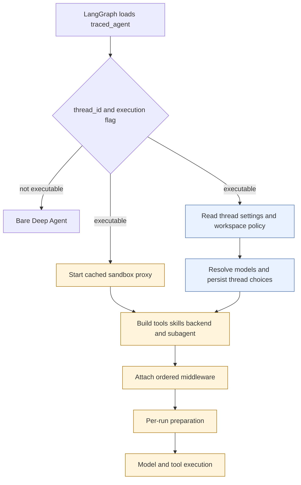

# Coding Agent Assembly

`get_agent(config)` is the composition boundary for the primary coding graph. The LangGraph deployment registers `agent.graphs.agent:traced_agent`, an alias of this factory. For an executable thread run, the factory builds a Deep Agent with a thread sandbox, resolved models, a curated tool surface, skill routes, one general-purpose subagent, and an ordered middleware stack.

## Load gate and factory flow

`RunConfig` is the deliberately tolerant boundary around `configurable`: declared fields are optional, unknown keys round-trip, and parsing discards individual invalid fields rather than losing the remainder. This permits dashboard, webhook, scheduler, and graph-specific launchers to share the contract.

The blue nodes are **per-thread persisted choices**; the amber nodes are **per-run values and work**. In particular, the triggering sender controls authorization for this invocation, while model choices and repository instructions are thread settings seeded on a new thread and retained for later participants.

The factory sets `DEFAULT_RECURSION_LIMIT`. It returns `create_deep_agent(system_prompt="", tools=[])` when there is no `thread_id` or `__is_for_execution__` is not true, avoiding sandbox and integration setup during graph discovery. Before binding a graph, `bindable_config` removes `__pregel_*` runtime objects: LangGraph reinjects them per invocation, while binding the read-time runtime can break later state reads and serialization.

## Sandbox attachment and persisted settings

For an executable thread, assembly creates a cached sandbox proxy and starts it before the remainder of setup. Its reconnect callback creates a `LocalShellBackend` for desktop runs; hosted runs call `ensure_sandbox_for_thread` with the selected workspace. This overlaps potentially slow sandbox attachment with settings reads.

Hosted sandbox lifecycle protects work: an existing but unreachable sandbox raises rather than being silently replaced, because it may contain uncommitted changes. A deleted sandbox is replaced, since its stale persisted identifier would otherwise prevent every later run from connecting. Desktop execution validates that `local_project_path` is an allowlisted project or an app-created worktree before exposing a local shell.

The main and general-purpose-subagent models start from workspace defaults. A dashboard profile can override the main pair and independently override the subagent pair; stored thread settings then override those values. Finally, a canonicalized per-run `agent_model_id`/`agent_effort` pair may override both only if it is supported and the model supports the effort. The resolved main/subagent pairs, routing settings, and repository instructions are persisted for hosted threads **before** the Fable availability gate, so a deployment-wide gate remains effective on each run. Model construction errors become deferred error models, allowing the graph to compile and surface the provider failure at call time. A fallback is added only when its model id differs from the primary id.

Adaptive routing is separately optional. When enabled by the profile/workspace or stored thread setting, `ModelSelectionMiddleware` selects among `fast`, `balanced`, and `performance` models; a deterministic thread bucket can force the `fast` mode. The selected route is recorded in run metadata, while `/oswe` question mode disables adaptive routing.

## Backend, skills, and prompt context

The Deep Agent receives a `CompositeBackend` whose default is the thread sandbox proxy. It overlays read-only routes for bundled skills and, on hosted runs, organization skills plus user skills scoped to the verified credential owner. A public or otherwise unverified credential scope omits personal tools and user-skill access; in that case `WorkspaceSkillsMiddleware` replaces the built-in skills middleware to scope skill metadata to the permitted sources. Desktop instead provides a read-only `StateBackend` snapshot for user skills.

The same ordered `skill_sources` is passed to the parent and made available to the forked subagent. On desktop, `/large_tool_results/` and `/conversation_history/` are routed to a thread-specific artifact directory outside the local project, preventing offloaded results and history from appearing as Git changes.

The factory intentionally supplies an empty static system prompt. `PrepareAgentRunMiddleware` computes `rendered_system_prompt` at run start and `BasePrepareRunMiddleware` prepends it as a system message to model requests. `construct_system_prompt` composes the working environment, dashboard and source context, self-awareness, default-repository and scope guidance, setup/collaboration/task guidance, dependency and untrusted-input guidance, commit/PR guidance, repository and workspace instructions, optional admin guidance, and the shared base. `render_open_swe_shared_base` adds sandbox-download instructions only when that capability is available.

Preparation also obtains the GitHub token, sandbox work directory, workspace, sender identity, and participants; it records run attribution and injects participant context as generated messages rather than persisting sender-specific identity in the system prompt. Its checkpoint fingerprint includes middleware class, latest message, and preparation configuration. A resumed attempt with the same fingerprint skips preparation, but a later invocation prepares fresh context and credentials. Therefore preparation implementations must be idempotent: failure before checkpoint persistence can run them again. Sandbox-attachment failures notify the user before being re-raised.

## Tool surface and dynamic integrations

The parent static list includes web, background, planning, repository, thread, review, automation, feedback, and eligible Slack tools. It is narrowed by authority and run context:

- Slack tools require trusted source context with a channel and, except for `/oswe` ask mode, a thread timestamp. Channel-history reading additionally requires a private thread.
- Admin context adds `ADMIN_TOOLS`; a private admin surface also adds read-only SQL and review-policy controls.
- Personal settings and skill tools require a known private credential scope. Desktop and stop-summary mode replace the list with small dedicated surfaces.
- `ExcludeToolsMiddleware` always removes the Deep Agent `grep` tool. Stop summaries also remove filesystem mutation, execution, and delegation; Slack ask mode excludes only Slack operations that require a bound thread.

MCP and Notion integrations are exposed through `DynamicToolMiddleware`, not appended directly to the static list. The factory eagerly obtains their schemas only for non-desktop, non-stop-summary runs with known credentials. The middleware gives the model a catalog and a `load_integration_tools` control tool; an integration call before loading is rejected. It serializes construction per group, turns loader failures into unavailable-tool results, clears selections at a new run, and rejects names that collide with static or Deep Agent tools.

## Subagent and middleware safety boundaries

The configured `general-purpose` subagent runs in `fork` mode with its own model, static tools, transcript, optional skills/dynamic integrations, conversation offloading, and guards. The factory passes nearly the parent static tools (except `save_user_settings`), but `_SubagentToolGuard` blocks context-sensitive operations at call time. It also disables inherited reply and selected parent middleware by name. This is an important boundary: parent-only checks must not be assumed to protect a separately compiled subagent.

The parent middleware is ordered outermost to innermost. It begins with conversation offloading, run preparation, transcript/incident/workspace-skill/dynamic-tool support; then sanitizes inputs and image reads, limits model calls, converts tool errors, excludes tools, constrains subdirectory reads, and retries `task`. It next applies PR and workflow-push guards, GitHub-proxy refresh, and normally message-queue checking. The inner layers provide timeout wrap-up, required-reply enforcement, step-limit notification, usage recording, optional model selection/fallback, provider/thinking sanitization, stable tool-result order, and model-error handling. `ModelCallTimeoutMiddleware` is innermost, so its deadline covers the provider call and can propagate to an outer fallback model.

`create_deep_agent` also supplies its own `PatchToolCallsMiddleware`; the factory deliberately does not add the older custom orphaned-tool-call repair middleware.

## Validation and change guidance

Treat `build_agent`/`get_agent` as the extension seam for model policy, sandbox providers, skills routes, static and dynamic tools, subagents, and middleware. Preserve the execution gate, the sender-authority versus durable-thread-settings distinction, the read-only skill routes, and the independently compiled subagent boundary when changing it.

Focused assembly tests cover sandbox startup overlap, credential-scope gating, backend and skill routes, desktop state/artifact behavior, model resolution and adaptive routing, middleware presence, tool authorization, and subagent guards. Dedicated model tests verify that a profile may select a different subagent model and provider-specific options from the main agent. Related pages: [Middleware Stack](middleware-stack.md), [Sandbox Lifecycle](sandbox-lifecycle.md), [Models & Profiles](../concepts/models-profiles-instructions.md), [Tools](../concepts/tools.md), and [Context Engineering](../workflows/context-engineering.md).
