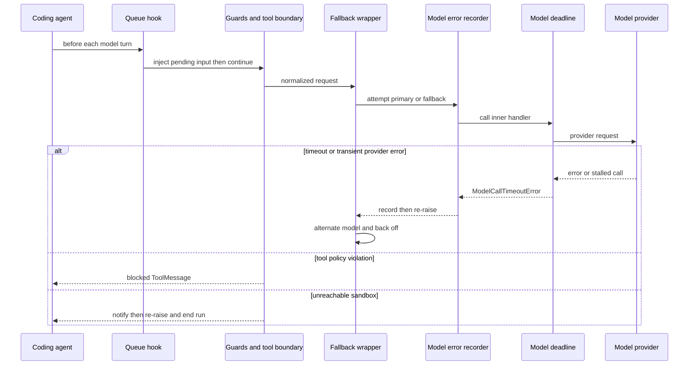

# Agent Middleware and Failure Boundaries

`get_agent` and `get_reviewer_agent` give ordered lists to `create_deep_agent`. Treat the list as an onion: an earlier wrapper surrounds later wrappers, so it can modify an outbound request and observe an exception or tool result from layers within it. Ordering is therefore a behavioral contract. This page describes the runtime boundary; see [Agent Graph](agent-graph.md), [Sandbox Lifecycle](sandbox-lifecycle.md), [Tools](../concepts/tools.md), [Follow-up messages](../workflows/follow-up-messages.md), and [PR creation](../workflows/pr-creation.md) for the adjacent systems.

## Coding-agent pipeline

The coding agent installs this outer-to-inner sequence. Entries marked *conditional* are omitted when their prerequisite is absent.

1. `ConversationOffloadingMiddleware`
2. `PrepareAgentRunMiddleware`
3. `TranscriptMiddleware`
4. `IncidentMiddleware` — *conditional*
5. `WorkspaceSkillsMiddleware` — *conditional*
6. `DynamicToolMiddleware` — *conditional*
7. `SanitizeToolInputsMiddleware`
8. `ValidateImageReadsMiddleware`
9. `ModelCallLimitMiddleware`
10. `ToolErrorMiddleware`
11. `ExcludeToolsMiddleware`
12. `SubdirAgentsReadMiddleware`
13. `ToolRetryMiddleware` for `task`
14. `PullRequestCreationGuardMiddleware` — omitted for local runs
15. `WorkflowPushGuardMiddleware`
16. `refresh_github_proxy_before_model`
17. `check_message_queue_before_model` — omitted in stop-summary mode
18. `TimeoutWrapupMiddleware`
19. `RequireUserReplyMiddleware`
20. `notify_step_limit_reached`
21. `record_run_usage`
22. `ModelSelectionMiddleware` — *conditional*
23. `ModelFallbackMiddleware` — only when a different fallback model resolves
24. `SanitizeFireworksMessagesMiddleware`
25. `SanitizeOpenAIResponsesMiddleware`
26. `SanitizeThinkingBlocksMiddleware`
27. `StableToolResultOrderMiddleware`
28. `ModelErrorMiddleware`
29. `ModelCallTimeoutMiddleware`

The innermost deadline wraps the provider operation. A deadline becomes `ModelCallTimeoutError`, a `TimeoutError`; `ModelErrorMiddleware` records it and re-raises; the optional fallback layer can then retry it. Consequently, the model-call failure path has a deliberate distinction: transient provider failures are retried, exhausted transient failures are normally **surfaced** as a terminal `AIMessage`, and non-retryable failures propagate to normal run-failure handling.

This sequence shows the principal failure boundaries: retryable model errors go outward to fallback, ordinary tool and policy errors become model-visible results, and a dead sandbox fails closed.

## Run preparation and changing capabilities

`BasePrepareRunMiddleware` is the checkpointed `before_agent` foundation used by the coding and reviewer preparation specializations. Its preparation fingerprint combines the middleware class, latest message, and preparation configuration. A matching checkpointed `run_prepared_for` latch skips setup on a resumed invocation, while a later invocation prepares fresh credentials, prompts, and context. A failure before the checkpoint may run preparation again, so `_prepare` implementations must be idempotent. The model wrapper prepends the rendered system prompt to the request.

The coding stack can alter the offered capability surface at construction and at call time. Conditional incident, workspace-skills, and dynamic-tool middleware supply context or capabilities only when configured; `ExcludeToolsMiddleware` removes disallowed names. `SubdirAgentsReadMiddleware` supplies applicable repository instructions. `SanitizeToolInputsMiddleware` repairs leading integer values for malformed `read_file.offset` and `read_file.limit` arguments before validation, and `ValidateImageReadsMiddleware` protects image-reading calls. Provider message sanitizers and stable tool-result ordering run immediately before error recording and the provider deadline, so the provider sees normalized request history.

## Queue delivery and completion controls

Before each eligible model call, `refresh_github_proxy_before_model` refreshes an expiring sandbox GitHub proxy token. The queue hook then retrieves a snapshot of `("queue", thread_id)/pending_messages`, converts input to human-message updates in FIFO order, and consumes only the snapshot after message construction so follow-ups appended while it awaits are retained. It also consumes a pending autofix event best-effort. If context or store lookup is unavailable, the hook safely does nothing rather than failing the turn.

`TimeoutWrapupMiddleware` starts its monotonic clock on its first model call, rather than graph construction. After `OPEN_SWE_WRAPUP_TIMEOUT_SECONDS`—45 minutes by default, with invalid or nonpositive values falling back to that default—it adds a one-time wrap-up instruction to the system message. `ModelCallLimitMiddleware` ends at its configured limit, and the after-agent step-limit hook can notify the Slack thread. `RequireUserReplyMiddleware` governs whether the agent has completed its required reply for the selected surface.

`RecordRunUsageMiddleware` tags model responses with invocation and route metadata and finalizes invocation usage on a successful after-agent completion. If a wrapped model call raises, it records an error finalization before re-raising; that persistence is not a conversion of the underlying model failure.

## Tool error normalization and fail-closed actions

Tool execution has a separate boundary from model failures:

* **Converted to a model-visible result.** `ToolErrorMiddleware` catches ordinary unhandled tool exceptions and returns `ToolMessage(status="error")` JSON with the error type, text, and, when available, tool name. The model can correct and continue.
* **Safely retryable / model-visible.** `SandboxRetryableConnectionError` becomes a `sandbox_transient` error `ToolMessage`. The SDK defines it as a rejected WebSocket upgrade before the execute frame, so the command did not start and retry cannot double-execute it.
* **Fail closed.** A `SandboxConnectionError` other than `SandboxServerReloadError`, or a `ResourceNotFoundError` for the sandbox resource, is treated as an unreachable sandbox. The middleware notifies the user and re-raises, ending the run rather than issuing more doomed calls. Notification targets an active Slack thread first, then Linear, then the configured GitHub issue or PR if a token exists. Coding-agent recovery does not silently replace the sandbox because that could mask loss of uncommitted work.

For direct sandbox operations, `retry_transient_sandbox_errors` retries only the SDK-marked pre-start error, normally up to four attempts with bounded exponential backoff and jitter. It does not retry a terminal sandbox failure.

`ToolRetryMiddleware` is deliberately narrower: it wraps only delegated `task` calls with two retries, a one-second initial delay, and a ten-second maximum delay. Its retry predicate accepts selected transient HTTP/provider failures—including a subagent `ModelCallTimeoutError`, because subagents lack fallback middleware. When exhausted, invalid-prompt and context-length failures return structured `failed` data to the parent model; other failures are re-raised.

Two guards return blocked tool results rather than performing the action. Outside local runs, `PullRequestCreationGuardMiddleware` prevents shell fallbacks that create a PR through `gh`, GitHub API, or `curl`, directing creation through the attributed PR tool. `WorkflowPushGuardMiddleware` recognizes pushes that change `.github/workflows`; it executes a rewritten safe command only for the recorded approved fingerprint, otherwise records/announces the approval request and returns a blocked result with its approval URL. These are **fail-closed** policy decisions, not retriable execution errors.

## Model deadline, fallback, and observability

`ModelCallTimeoutMiddleware` reads `OPEN_SWE_MODEL_CALL_TIMEOUT_SECONDS`, accepting only a positive number and otherwise using 900 seconds. `asyncio.wait_for` makes an otherwise stalled transport observable; the deadline is intentionally above normal provider request timeouts so provider-client retry can happen first.

When configured with a distinct fallback model, `ModelFallbackMiddleware` alternates primary and fallback attempts. Its default schedule gives six attempts total: immediate, then 5, 15, 30, and 45-second delays with positive jitter. It retries connection and timeout failures, retryable `ModelError`s, and selected status codes including 408, 409, 425, 429, 5xx, and 529. Model-access errors such as `model_not_available` are immediately converted to an explanatory `AIMessage`; an exhausted transient budget normally returns an outage `AIMessage`, but `surface_outage_message=False` re-raises the last exception.

Inside fallback, `ModelErrorMiddleware` logs and classifies an exception, writes its type and classification code to thread metadata when run context is available, and re-raises the same exception. This placement records timeout/provider failures before fallback consumes them, while avoiding a false error record for a fallback attempt that succeeds.

## Reviewer variant and exit guarantee

The reviewer is intentionally leaner. Its outer-to-inner list is `PrepareReviewerRunMiddleware`, `SanitizeToolInputsMiddleware`, `ModelCallLimitMiddleware`, `ToolErrorMiddleware`, GitHub-proxy refresh, queue delivery, `TimeoutWrapupMiddleware`, the three provider message sanitizers, `RepairOrphanedToolCallsMiddleware`, `StableToolResultOrderMiddleware`, `ModelErrorMiddleware`, `ModelCallTimeoutMiddleware`, and `settle_review_check_on_exit`.

It omits coding-agent-only offloading, transcript/incident/workspace/dynamic capability layers, exclusion and subdirectory hooks, task retry, reply enforcement, PR and workflow guards, usage recording, model selection, and model fallback. `RepairOrphanedToolCallsMiddleware` adds synthetic error results for tool-call IDs left without a result, allowing a resumed review to make a valid provider request.

The reviewer exit hook protects the PR status boundary. If the tracked review check remains unpublished, it settles it as **neutral**, not as a code failure. If `publish_review` already finished but only its completion PATCH failed and left a pending conclusion, the hook instead retries that real conclusion. Reviewer sandbox provisioning may replace a dead checkout because it is re-derived; a failed replacement remains a typed sandbox-unreachable failure.

## Safe changes and focused tests

When adding middleware, identify whether it wraps model calls, tool calls, lifecycle hooks, or request transformation, then preserve the required ordering edge. In particular, do not move the deadline outside fallback, the error recorder outside its retried attempts, queue consumption after a second unguarded read, or a destructive guard inside the tool implementation. New sandbox retries require the same pre-start guarantee before they can be safe.

Focused tests cover queue handoff and retention, dynamic tools, preparation latching and prompt injection, input/message sanitizers, orphaned-call repair, stable ordering, deadline behavior, fallback eligibility and alternation, step-limit notification, subdirectory instructions, and usage recording. Extend the closest test when changing ordering, whether an error is visible to the model, or whether a failure ends the run.
