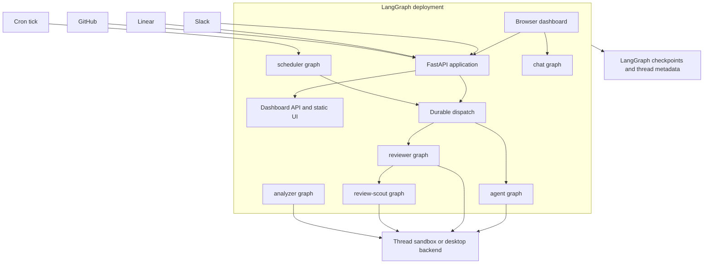

# Runtime Architecture

Open SWE is a LangGraph deployment with a custom FastAPI application. Browser, webhook, and scheduler surfaces create or observe durable work on named graph entrypoints. Coding and review graphs operate against thread-scoped backends; PR chat is explicitly sandbox-less. The deployment also hosts a browser dashboard, while the desktop manifest narrows the runtime to a local-project coding agent.

## Runtime boundaries and inbound surfaces

This context diagram separates HTTP ingress from graph execution. `dispatch_agent_run` is the shared creation boundary for `agent` and `reviewer` runs; chat, analysis, review scouting, and cron work have their own registered graph entrypoints.

## Deployable graph entrypoints

`langgraph.json` is the cloud deployment manifest. Its stable `agent/graphs/` modules re-export the graph factories registered with LangGraph, mount `agent.webapp:app`, load `.env`, configure checkpointer retention, and attempt to build the dashboard bundle into the image.

| Graph | Registered entrypoint | Runtime role |
|---|---|---|
| `agent` | `agent.graphs.agent:traced_agent` | Per-run coding-agent factory with a thread backend, models, tools, skills, and middleware. |
| `reviewer` | `agent.graphs.reviewer:traced_reviewer_agent` | Pull-request review and findings-publication workflow. |
| `analyzer` | `agent.graphs.analyzer:traced_analyzer` | Per-repository review-style learning. |
| `review-scout` | `agent.graphs.review_scout:traced_review_scout` | Produces a PR walkthrough and records author steering before review. |
| `chat` | `agent.graphs.chat:traced_chat_agent` | Read-only discussion of one PR without a sandbox. |
| `scheduler` | `agent.graphs.scheduler:get_scheduler` | Cron-tick dispatcher for maintenance and scheduled work. |

The review scout runs on a separate thread for each PR. It derives an ordered walkthrough from the full diff and records where author guidance affected the shipped change; the reviewer starts it and waits for both results before reviewing.

`build_agent` (exported through the agent graph) creates a fresh deep-agent graph for an executable thread. It resolves the initiating GitHub identity, chooses a desktop `LocalShellBackend` or obtains a thread sandbox, resolves and persists thread model settings, then builds the tool and middleware stack. When there is no thread ID or the graph is loaded outside execution, it deliberately returns an empty deep agent without provisioning a backend. This supports discovery and other non-execution loads safely. See [Agent Graph & get_agent Factory](./agent-graph.md) for the detailed factory and [Threads and State](../concepts/threads-and-state.md) for state ownership.

The reviewer shares the sandbox lifecycle but deliberately exposes review tools—`add_finding`, `update_finding`, `list_findings`, and `publish_review`—rather than commit, push, or PR-opening tools. It prepares the repository and computes valid diff lines before model work, so a finding can be checked at creation rather than only when it is published. The analyzer uses a workspace-scoped sandbox and GitHub access to mine historical human feedback and previous finding outcomes, then stores a per-repository prompt with `save_review_style_prompt`. See [Reviewer & Review-Style Analyzer Graphs](./reviewer-and-analyzer.md).

The chat graph is sandbox-less and read-only. The review chat proxy seeds the PR diff, findings, and overview as virtual `/pr/` files in the `files` state channel. Its filesystem tools can read that context, while shell execution and file mutations are excluded; GitHub-backed tools receive a repository-scoped GitHub App token instead of a user credential.

The scheduler is a compiled, single-node `StateGraph`. Its node routes a tick to stale-run reconciliation, watch evaluation, legacy-cron deletion, background-task monitoring, workspace refresh, session cost, thread-feedback prompting, agent cost, or a scheduled agent run. Required identifiers missing from a tick return structured statuses; transient sandbox errors are retried up to the configured attachment window and ultimately return `sandbox_unavailable`.

## FastAPI composition and HTTP lifecycle

`agent/webapp.py` is a compatibility re-export of the application assembled by `agent/api/app.py:create_app`. The application pins one event loop before queue workers initialize. It configures credentialed CORS from `DASHBOARD_ALLOWED_ORIGINS`, rejecting `*`, and mounts dashboard, plan, workflow-approval, Linear, Slack, GitHub, health, and sandbox-tool routers plus the static dashboard UI.

The lifespan repeats event-loop pinning; validates GitHub-login, sandbox, and local-development LLM configuration; requires and migrates the database; imports older workspace and user records from the LangGraph Store; synchronizes configured administrators; and starts reporting, analytics, and transcript listeners. Workspace import failure is intentionally nonfatal but causes repository routing to fail closed, while analytics and transcript-listener failures degrade with warnings. Shutdown stops the listener and analytics worker and closes the database.

The dashboard router is rooted at `/dashboard/api` and applies a same-origin dependency to mutations. It aggregates browser APIs including OAuth and profiles, user preferences and instructions, administration, workspaces and repositories, pull requests and reviews, schedules, threads and transcripts, integrations, incident surfaces, skills, analytics, and API keys. Importing `agent.dashboard` does not eagerly load this full FastAPI surface: its PEP 562 `__getattr__` imports and caches `routes.router` only when the web application mounts it.

Slack, Linear, and GitHub webhook routes normalize external events and resolve deterministic thread identities so follow-up activity returns to the relevant agent, issue, conversation, or PR thread. These routes are ingress adapters: they prepare authenticated event context and initiate durable work rather than owning long-running agent execution.

## Durable dispatch and state lifecycle

`dispatch_agent_run` is the common run-creation contract for Slack, Linear, GitHub, dashboard, and scheduled `agent` or `reviewer` work. `assistant_id` selects the graph while `source` shapes input identity and is retained for metadata and logging. It rejects an ambiguous prebuilt input combined with content or identity arguments.

The durable defaults matter for cross-surface behavior: `multitask_strategy="interrupt"` interrupts active work so the follow-up can resume with history; `durability="sync"` checkpoints before each step; the dispatcher enables resumable streams, subgraphs, and the v3-compatible stream modes and marker. Consequently, the dashboard can attach to and replay runs it did not create itself. A caller such as background work can explicitly use another strategy such as `enqueue`.

Completion notification is optional rather than a run-creation dependency. Dispatch attaches the completion webhook only when `RUN_COMPLETE_WEBHOOK_SECRET` is configured and `COMPLETION_WEBHOOK_URL` is absolute and non-loopback; otherwise it logs or omits the callback so rejected webhook configuration cannot block every run.

Graph factories are ephemeral, but execution context survives them: LangGraph checkpoints retain graph state and thread metadata binds a sandbox ID and thread settings. The connection cache is process-local and keyed by sandbox ID; a worker that lacks that connection reconnects using the ID in metadata. A deleted sandbox is recreated, but an existing unreachable coding sandbox raises by default to avoid silently replacing uncommitted work. Read-only review and scout flows may permit replacement because they re-derive their checkout. See [Invocation](../workflows/invocation.md).

## Cloud dashboard and desktop runtime

The cloud manifest pins Python 3.14 and accepts LangGraph API versions compatible with `>=0.15.0rc1`. Its checkpointer deletes expired data, sweeps every 60 minutes, and defaults to a 43,200-minute TTL. Dockerfile instructions build the dashboard using the configured HTTP mount prefix and install it as static assets on a best-effort basis, so a failed UI build leaves a backend deployment available.

The `ui/` dashboard is a TanStack Router React application. Its route tree covers agent and local sessions, assistant sessions, reviews and review styles, workspaces, integrations, incidents, administration and evaluations, usage, settings, schedules, skills, plans, and pull-request views. The router adopts Vite's base path, allowing a build under a deployment mount prefix. The agents layout requires a session except for enabled local desktop routes and can redirect authenticated users to the experimental assistant surface.

`langgraph.desktop.json` registers only the main agent graph, uses `agent.local_auth:auth` with Studio authentication disabled, installs a local checkpointer, and disables the bundled UI. A desktop run is identified by `configurable.source == "desktop"`. Its requested `local_project_path` must resolve to an existing directory either listed in `OPEN_SWE_LOCAL_PROJECTS_FILE` or beneath `OPEN_SWE_LOCAL_WORKTREES_DIR`; the local shell receives only a small environment allowlist. Desktop artifact routes send large tool results and evicted history outside the project, preventing them from being picked up by `git add -A`.

## Operations and safe changes

- Register a new deployable graph through a stable `agent/graphs/` re-export and the relevant manifest. Registration alone does not make it eligible for `dispatch_agent_run`, which is an agent/reviewer creation contract.
- Add browser-facing APIs through `create_app` and the dashboard router, preserving credentialed-origin and same-origin mutation controls.
- Treat an unreachable coding sandbox as a recovery decision, not a cache miss. Replacing it changes the thread working tree.
- When changing dispatch defaults or stream fields, exercise a run created outside the dashboard and attach the dashboard to it; external-run observability depends on replayable compatible streams.
- When changing desktop path handling, preserve real-path validation, allowlist/worktree restrictions, and external artifact routing; they separately protect local filesystem access and repository hygiene.

Related pages: [Agent Graph & get_agent Factory](./agent-graph.md), [Reviewer & Review-Style Analyzer Graphs](./reviewer-and-analyzer.md), [Threads and State](../concepts/threads-and-state.md), [Dashboard UI](../integrations/dashboard-ui.md), and [Invocation](../workflows/invocation.md).
