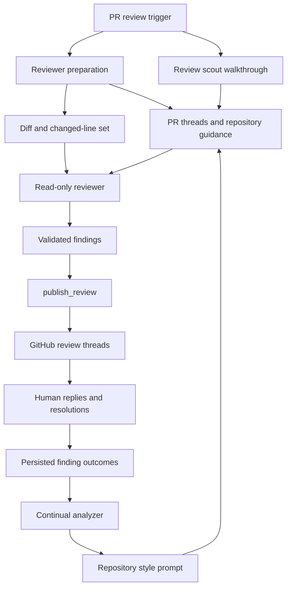

# Review, PR Chat, and Style Learning Graphs

Open SWE registers four related LangGraph assistants: `reviewer`, `chat`, `review-scout`, and `analyzer`. They are deliberately not interchangeable: the reviewer can publish GitHub review output; PR chat answers a viewer's questions without a sandbox; the scout builds a PR walkthrough in an isolated checkout; and the analyzer turns historical feedback into an optional repository-specific supplement for later reviews.

For webhook routing, see [PR Review Workflow](../workflows/pr-review.md). For sandbox provisioning and replacement semantics, see [Sandbox Lifecycle](sandbox-lifecycle.md). For shared model and instruction configuration, see [Models, Profiles, and Instructions](../concepts/models-profiles-instructions.md).

## Roles and authority boundaries

| Graph | Primary role | State and context | Sandbox and mutation boundary |
| --- | --- | --- | --- |
| `reviewer` | Assess one PR and manage its findings | Deterministic reviewer thread, PR diff, GitHub threads, repository guidance, style prompt, walkthrough | Re-derived checkout; does not edit repository files or invoke raw GitHub review commands. Publication goes through review tools. |
| `chat` | Answer questions about a single PR for one viewer | Private per-viewer chat thread and virtual `/pr/` overview, diff, and findings files | **No sandbox** and no shell. It has read-only repository/GitHub-facing tools and a GitHub App token. |
| `review-scout` | Produce an ordered walkthrough and capture author steering | Separate deterministic scout thread and persisted walkthrough/guidance records | Its own replaceable checkout. Its only domain tools record walkthrough steps and guidance; it does not publish review findings. |
| `analyzer` | Learn a per-repository review-style prompt | Deterministic style thread and `review_styles` record | Sandbox for historical GitHub exploration; only style-outcome read/save domain tools. Bundled procedures are virtual state files, not sandbox files. |

All four factories return an empty deep agent when execution is disabled or the required `thread_id` is absent. The reviewer, chat, and scout copy configuration before setting defaults; analyzer instead writes its default recursion limit into the supplied config. This difference matters to embedding callers that reuse a config object.

## Reviewer: controlled PR assessment

The reviewer factory selects configured or workspace-default reviewer and subagent models, applies the Fable gate, and binds a sandbox reconnect function. It exposes lifecycle tools such as `add_finding`, `update_finding`, `list_findings`, `publish_review`, and finding-thread reply/resolve helpers alongside read helpers. The system prompt prohibits commits, pushes, and direct `gh pr review`/review API use; repository changes are not part of this graph's authority.

A reviewer subagent may inspect a disjoint partition of files and return candidate defects, but cannot create findings or publish. The parent validates candidates and owns the durable state transition.

### Preparation and context assembly

`PrepareReviewerRunMiddleware` runs before the first model call. It obtains a repository-scoped GitHub App token, caches it for the reviewer thread, ensures a replaceable sandbox, and clones/fetches then checks out the PR head. Replacement is acceptable because the checkout is re-derived; a replacement failure remains a run failure rather than silently producing an incomplete review.

Preparation computes the review diff and changed-line set and places `diff_text` and `diff_line_set` in state. Concurrent work collects PR title/body, existing review threads, organization guidance, base-revision `AGENTS.md` plus changed-file scoped instructions, API standards, an optional learned style prompt, and an approval policy. Existing GitHub threads are reconciled before rendering their context. First-review, re-review, and finding-reply paths then render different task context. The reviewer also awaits a scout walkthrough when available, but proceeds without it on scout failure or timeout.

This flow shows the feedback loop: human feedback and review outcomes are transformed into style guidance that is injected into later reviewer runs.

Untrusted GitHub-authored fields, including PR text, thread comments, and finding replies, are rendered as data blocks. Closing tags are neutralized and login attributes are validated, preventing PR content from escaping into instructions.

### Findings, reconciliation, and publication

A finding contains its severity/confidence/category, changed-file location and side, description and optional suggestion, status, SHA history, GitHub identities, surface state, human-reply bookkeeping, diff hunk, fingerprint, interactions, and rank. Surface state is monotonic, so legacy normalization retains the furthest state. New findings must anchor to the PR diff: an out-of-diff range returns `success: false` and `in_diff: false` rather than encouraging re-anchoring. Suggestions longer than four lines are dropped rather than posted.

Findings now live in PostgreSQL under the PR. Reviewer-thread metadata still owns PR identity, latest reviewed SHA, and related thread-level state. Older metadata-resident findings migrate on first access, which preserves prior reviews while moving canonical storage out of sandbox and thread metadata.

Before a normal review, reconciliation correlates current GitHub threads with stored findings, backfills GitHub IDs, marks surfaced records, resolves records only when their threads are resolved or outdated, and captures the newest applicable human reply as an interaction requiring reassessment. Publication selects open, unpublished, in-diff findings at or above the severity threshold (normally `medium`) and caps the batch. It creates one GitHub review with inline comments; embedded `open-swe-review-comment` markers allow later recovery and reconciliation.

A successful publication records review/comment/thread identities, resolves GitHub threads for resolved findings, and advances the reviewed SHA. A successful result does not necessarily mean a review was posted: a re-review with no new comments can return `review_id: null` and `skipped_empty_re_review: true`; dry-run evaluation also has no real review ID. If GitHub rejects an anchor, publication filters invalid findings and retries once only when valid comments remain; otherwise it reports the unresolvable IDs rather than retrying blindly.

## PR chat: private, sandbox-less investigation

The review UI derives one deterministic chat thread per PR and GitHub login. Every proxy request verifies stored metadata (`kind`, login, repository, and PR number); a nonmatching or non-chat thread receives a 404. The thread is created lazily on the first run.

The proxy seeds three virtual files: `/pr/overview.md`, `/pr/diff.patch`, and `/pr/findings.md`. It truncates a diff at 400,000 characters. On later turns it reseeds when the PR head or reviewer `last_reviewed_sha` changes. A reseed failure on an existing chat retains the last context, but a first seed failure is surfaced because there is no safe context to answer from.

The graph has no sandbox. Its filesystem tools operate on virtual files, and middleware excludes `execute`, `write_file`, `edit_file`, and `delete`, including in its general-purpose subagent. It can read repository files/search code/list review findings and use web read helpers. Its run preparation resolves a repo-scoped App token into `chat_github_token`, so GitHub-backed tools do not receive the viewer's token.

## Review scout: walkthrough before or alongside review

The scout runs separately per PR/head. It checks out the PR into its own replaceable sandbox, creates a working tree around the merge base, and receives any stored author-steering history. It may call only `commit_walkthrough_step` and `record_guidance`; the resulting pseudo-commits provide an ordered, at-most-eight-step explanation of the change rather than a code mutation to be pushed.

After the agent completes, finalization derives steps from that working tree and replaces the persisted walkthrough only when there is at least one substantive step. It marks author-guidance review complete only after a scout successfully reaches this stage. Launching is idempotent for an active run on the same head; a new head does not reuse an old-head run. The reviewer polls for up to `SCOUT_WAIT_SECONDS` (600 seconds), then continues without a walkthrough while the scout may still populate the review page later.

## Analyzer: repository-style learning

The analyzer learns a `custom_prompt` from two sources:

- **Bootstrap** collects samples and explores historical merged-PR human feedback to establish a cold-start repository norm.
- **Continual** reads the reviewer's stored finding outcomes to promote recurring confirmed patterns and demote recurring false positives.

`analyzer_mode` selects the corresponding `SKILL.md` playbook. Launchers put those bundled skills in the run's `files` channel; the graph mounts a `StateBackend` at `/skills/` inside a `CompositeBackend`. Therefore the procedural playbooks are available to SkillsMiddleware without being written to the execution sandbox.

`REVIEW_STYLES` is a typed store in the `review_styles` namespace keyed by `owner/repo`. A `ReviewStyle` records status, custom prompt and summary, samples/reviewers, analyzer thread/run IDs, continual cron ID, error, and timestamps. The reviewer reads the saved prompt fail-soft: a store failure removes only this supplement. When present, it is framed as repository-specific guidance and is subordinate to the global review bar.

Bootstrap collection failures and durable-run startup failures mark the record failed. A successful `save_review_style_prompt` trims and saves the prompt and metadata as completed; empty prompt output marks it failed. Saving also attempts—without rolling back the saved prompt—to register one daily continual cron. Registration is idempotent, and its SHA-256-derived schedule is staggered from 05:00 through 08:59 UTC.

The cron itself is threadless but explicitly supplies the repository's deterministic style `thread_id`; otherwise the graph would return an empty agent. It supplies no accumulating chat history and no user token, so analyzer preparation resolves App credentials for the repository.

## Focused change and test guidance

Changes to reviewer prompting must preserve changed-line validation, data-block treatment of GitHub content, and the split between candidate-producing subagents and parent-owned publication. Changes to storage must preserve migration of legacy thread metadata and the finding/GitHub-thread reconciliation contract. PR chat changes must preserve per-viewer authorization and avoid adding sandbox or write tools. Scout changes must retain head-specific walkthrough isolation and its nonblocking fallback. Analyzer changes must keep the learned prompt optional and bounded by reviewer policy, retain virtual skill delivery, and preserve failed/running/completed style-record transitions.
