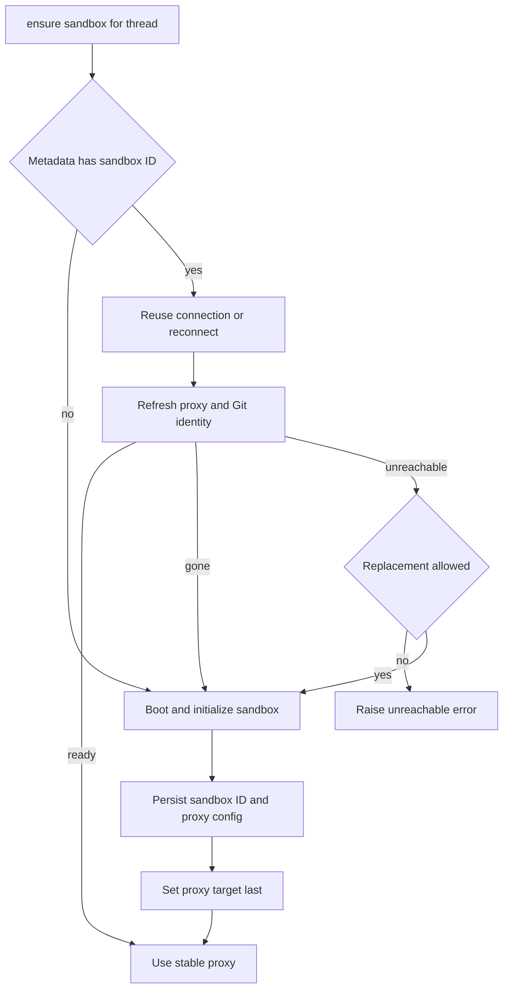

# Thread Sandbox Lifecycle

A normal coding thread is bound to a sandbox that holds its checkout and uncommitted working tree across runs. The binding has two layers: durable thread metadata identifies the provider resource, while a worker-local stable proxy gives tools a handle that can survive reconnection and target replacement. This distinction is fundamental to recovery: a worker restart loses its connection cache, not the thread's sandbox identity.

> **Safety invariant:** an unreachable coding sandbox is **not silently replaced**. It may recover on a later run and may hold the only uncommitted copy of the working tree. Only a provider-confirmed deletion is replaced automatically.

Related: [Agent graph](agent-graph.md), [Threads and state](../concepts/threads-and-state.md), [Auth and security](../concepts/auth-and-security.md), [Sandbox providers](../integrations/sandbox-providers.md), and [Configuration](../operations/configuration.md).

## Ownership, identity, and stable handles

`thread.metadata["sandbox_id"]` is the durable binding. `get_sandbox_metadata` prefers inline run metadata containing a string ID, then reads the live LangGraph thread; unlike a cache miss, a failure to read the live thread propagates. Treating a failed lookup as unbound would allow a new ID to overwrite the identity of a live sandbox.

`SANDBOX_BACKENDS` is a process-local `thread_id` to `SandboxBackendProxy` map. A separate `SANDBOX_CONNECTIONS`, keyed by sandbox ID, retains reusable live provider connections. `set_sandbox_backend` updates an existing proxy target rather than replacing the proxy object, so middleware and tools which already hold the proxy see a successful handoff.

The proxy is async-only: synchronous calls reject with `NotImplementedError`, while `a*` calls resolve and delegate to the current backend. If no target is available, it uses its run-supplied reconnect callback or reads the durable ID and reconnects through `create_sandbox`. A lock and one shared startup task collapse concurrent callers into a single reconnect; `asyncio.shield` prevents cancellation of one caller from cancelling that shared work. The proxy subclasses `BaseSandbox` to retain capture-at-source behavior for filesystem tooling, and falls back to ordinary execution when an underlying provider has no offload API.

## Provider choice and workspace bootstrap

`create_sandbox` is the provider-neutral creation and reconnection boundary. `SANDBOX_TYPE` selects a lazily imported factory: `langsmith`, `daytona`, `modal`, `runloop`, `e2b`, or `local`. The registry reports unsupported values and gives a targeted install error when an optional provider extra is absent. LangSmith alone receives snapshot, resource, and create-body overrides; native async factories are awaited and synchronous wrappers run in a worker thread.

Before serving work, `validate_sandbox_startup_config` eagerly validates the active provider. For LangSmith it validates numeric sizing and retention values, rejects negative retention TTLs, and parses extra create JSON. This moves configuration and optional-dependency failures from the first request to process startup.

For a workspace-backed thread, `SandboxCreateConfig.resolve` chooses the workspace's ready snapshot and carries its resource settings and create parameters into provisioning. If the workspace has no ready snapshot—or the caller explicitly requests `source="base"`—LangSmith uses its provider base snapshot. When a ready snapshot has aged past the update interval, the new sandbox runs the workspace update script before its first model call; script failures are logged but do not discard the usable snapshot-based sandbox. It also schedules a background builder update for future sandboxes. A builder refresh runs setup plus update for a full refresh, or update alone from the current snapshot, and captures only after all scripts succeed; a failed refresh leaves the previous ready snapshot in place.

The `local` provider is for local development: it executes on the host without isolation. It scopes global Git changes to `.gitconfig-sandbox` and builds an explicit child environment without model and provider API keys.

## Thread lifecycle

`ensure_sandbox_for_thread` is the normal entrypoint. Dispatch interrupts concurrent work for the same thread, so the lifecycle relies on that serialization rather than storing a cross-process `__creating__` sentinel. The provisioning operation configures bot Git identity and, for LangSmith, GitHub proxy access before binding the new ID. Git identity and proxy configuration run concurrently after the box exists; identity is re-applied for reused boxes because global configuration can be lost.

*The thread lifecycle distinguishes a confirmed deletion from an unreachable resource and publishes only a durable, initialized binding.*

The normal paths are: reuse a cached connection for the durable ID, reconnect by that ID after a worker change, or create a new sandbox if no ID exists. For a reconnect, refreshing LangSmith proxy configuration is itself the reachability operation; there is no separate preliminary ping.

On a new or replacement sandbox, initialization completes before `sandbox_id` (and any base proxy configuration) is written to thread metadata. The metadata write completes before the backend is published through `set_sandbox_backend`. Thus a creation or persistence failure does not expose the new backend through the proxy; a later run can retry provisioning instead of adopting a partially initialized resource.

## Recovery semantics: coding versus read-only review

`SandboxGoneError` says the provider confirms that the durable resource no longer exists. The lifecycle always creates a replacement, persists its distinct ID, and updates the stable proxy. This clears a stale binding that would otherwise make every later run reconnect to a deleted resource.

`SandboxUnreachableError` says only that this run could not reconnect or reconfigure the resource. By default it is raised, not converted into an empty replacement. If a caller has deliberately opted into replacement and that replacement fails, the failure remains a `SandboxUnreachableError` so callers retain one recovery contract.

The reviewer is the deliberate exception. It calls `ensure_sandbox_for_thread(..., allow_replacement=True)` because its sandbox is read-only in lifecycle terms: `prepare_review_repo` clone-or-fetches the repository and force-checks out the requested PR head on every run. Its state is re-derivable, unlike a coding thread's worktree, and review threads persist across pushes. Review preparation verifies the checked-out SHA; trusted skills are extracted from the base reference into `.review-skills` outside the PR checkout, never from PR-head content. This is recovery policy, not a general permission to replace user coding sandboxes.

At tool execution time, a rejected WebSocket upgrade represented by `SandboxRetryableConnectionError` is retryable because the SDK guarantees the command frame was never sent. Retries are bounded and use exponential jittered backoff. Command error frames are ordinary tool errors, not evidence that the sandbox is dead. A non-transient connection failure triggers one user notification and terminates the run rather than repeatedly running against a presumed-dead backend.

`ReadOnlyBackend` is a separate capability boundary used for routed skill sources: it delegates only async listing, reading, searching, globbing, and downloads, while mutation operations are absent. It does not make a sandbox safe to replace; the reviewer is safely replaceable because its checkout is rebuilt each run.

## GitHub access through the LangSmith proxy

GitHub proxy setup is LangSmith-specific. `workspace_token` intersects any requested repositories with the workspace's configured repositories, then mints an installation token only for matching accessible repository IDs. A missing workspace, repository mismatch, or lookup failure does not fall back to installation-wide credentials.

The LangSmith proxy injects the credential on the network boundary: `api.github.com` receives `Authorization: Bearer`, and `github.com` plus `*.github.com` receive Basic authentication for `x-access-token:<token>`. The sandbox only receives the `GH_TOKEN=proxy-injected` placeholder needed by `gh`; the real token is not put in its environment or filesystem. Proxy configuration removes and replaces managed credential rules while preserving unrelated base rules. PATCH retries transient transport and configured HTTP failures; a not-ready response causes a best-effort sandbox start followed by another PATCH, preserving stopped sandbox files rather than treating the sandbox as deleted.

A token record is worker-local and tracks expiry, record time, repository scope, permission scope, workspace, and base proxy configuration per thread. Before every model call, middleware refreshes a LangSmith proxy token within five minutes of known expiry, or after 50 minutes when expiry is unknown. Rotation reuses the recorded scope; a supplied repository set can only narrow that scope. Refresh errors are logged and do not themselves block the model call.

## Explicit recreation and operations

`recreate_sandbox_for_thread` is the explicit fresh-start operation. It requires an existing bound sandbox, creates and initializes a distinct new box from the workspace or base source, persists its ID (and recorded base proxy configuration when present), then swaps the cached proxy target. It does not delete the old provider resource. If metadata persistence fails, the old proxy target remains active, although the newly created provider resource may be detached.

Provider filesystem roots differ. `resolve_sandbox_work_dir` tries provider work-directory methods, `pwd`, provider home/root methods, then `$HOME`; every candidate is checked for writability and the chosen path is cached. Repository operations append a non-empty repository name to that portable work directory.

Focused tests cover one-shot concurrent proxy reconnection, publish ordering, explicit recreate handoff, deleted versus unreachable recovery, reviewer replacement, retry safety, proxy rules and repository scope, snapshot refresh behavior, and provider path resolution.
