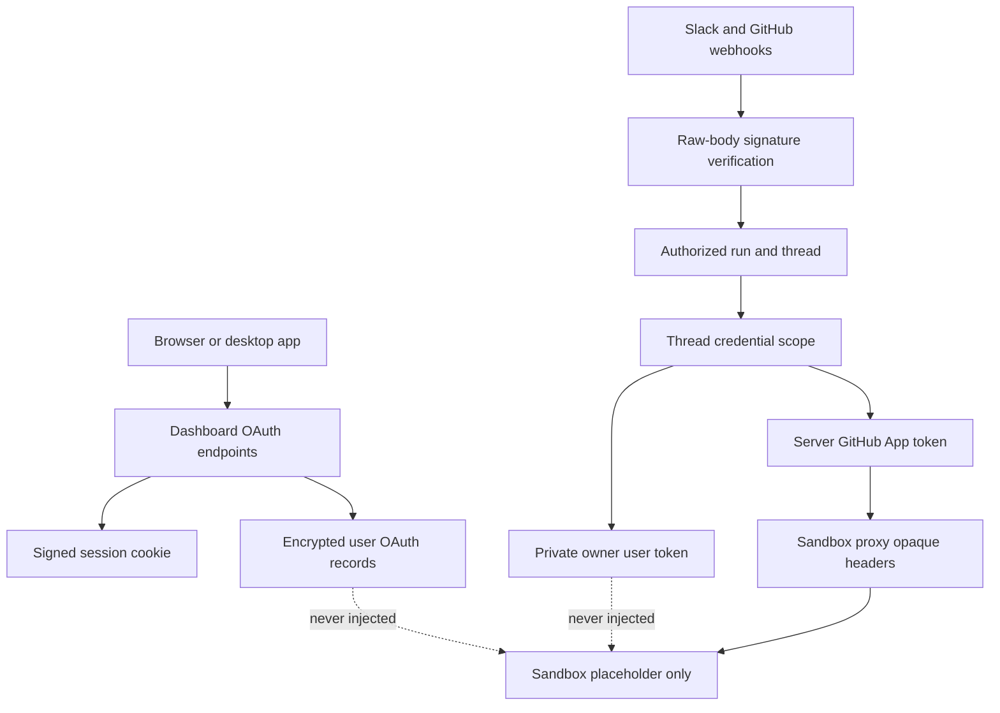

# Identity, Authorization, and Credential Boundaries

Open SWE distinguishes the identity that may start or continue a conversation from the credential that may access GitHub. It also separates server-held credentials from sandbox traffic: a sandbox can make appropriately scoped GitHub requests, but does not receive the usable token. This page covers those boundaries; see also [sandbox lifecycle](../architecture/sandbox-lifecycle.md), [tools](./tools.md), [dashboard UI](../integrations/dashboard-ui.md), [configuration](../operations/configuration.md), and [invocation](../workflows/invocation.md).

The trust boundary: user connections and server-held credentials are resolved outside the sandbox; GitHub App authority reaches a sandbox only through an opaque proxy rule.

## Dashboard identity and browser protections

The dashboard's normal entry point is GitHub App OAuth. `/auth/login` creates a random nonce, stores the raw value in an `osw_oauth_state` cookie, and places its HMAC in a signed, ten-minute state JWT. `/auth/callback` uses a constant-time comparison before exchanging the authorization code, looking up the GitHub identity, applying the login gate, and persisting the OAuth response. The resulting seven-day HS256 session JWT is signed with `DASHBOARD_JWT_SECRET` and carried in the `HttpOnly` `osw_session` cookie; `require_session` rejects a missing or invalid cookie.

Redirect handling is deliberately restrictive. `sanitize_redirect_to` accepts a non-protocol-relative relative path or an absolute URL whose origin is `DASHBOARD_BASE_URL` or an entry in `DASHBOARD_ALLOWED_ORIGINS`; dashboard login/API paths are blocked as redirect destinations. Session cookies are `Secure; SameSite=None` only for HTTPS split-origin deployment, otherwise they use `SameSite=Lax`. The state cookie is `HttpOnly`, `SameSite=Lax`, limited to the state lifetime, and scoped to `/dashboard/api/auth`.

At startup, the service requires a GitHub login allowlist unless `OPEN_SWE_LOCAL_AUTH_TOKEN` is configured. A login is authorized when it is case-insensitively listed in `ALLOWED_GITHUB_USERS` or is an active member of an `ALLOWED_GITHUB_ORGS` organization; organization membership is resolved through the GitHub App and failures do not authorize the user. Local `langgraph dev` may instead authenticate as the `gh` CLI user, but only when development login is enabled and the same gate passes.

Unsafe cookie-authenticated dashboard requests must present an allowed `Origin` or `Referer`; reads are exempt. An explicit `Authorization: Bearer` GitHub token with **no** session cookie is exempt because it is not an ambient browser credential. With no dashboard origin configuration the check intentionally does nothing for local development; CORS is configured only for explicit origins and rejects `*` with credentials.

Desktop OAuth does not set a session on its loopback redirect. Instead, the callback returns a short-lived handoff JWT to a fixed `127.0.0.1` callback and the desktop app must prove possession of its PKCE verifier with a constant-time S256 comparison before receiving a session. Cloud-terminal tickets are distinct 60-second JWTs, checked for their audience and the requested `thread_id`.

### Slack identity linking

A signed-in dashboard user can link Slack through Slack OIDC (`openid email profile`), not through a claimed Slack ID. UserInfo yields the Slack-verified user and team IDs; `SLACK_TEAM_ID`, when configured, rejects a different workspace, including Slack Connect identities. Auth-failure messages sent to a shared Slack thread link only to the generic, token-free dashboard settings URL so another thread participant cannot complete somebody else's authorization flow.

## Credential ownership and GitHub authority

GitHub OAuth access and refresh tokens are stored separately from editable profiles, in the `oauth_tokens` namespace, preventing a profile update from overwriting a concurrent OAuth callback or refresh. They are encrypted with `MultiFernet` from `TOKEN_ENCRYPTION_KEY`; a newest-first comma/newline list supports rotation. A user access token is refreshed under a per-login lock when it is near expiry. Permanent GitHub refresh errors (`bad_refresh_token`, `unauthorized_client`) delete the unchanged stored authorization rather than repeatedly returning a stale token.

The run resolver uses saved **thread scope**, not the invocation source, to decide whether it may obtain a personal token:

- Public threads always use the workspace GitHub App installation token. Cached user authority is invalidated before resolution and is never consulted for the public path.
- A private thread can use only the saved `owner_login`, and only when the current run's GitHub login matches that owner. If no valid saved user token exists, `GitHubUserAuthRequired` is raised; it never falls back to the App.
- A system-owned thread uses App authority. A system thread marked private, an unknown visibility/owner type, a missing private owner, or a metadata lookup failure is rejected rather than permitting personal credentials.

This scope also controls pull-request authorship. In a user-owned public thread, a PR uses the authenticated requester, or a named login only if that login is already a thread participant. Private threads remain pinned to their owner and system threads to the App. Background completion cannot publish using saved user identity because it cannot establish the requester.

App authority is short-lived and server-held. The GitHub App configuration exchanges App authentication for an installation token; the in-process cache key includes installation ID, repository IDs/names, and requested permissions. A token is reused only until ten minutes before its reported expiry. Dashboard repository configuration separately verifies the requested repository with the user's OAuth token or the workspace App token, translating GitHub status into explicit authentication, authorization, not-found, and upstream errors.

A process-local run-token cache is keyed by `(thread_id, principal)`, where user principals normalize to `login:` or `email:` and App credentials use a separate `bot` principal. It refuses to cache an unbound user token, expires at token expiry with a 60-second skew or a 24-hour cap, and can clear all entries for a thread after credential failure.

## Workspace scope and sandbox proxy

Sandbox GitHub access is narrower than installation-wide discovery. `repository_token` first uses an installation token on the server to discover accessible repositories, intersects that list with requested full names, and mints a repository-ID-scoped token only for matches. No match produces no sandbox credential. `workspace_token` limits the request to the workspace repository list and, when callers further restrict it, takes the intersection; an unknown non-default workspace is an error and the default fallback grants no access.

For LangSmith sandboxes, `configure_sandbox_proxy` sends the real scoped App token only in opaque `Authorization` proxy headers: Bearer for `api.github.com`, and Basic `x-access-token` for `github.com` and subdomains. The sandbox gets `GH_TOKEN=proxy-injected` solely because `gh` requires a token-shaped environment value. User OAuth records and user tokens are never injected.

The proxy records a thread's expiry, workspace, repository scope, permission scope, and base proxy configuration. Before model work, refresh logic re-mints and reconfigures a near-expiry token; it preserves the recorded scope, or intersects a newly requested repository list with it, so refresh cannot widen authority. If proxy configuration finds an idle sandbox not ready, it attempts to start it and retries; other configuration failures surface rather than allowing unauthenticated fallback.

## Inbound verification and operational authorization

Webhook routes read the raw body before parsing. GitHub requires a constant-time comparison of `sha256=HMAC(GITHUB_WEBHOOK_SECRET, body)` with `X-Hub-Signature-256`; an unset secret rejects every request. Slack routes similarly reject invalid signatures before parsing Event API payloads. Slack verification signs `v0:timestamp:body`, uses constant-time comparison, and rejects timestamps outside the five-minute replay window. After GitHub signature verification, repository routing may return 503 to obtain delivery retry when workspace ownership cannot be read, and ignores repositories not assigned to a workspace.

Administrative authority is separate from login. `CONFIGURED_ADMINS` is a case-insensitive set of logins/emails. `require_admin` re-evaluates the run actor at tool-call time; scheduled runs instead require saved authorized-admin schedule state. This avoids treating a thread's `admin_thread` metadata as sufficient authorization. Untrusted GitHub comment text is wrapped in reserved trust tags after any attempt to include those tags is replaced, preventing an external commenter from spoofing the prompt trust delimiter.

## Focused tests and safe changes

`tests/auth/test_thread_credential_scope.py` is the principal regression suite for public/private/system thread authority, PR authorship, participant restrictions, background completion, and denial on malformed metadata. `tests/auth/test_github_token_ttl.py` covers principal isolation, expiry, 24-hour eviction, and cache invalidation. `tests/auth/test_encryption.py` covers key parsing and rotation. `tests/dashboard/test_github_token_auth.py` covers bearer parsing and the CSRF exception. When changing identity or sandbox code, preserve the key invariant: a public or malformed thread must not cause a personal credential to be read, and a sandbox must never receive a usable server-held or user token.
