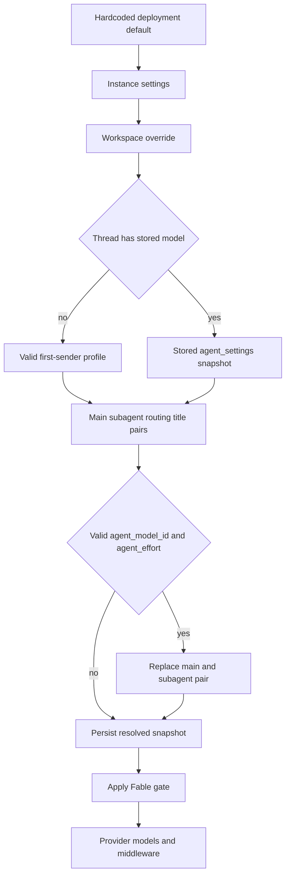

# Model, Profile, and Instruction Resolution

A model choice is not one global setting. A hosted run starts from the effective workspace settings, can use the first sender's profile to seed a new thread, then treats the resulting thread settings as the stable choice for later runs. An explicit valid `agent_model_id`/`agent_effort` is the intentional exception: it replaces the snapshot and becomes the new stored choice. This distinction is important in multi-party, long-lived threads: sender-specific preferences such as draft PRs and standing instructions are refreshed during preparation, while the operational model and repository-instruction choices are retained by the thread.

See [Agent graph](../architecture/agent-graph.md), [Threads and state](threads-and-state.md), [Dashboard UI](../integrations/dashboard-ui.md), [Configuration](../operations/configuration.md), and [Context engineering](../workflows/context-engineering.md).

## Valid choices and recovery

`SUPPORTED_MODELS` in `agent/dashboard/options.py` is the selectable-model registry. A `ModelOption` supplies a provider-prefixed id, label, supported `efforts`, `default_effort`, image support, and optionally whether it can be a saved default. `SUPPORTED_MODEL_IDS` is the membership set used by the resolution layers. Effort is model-specific rather than a universal enum: for example, Kimi K3 permits only `low`, `high`, and `max`; some choices support `none`; and only some support `xhigh` or `max`. Use `model_supports_effort` and `model_supports_images` rather than accepting a persisted pair unchanged.

The `/options` presentation path enriches copies of those options with context-window data. It uses Codex-specific overrides first, then LangChain provider profiles, then fallback values, without altering the registry. The `FABLE_MODEL_IDS` set is derived from this registry, while `NON_DEFAULT_MODEL_IDS` prevents a model such as Fable from being stored as a profile or workspace default.

### Defaults, stale ids, and Fable

`default_model_pair()` is the terminal deployment fallback. It reads `LLM_MODEL_ID` and `LLM_REASONING_EFFORT`, chooses a credential-sensitive built-in model when no id is configured, and rejects unsupported, non-default-eligible, or invalid-effort selections with `ValueError`. This makes a bad deployment default visible instead of silently constructing an arbitrary provider model.

Staleness has deliberately different semantics:

* A non-deprecated id that is no longer registered can recover through `provider_fallback_pair`: it prefers the same Claude family when applicable, otherwise the first supported model for the same provider. A compatible effort is retained (including Gemini `none` to `minimal`); otherwise the fallback default effort is used.
* An explicitly deprecated id never uses that provider fallback. `DEPRECATED_MODEL_REPLACEMENTS` currently has empty replacement values and `canonical_model_pair()` returns `None`, so deprecated choices defer to a workspace or deployment default instead of being silently migrated.
* Workspace role resolvers guarantee a constructible pair: valid configured pair, same-provider recovery, then `default_model_pair()`.

Fable is additionally a workspace-wide ZDR guard. It cannot be saved as a normal default, and disabling `fable_enabled` rewrites Fable defaults to the safe non-Fable Anthropic fallback. `gate_fable_model` is applied after thread resolution to main, subagent, and title models, and also on dashboard selection. A stale Fable snapshot therefore cannot reach construction while the workspace has disabled it.

## Stored defaults and resolution precedence

Workspace settings have two persisted tiers. The instance record remains keyed `"default"` in `["team_settings"]` for compatibility; a workspace has a sparse record in `["workspace_settings"]` keyed by slug. Effective values merge in this order: hardcoded defaults, non-null instance fields, then non-null workspace fields. A failed store read logs a warning and returns hardcoded defaults, preventing a shared settings outage from failing every run.

Defaults are role-specific. Agent and reviewer each have main and subagent pairs; review chat inherits the agent pair when no valid chat-specific pair is set. The workspace also defines `fast`, `balanced`, and `performance` routing pairs and a separately resolved title pair. The title resolver can substitute the Anthropic title default for an OpenAI title model on an Anthropic-only deployment without usable gateway routing or desktop OpenAI OAuth.

Profiles are records in `["profiles"]` keyed by GitHub login. They hold main and optional subagent pairs, repository and branch preferences, PR/CI preferences, and an optional `model_routing_enabled` preference. OAuth tokens are deliberately stored separately and encrypted in `["oauth_tokens"]`, avoiding a read-modify-write conflict between profile editing and token refresh. Run-start profile reads are fail-soft; the dashboard CRUD reader intentionally lets store errors surface. A profile pair must be valid and default-eligible, although a stale non-deprecated id can recover on its original provider.

*Caption: workspace settings seed a thread once; a valid explicit run choice is the supported way to replace its stored model pair.*

In `build_agent`, the factory loads `agent_settings` from thread metadata before profile resolution. If a stored `model_id` exists, it overrides the main/subagent pair and the routing-enabled flag; stored routing pairs also override current workspace routing defaults. If no model is stored, a valid triggering-user profile can replace the workspace main pair (and becomes the subagent pair unless the profile supplies a valid subagent pair). The factory then applies a valid explicit run pair to both main and subagent settings. It writes the resolved settings—including routing choices and repository instructions—back to the thread before applying the Fable construction gate.

`agent_settings` is a typed metadata snapshot with a five-minute cache. It contains model/subagent pairs, routing state and pairs, and `repo_instructions`; obsolete keys are stripped, malformed metadata becomes an empty snapshot, and reads/writes fail soft. Thus changing a workspace default affects new threads, but does not normally move an existing thread. Conversely, a deployment Fable switch is checked after snapshot loading and remains effective for every run.

Dashboard thread creation uses a related one-shot selection order—workspace agent default, valid profile pair, then valid request pair—and immediately gates Fable. A deprecated requested id bypasses both request and profile choice and leaves the workspace default. For image-bearing dashboard creation, a text-only resolved model is replaced with `default_vision_model_pair()`; direct image block construction rejects absent or text-only models with HTTP 422.

## Adaptive routing and provider construction

Adaptive routing is opt-in. A profile's boolean `model_routing_enabled` overrides the workspace setting when a snapshot is first seeded; an existing snapshot supplies its own routing flag. For dashboard runs, `model_selection` of `auto` or `explicit` sets routing on or off for that invocation before snapshot persistence. Slack ask runs disable adaptive routing.

When enabled, `ModelSelectionMiddleware` constructs the workspace/snapshotted fast, balanced, and performance models. It uses the fast model as a hidden structured-output classifier, classifies the latest real human task (limited to 8,000 trailing characters), and routes the model call. Classification failure is logged and falls back to `balanced`; a persisted `model_route` is reused, and a split based on the thread id selects either classifier-driven `auto` or forced `fast` mode. The selected model id is emitted as a cosmetic stream event only in `auto` mode.

`provider_model_kwargs` translates a resolved effort at the provider boundary:

| Provider family | Result |
| --- | --- |
| OpenAI | `reasoning`, with `summary: "auto"` except for `none` |
| Anthropic | adaptive, summarized `thinking` plus `effort` |
| Gemini 3 | `thinking_level` |
| Fireworks | `model_kwargs.reasoning_effort` |
| Baseten | `reasoning_effort` for `low`, `high`, or `max` |

`make_model` calls `init_chat_model` with six retries and a 600-second timeout for shipped provider prefixes. OpenAI defaults to the Responses API with `store=False`, `output_version="responses/v1"`, and encrypted reasoning included; without gateway routing and without `OPENAI_API_KEY`, desktop OAuth can build the model. Baseten is treated as OpenAI-compatible and requires `BASETEN_API_KEY` plus its base URL when not gateway-routed. The factory catches construction failures and installs a deferred-error model, allowing failure to be reported at invocation rather than aborting graph assembly.

Gateway routing is tri-state: a workspace `gateway_enabled` value of `True` or `False` wins, while `None` inherits `LANGSMITH_GATEWAY_ENABLED` or, if unset, the presence of `LANGSMITH_GATEWAY_API_KEY`. For routable providers with a LangSmith key, gateway overrides replace direct `base_url` and API key and decide OpenAI Responses use. Missing gateway credentials or an unroutable provider are logged and remain direct-provider calls.

Runtime fallback is separate from stale-selection recovery. `ModelFallbackMiddleware` honors `LLM_FALLBACK_MODEL_ID` first; otherwise Anthropic primaries fall back to OpenAI and OpenAI primaries to Anthropic. Google, local, and self-hosted providers are not silently redirected.

## Instruction layers and persistence

There are four materially different instruction sources:

* **Repository custom instructions** are dashboard-managed `["agent_instructions"]` records keyed by `owner/name`. The factory resolves them for the prompt's effective default repository only when no thread model snapshot exists, then stores the result as `repo_instructions`. The system prompt renders non-empty content as the repository custom-instructions section. This makes the repository text thread-stable, and lookup failure merely omits it.
* **Workspace instructions** are attached to the resolved workspace and passed to `construct_system_prompt` on every preparation. They are rendered as a distinct workspace section; unlike repository custom instructions, they are not in `ThreadSettings`.
* **User instructions** live in `["user_instructions"]`, keyed by login and capped at 20,000 characters. They are separate from profile records because both the dashboard and `save_user_instructions` can update them. During prepare-run, participant construction loads current instructions fail-soft and puts them in that participant's `standing_instructions` context. They are therefore personal, current participant context—not the shared repository snapshot.
* **Repository `AGENTS.md`** is a file-level convention mechanism, separate from custom prompt sections. `SubdirAgentsReadMiddleware` appends readable ancestor `AGENTS.md` content to a `read_file` result as a system reminder, once per thread/path; nested files take precedence. The reviewer can also fetch root `AGENTS.md`, falling back to `CLAUDE.md`, with a 64 KiB cap. These mechanisms do not imply that a user profile can override repository policy.

The main system prompt assembles default/deployment prompt content, repository custom instructions, recent context, workspace instructions, and shared guidance. Do not describe these as a universal strict precedence chain unless the target prompt explicitly establishes one: repository custom instructions are a shared snapshot, workspace instructions are current system-prompt input, user instructions are participant context, and `AGENTS.md` is scoped file-read/reviewer guidance.

## Focused verification

`tests/models/test_model_fallback_resolution.py` exercises environment defaults, stale same-provider recovery, deprecated-id deferral, context-window enrichment, profile/workspace validation, and Fable behavior. `tests/dashboard/test_dashboard_thread_api.py` covers workspace/profile/request selection order, deprecated-request behavior, image fallback, and HTTP 422 image validation. `tests/agent/test_thread_settings.py` verifies typed snapshot normalization, while `tests/agent/test_agent_assembly_context.py` and `tests/models/test_agent_subagent_models.py` cover factory wiring, snapshot stability, routing, profile inheritance, and Fable gating.
