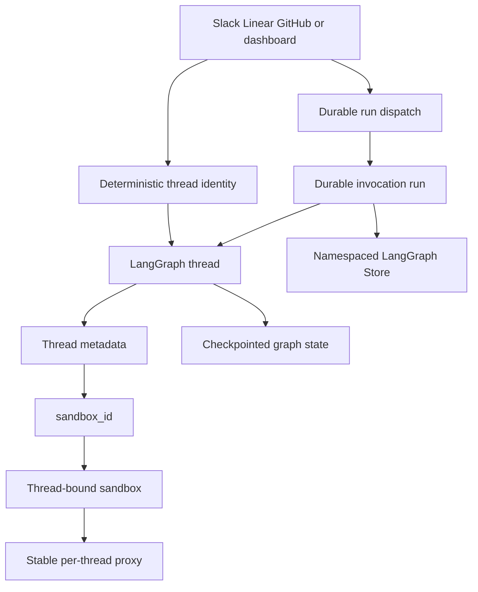

# Threads, Runs, and Durable State

A LangGraph **thread** is Open SWE's unit of conversational continuity. Its stable `thread_id` selects durable graph/checkpoint state and history. A **run** is one execution against that thread: it contributes input and executes the selected graph; it does not replace the thread. Thread metadata is a durable, queryable cross-surface index, while the LangGraph Store is separately namespaced application storage.

This distinction is a change-safety boundary. A webhook, dashboard action, reviewer, or background job should rejoin the intended identity, provide new input, and preserve existing metadata and sandbox state rather than make a random conversation or silently replace working state.

The thread owns durable graph identity, metadata connects it to a sandbox, and runs use checkpoints and Store records without conflating those layers.

## Identity is a persistence contract

`agent/thread_ids.py` is the single home for deterministic derivation. These IDs are cross-process routing contracts: webhooks, the dashboard, and reviewer flows independently derive an ID from the same external identifiers. Changing a key format or namespace orphans live threads from their normal entrypoints.

| Purpose | Stable key and derivation |
| --- | --- |
| Slack location | `slack:{channel}:{timestamp}:{nonce}` via UUIDv5 |
| External PR agent thread | `{owner}/{repo}/pr/{pr_number}` via UUIDv5 |
| PR reviewer | `{owner}/{repo}/pr/{pr_number}/reviewer` via UUIDv5 |
| Review scout | `{owner}/{repo}/pr/{pr_number}/review-scout` via UUIDv5 |
| Per-user PR chat | `{owner}/{repo}/pr/{pr_number}/chat/{login.lower()}` via UUIDv5 |
| Review style | `{owner}/{repo}/review-style` via UUIDv5 |
| Linear or GitHub issue | `linear-issue:{issue_id}` or `github-issue:{issue_id}` via a SHA-256-derived UUID |
| Baby-sit lock | `open-swe:baby-sit-lock:{key}` via UUIDv5 |

The reviewer key is deliberately distinct from `pr_comment_thread_id`, so autonomous review and an agent conversation about the same PR cannot collide. For an Open SWE-created branch, the GitHub PR-comment handler first recovers the embedded UUID with `thread_id_from_branch`; it uses the PR-derived fallback only when no UUID exists. Linear routes deliveries for an issue through `linear_issue_thread_id(issue_id)`.

### Slack locations, mappings, and code channels

A Slack location has an explicit Store mapping in `("slack_thread_map", channel)`, keyed by timestamp. `resolve_slack_thread_id` reads that mapping first; otherwise it searches thread metadata for a matching `source_context`, fails if more than one thread matches, then binds either the match or the deterministic Slack fallback. Binding validates the location, rejects a different existing mapping, and read-verifies its write. A location therefore cannot silently map to two Open SWE threads.

Detaching a location writes a fresh nonce instead of merely deleting the map. The next deterministic fallback is consequently a different ID and cannot collide with the retired conversation.

A Slack code channel represents one whole-channel session, using `CODE_CHANNEL_SESSION_TS = "0"` rather than a reply timestamp. `manage_code_channel` binds the original agent thread at `(channel_id, "0")`, updates its `source_context`, then detaches the source location. The sentinel controls context retrieval: a code session reads channel history, whereas an ordinary conversation reads replies for its thread timestamp. Its `processing`, `active`, `suspended`, and `closed` session states belong to the Slack code-channel UI, not to LangGraph thread status.

## Metadata, Store, and settings

`source_context` in thread metadata records the Slack location, Linear issue, GitHub issue, and PR provenance. It preserves supplied unknown fields and emits only supplied fields, so integrations can enrich it without erasing one another's data. Malformed historical context becomes an empty context rather than failing a run. Metadata also stores participants as key-per-person `participant_logins` and `participant_emails` objects: JSONB containment can then find one participant entry. Reviewer threads carry `kind = "reviewer"`; completion handling uses that marker to avoid treating them as normal agent Slack work.

Thread-level `agent_settings` is a snapshot: model, effort, subagent settings, routing and repository instructions are resolved on the first run. Sender identity, personal instructions, and PR preferences remain message-specific. Profile edits therefore do not change an existing thread until an explicit rewrite, such as a per-run model override. The snapshot is strictly normalized, cached for five minutes, and its read/write helpers fail soft so settings persistence does not prevent a run.

The Store is not metadata. `agent/store.py` is the sanctioned interface for namespaced records: only a missing item is `None`; other failures propagate so an outage is not mistaken for absence. `TypedStore` validates a namespace with a Pydantic model. A requested unreadable record raises, but search/list operations log and skip bad records so one corrupt historical entry cannot break a listing.

## Input, per-run configuration, and dispatch

A run adds normalized input to the thread. `build_run_input` serializes authored content into an escaped `<input-message>` envelope with validated namespaced sender identity, surface, kind, optional channel, and structured data. It can prepend hashed channel and system `<dynamic-context>` introductions. Previously injected introductions are suppressed; when summarization hides messages before its cutoff, only context still visible to the model is considered injected, allowing necessary context to be reintroduced.

`RunConfig` is the tolerant per-run `configurable` contract. Unknown keys round-trip, only supplied fields are emitted, and parsing drops invalid fields rather than discarding a whole configuration. This makes it safe for webhook, dashboard, and cron writers to add independent fields while retaining essentials such as `thread_id`.

`dispatch_agent_run` is the common trigger entrypoint for Slack, Linear, GitHub, dashboard, and background work. It rejects ambiguous use of both prebuilt input and source material, builds input if necessary, and delegates to `create_durable_run`. Dispatch merges run metadata, resolves or creates an invocation ID, copies the invocation start time into metadata and `configurable`, and enables the v3 streaming compatibility marker.

`create_durable_run` defaults to `multitask_strategy="interrupt"`, `durability="sync"`, `if_not_exists="create"`, and resumable streaming. Sync durability checkpoints before each step, so a crash or recycle resumes at the last checkpoint. Interrupt preserves that checkpoint while a follow-up runs with thread history; background follow-ups may opt into `enqueue`. It requests v3-compatible stream modes and subgraph streaming, so a dashboard attaching to a run it did not create can replay events and observe tool and subgraph activity.

A completion webhook is attached only when `RUN_COMPLETE_WEBHOOK_SECRET` is set and `COMPLETION_WEBHOOK_URL` is an absolute non-loopback HTTP(S) URL. Invalid or unavailable configuration degrades to no webhook with a warning rather than making every `runs.create` fail. Checkpoint TTL is configured with deletion strategy, a 43,200-minute default TTL, and a 60-minute sweep; dormant checkpoint state is eventually deleted.

## Queued follow-ups

Webhooks generally interrupt rather than use an in-process busy lock. A Store FIFO remains for deliberate dashboard follow-up injection and Slack edit handling. It uses `("queue", thread_id)` / `pending_messages`, deduplicates a supplied `queue_id`, caps the queue at `MAX_QUEUED_MESSAGES` (100), and discards oldest messages beyond that cap. Completion can dispatch a pickup run for leftovers, guarded so it does not interfere with a newly started run.

## Sandbox continuity and recovery

Thread metadata's `sandbox_id` ties a conversation to its working tree. `ensure_sandbox_for_thread` reuses a cached connection when available, otherwise reconnects using that ID; it creates only when there is no usable recorded sandbox. An unreachable sandbox raises `SandboxUnreachableError` instead of being replaced, protecting uncommitted work. A `SandboxGoneError` is replaceable because the deleted sandbox cannot be recovered; `allow_replacement` additionally permits an unreachable read-only reviewer sandbox whose checkout is re-derivable.

For a new or replacement sandbox, the ID is written to metadata only after creation and initialization. The backend is published to the thread-keyed proxy last, so a failed preparation cannot expose a half-built backend or leave a durable ID for a later run to adopt. `SandboxBackendProxy` is a stable handle: it serializes lazy reconnect and lets middleware holding the proxy observe the newly connected target rather than a stale backend object.

## Operational checks

When changing this area, test the durable boundaries rather than only the immediate caller:

- Preserve deterministic ID formulas; test PR branch recovery, issue redelivery, mapping conflicts, metadata fallback, duplicate Slack metadata matches, and nonce retirement.
- Test the code-channel `"0"` sentinel separately from normal Slack reply threads and do not conflate Slack session status with LangGraph status.
- Test dispatch defaults, prebuilt-input exclusivity, invalid webhook degradation, interrupt versus enqueue semantics, and v3 resumable/subgraph streaming.
- Test escaping and namespaced identity validation in input envelopes, dynamic-context suppression, and reintroduction after summarization.
- Test Store absence versus failure, queue deduplication/capping, settings fail-soft behavior, and sandbox create-bind-publish ordering.

For surrounding flows, see [Agent Graph](../architecture/agent-graph.md), [Sandbox Lifecycle](../architecture/sandbox-lifecycle.md), [Invocation](../workflows/invocation.md), [Follow-up Messages](../workflows/follow-up-messages.md), and [Models, Profiles, and Instructions](./models-profiles-instructions.md).
