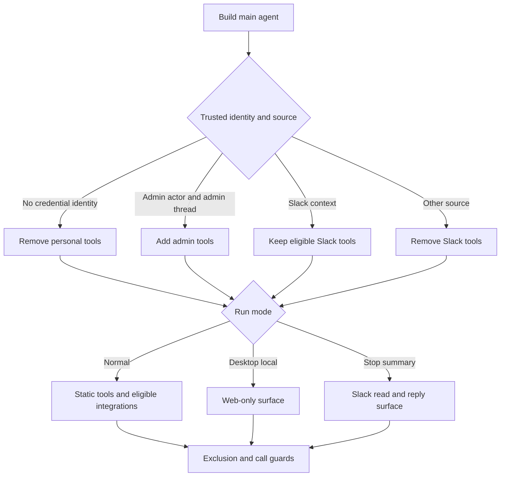
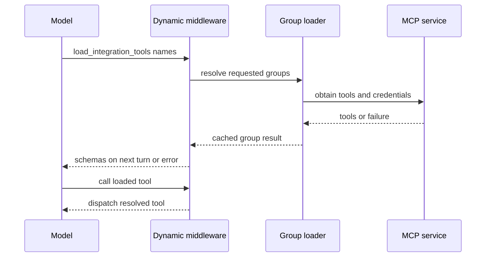

# Tool Surface and Capability Gating

Open SWE treats the importable tool catalog as distinct from an executable tool surface. A capability becomes available only after its graph factory wires it in, run context passes source, identity, and mode gates, and middleware permits the call. Sensitive operations additionally enforce their own authorization or approval boundary.

## Capability selection and gates

Authorization and mode gates happen before tool families are enumerated. `get_agent` derives admin access from the runtime actor rather than trusting a client-supplied flag; it fails closed when private-thread visibility cannot be read. A missing credential identity removes personal settings and skills tools. Slack tools require trusted source context and a valid channel or thread; channel-history reading additionally requires a private thread. Desktop local runs and stop-summary runs replace, rather than merely trim, the normal static surface.

This selection flow shows that graph wiring is necessary but not sufficient: the final model-visible set is shaped by trusted run state and middleware.

`agent.tools` is a lazy public facade. `_TOOL_MODULES` maps exported names to local or selected integration modules, imports an export on first access, and caches it. Its custom module type prevents an imported submodule with the same name from shadowing the intended public export. Exporting a name does not grant it to every graph.

## Main-agent surface

For a normal run, `agent.server:get_agent` starts with web access, background execution, plan and user-preference tools, thread and baby-sit operations, PR and expedited-review actions, sandbox recovery, feedback and scheduling, safe settings lookup, and Slack operations. It adds signed sandbox download, iframe, and port-exposure helpers only for supported non-desktop LangSmith sandboxes. Expedited-review operations require non-local execution, a Slack bot token, and workspace enablement.

`ADMIN_TOOLS` are added only when `actor_has_admin_context` confirms both an admin-stamped thread and a still-authorized actor (or an authorized scheduled invocation). They cover automation, workspace lifecycle and repository configuration, and organization-skill mutation. `read_only_sql` and review-approval policy management have the stronger private-admin-surface requirement.

The remaining major source and mode rules are:

- A local desktop run exposes only `http_request`, `fetch_url`, and `web_search`; a stop-summary run exposes only `slack_read_thread_messages` and `slack_reply`.
- Slack tools are removed without trusted Slack context. In a Slack DM, reactions are removed; in Slack ask mode, tools that require an existing thread are excluded. Automatic incident sessions append incident tools but exclude mutating, delegation, reply, and administrative capabilities unless explicitly requested.
- `ExcludeToolsMiddleware` runs after Deep Agents injects built-ins, which lets the main graph hide `grep` in normal runs and additionally hide filesystem mutation, shell execution, delegation, and deletion in stop-summary mode.
- The general-purpose subagent is compiled separately, so it receives explicit dynamic, workflow-push, model, and shell guard middleware. A tool-call guard rejects parent-only tools such as background execution, thread management, settings reads, and most Slack operations.

## Deferred MCP and personal integrations

Normal non-local, non-summary runs with a known credential scope collect two deferred groups: workspace MCP tools and personal Notion tools. MCP sources are loaded in instance, workspace, then user order, with a later same-named connection replacing an earlier one. The factory caches loading with a timeout and failure degrades to an empty tool list. `DynamicToolMiddleware` advertises only names through `load_integration_tools`; it does not disclose every tool schema on the initial model call.

The loader records selected names in run state, so a tool is injected on the next model turn only after it was explicitly loaded.

Dynamic names must be unique and cannot collide with `load_integration_tools`, built-ins, or static names. Each group has a lock and a once-only cached resolution, including failure. The middleware resets loaded names before a non-forked run; unknown, unloaded, or unavailable tools return recoverable error messages rather than failing the run.

Notion is deliberately personal and private-owner scoped. Stored tokens are encrypted; status APIs expose connection metadata rather than tokens. The initial MCP connection discovers schemas, but each wrapped Notion call requires `on_behalf_of`, resolves that participant, verifies it is the private credential owner, obtains a fresh access token, and reconstructs the MCP tool. If credentials, refresh, or loading fail, Notion tools are absent or the call explains that reconnection is needed.

## Sandbox and specialist surfaces

The main agent uses a sandbox-backed Deep Agents graph. Sandbox helpers are conditional as above, while tool middleware protects operations that could bypass audited workflows:

- `PullRequestCreationGuardMiddleware` intercepts `execute` and `background_execute` commands that create a PR via `gh pr create`, POSTs to GitHub's pulls endpoint, or `curl`. It returns a structured, non-recoverable error directing the agent to `open_pull_request`, preserving triggering-user attribution instead of allowing a shell fallback.
- `WorkflowPushGuardMiddleware` recognizes constrained `git push origin` commands. When the sandbox diff includes `.github/workflows/` changes, it records a fingerprinted pending approval with a bounded diff preview, may notify the Slack thread, and blocks the push. Approval permits only the normalized exact push command; a changed workflow diff produces a different fingerprint and needs approval again.

Specialist graph factories intentionally expose narrower surfaces:

| Graph | Curated tool surface |
| --- | --- |
| Reviewer | Review diff and finding lifecycle tools, plus `web_search`, `fetch_url`, and `http_request`; it does not wire `open_pull_request`. |
| Analyzer | Only `save_review_style_prompt` and `read_finding_outcomes` for review-style guidance. |
| PR chat | GitHub-backed `read_repo_file` and `search_repo_code`, review-findings lookup, and web read tools. It has no sandbox and excludes execute and filesystem writes; its subagent is similarly read-only. |

## Tool-side authorization

Graph placement is a least-privilege measure, not an authorization substitute. `read_user_settings` obtains the private owner or verified thread participants from runtime context rather than caller arguments. It returns allowlisted profile settings, instructions, Notion connection status, and an unresolved-participant count, never credentials or connection tokens.

Automation tools recheck `require_admin` at invocation and use an authorized schedule record for scheduled runs. They wrap the schedule store with structured `{ok: false, error: ...}` outcomes. Creation records the verified identity; updates reject contradictory clear/set values while preserving omitted fields; triggering delegates to the schedule service. This repeated identity check protects the operation if graph construction or thread membership changes after the tool was offered.

## Extending safely

1. Add a curated tool and lazy export only when it is a reusable capability; then wire it deliberately into the needed graph factories.
2. Specify source, identity, privacy, sandbox, local-run, summary, and subagent behavior before adding it to the normal surface. Reserve its name against static and dynamic tools.
3. Use an `IntegrationGroup` for optional or expensive MCP capabilities. Loading must tolerate timeouts and service failures without terminating the run.
4. Enforce authorization, actor/resource scope, and irreversible-action approval in the tool or middleware boundary. Never use a model argument as authority; keep credentials server-side and return redacted status or actionable errors.
5. Add focused tests for composition and filtering, loader state and failure behavior, credential refresh/scope, authorization denial, and command guards. Existing coverage in `tests/middleware/test_dynamic_tools.py`, `tests/tools/test_notion_mcp_tools.py`, `tests/github/test_pr_creation_guard.py`, and `tests/agent/test_workflow_push_guard.py` illustrates these boundaries.

## Related pages

- [Agent graph](../architecture/agent-graph.md) — graph construction and runtime assembly.
- [Middleware stack](../architecture/middleware-stack.md) — ordering and cross-cutting enforcement.
- [Authorization and security](auth-and-security.md) — identity and credential trust boundaries.
- [Observability and MCP](../integrations/observability-and-mcp.md) — MCP connection configuration.
- [PR creation](../workflows/pr-creation.md) — attributed PR workflow behavior.
