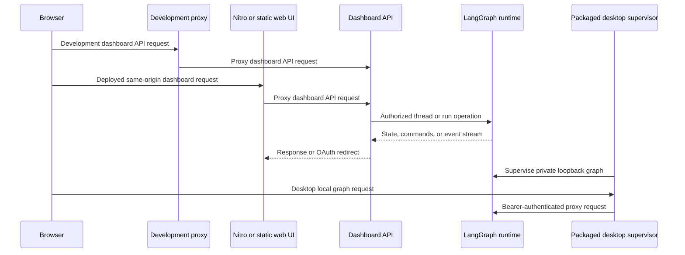

# Dashboard, Web UI, and Desktop Clients

The dashboard is the user-facing control plane for Open SWE. Its FastAPI API authenticates people, applies product authorization, owns dashboard-specific records, and mediates access to LangGraph threads and runs. The React web application and experimental Electron client deliberately consume those mediated interfaces rather than exposing deployment or LangSmith credentials to a renderer.

## Request topology and ownership

`create_app()` installs the dashboard router alongside separate plan and workflow-approval routers, webhook and health routes, then mounts the UI. The dashboard router is rooted at `/dashboard/api` and composes feature routers for authentication, profiles, repositories, reviews, settings, schedules, skills, threads, transcripts, workspaces, and integrations. The graph runtime retains its own `/threads`, `/runs`, `/assistants`, and related APIs; the dashboard does not make those raw endpoints a browser contract.

Diagram: web development, deployed web traffic, dashboard-to-runtime operations, and desktop-local execution use distinct boundaries.

The browser normally builds relative `/dashboard/api/*` URLs and includes credentials. Vite development proxies backend prefixes to the Python service, preserving the browser's apparent origin. The deployed TanStack Start/Nitro application instead registers `ui/server/backend-proxy.ts` for `/dashboard/api/**` and `/webhooks/**`; it reads `DASHBOARD_API_URL` at request time and refuses to run without it. That proxy streams requests, does not follow OAuth redirects, removes hop-by-hop and reframed headers, and preserves each upstream `Set-Cookie` header separately. During SSR, the fetch layer addresses `DASHBOARD_API_URL` directly and copies the incoming cookie header explicitly, since server-side `credentials: "include"` does not carry browser cookies.

## Authentication and mutation boundary

GitHub OAuth starts with signed state containing a hash of a nonce stored in a short-lived state cookie. The normal callback verifies that nonce, exchanges the code, applies the GitHub login gate, persists the access-token response, signs the user in, and sets the session cookie. Desktop login follows the same identity checks but redirects a PKCE-bound handoff code to a fixed loopback callback and leaves no browser session behind. The desktop process redeems it at `POST /dashboard/api/auth/desktop/exchange` using the verifier, so possession of a URL-visible handoff code alone cannot mint a desktop session.

`require_session` decodes the session cookie and returns `401` for a missing one. Endpoint dependencies then add feature-specific authorization such as administrator status, repository access, or whether a thread can be read or prompted. The router-level `require_same_origin_for_mutations` guard protects cookie-backed mutations: safe methods pass, and a bearer-token-only request passes, but a cookie-authenticated mutation must have an allowed `Origin` or `Referer`. WebSockets always receive the origin check. Configured `DASHBOARD_ALLOWED_ORIGINS` enables credentialed CORS but rejects `*`.

## Threads, activity, and streamed runtime operations

The thread API is the dashboard adapter for ordinary agent conversations. It lists participant-scoped threads for normal users and reserves `all=true` for admins; it offers summaries, pinning, messages, rename/resolve/delete actions, diffs, PR context, and run cancellation. Thread listing applies metadata filters before building summaries and refreshes potentially active run metadata with a concurrency limit of eight. A detail request is a dashboard summary/read operation, while `/threads/{id}/state` supplies state separately.

For client SDK compatibility, dashboard routes proxy controlled LangGraph operations. `POST /threads/{id}/stream/events` first validates JSON content and thread readability, then forwards to the runtime's event-stream endpoint as SSE. `/commands` similarly parses and authorizes command requests before forwarding. A missing thread may be created only by `run.start`; it is stamped and attributed on that path. When a thread is busy, a person can request a queued follow-up or steer the running thread; a machine principal receives a conflict instead. These rules preserve the LangGraph protocol while preventing the browser from bypassing dashboard authorization or metadata attribution.

A completed surfaced thread can be marked viewed by an authenticated reader, and callers may opt out with `mark_viewed=false`; running threads are not marked viewed. Pins are per-login identifiers rather than authority grants: loading them fetches each saved thread and excludes entries that are missing or no longer readable.

Cloud terminal access is a separate two-step capability. `POST /threads/{id}/terminal/connect` validates access and sandbox readiness, returns a no-store WebSocket URL plus the `open-swe-terminal` subprotocol and a thread-bound signed ticket. The WebSocket reads that ticket from the offered subprotocol, rechecks thread and sandbox access, only supports LangSmith sandboxes, and limits active sessions with a 20-slot semaphore. It bridges bounded input and terminal resize messages to a PTY and cleans up the handle on exit or disconnect.

## Plans and workflow approvals

Plans are dashboard-owned review artifacts under `/dashboard/api/plan`. Read endpoints require a readable thread; updating a plan or adding comments requires a promptable thread. Plan edits retain existing comments, validate non-empty content, persist the content, and write the updated plan to the thread sandbox. Only the comment author may delete a comment.

Workflow-file push approvals use `/dashboard/api/workflow-approval`. Any reader can see approvals, but approve and reject require a promptable thread. An approval records the decision and dispatches an attributed follow-up instructing the existing agent thread to retry its blocked push; rejection records the decision without that retry. Both plan and approval routers have the same mutation-origin protection as the main dashboard router.

## Browser UI serving and routing

When a static build is present, `mount_dashboard_ui` serves its hashed `/assets` files with one-year immutable caching and answers browser navigations with `_shell.html` using `no-cache`. It does not shadow dashboard APIs, webhooks, health, LangGraph runtime, documentation, metrics, or asset routes. Unknown non-HTML paths fall through instead of receiving the application shell. `DASHBOARD_STATIC_DIR` selects a build explicitly; otherwise the in-repository `ui/.output/public` build is used if available. A UI built beneath a LangGraph mount prefix must use the matching `DASHBOARD_BASE_PATH`, which the TanStack router obtains from Vite's `BASE_URL`.

For development, `DASHBOARD_DEV_SERVER_URL` swaps the static shell for a reverse proxy to Vite while retaining the backend origin for API calls and OAuth callbacks. The catch-all must remain after all application routes; code that adds routes later calls `keep_dashboard_ui_last`. The UI has distinct product areas including agents, assistant, automations, incidents, reviews, settings, workspaces, administration, and integrations. On agent routes, unauthenticated access is permitted only for desktop local-only mode at the local home or `/agents/local/...` paths; other routes redirect to login.

## Packaged desktop and local graph

The Electron application serves the compiled UI at the privileged `open-swe://app` origin. Its main process, not the renderer, owns backend configuration, sessions, login handoff, project selection, and the local graph. Requests to the private `/local-graph` prefix are proxied to a supervised `127.0.0.1` runtime: the proxy removes renderer cookies, injects the supervisor's random bearer token, and exposes only the stable configuration `{ apiUrl: "/local-graph", graphId: "agent" }`.

`BackendSupervisor` starts lazily and coalesces concurrent starts. It reserves a loopback port, generates its token, checks project/worktree configuration, and starts `langgraph dev` from `langgraph.desktop.json` during development or the bundled runtime/configuration in packaged builds. It supplies the project allowlist, worktree directory, and—when configured—checkpoint and artifact paths to the child. Startup polls the authenticated loopback service for up to 60 seconds and retains child output for an error. Shutdown clears public state, sends `SIGTERM`, then escalates to `SIGKILL` after five seconds if needed.

A run whose source is `desktop` uses `LocalShellBackend` rather than a cloud sandbox. Its requested path must resolve to an existing allowlisted project or a desktop-managed worktree. Desktop scratch routes for `large_tool_results` and `conversation_history` use sanitized per-thread directories outside the project, avoiding accidental working-tree changes from agent artifacts.

## Focused verification and safe changes

Dashboard tests exercise shell routing, cache behavior, reserved-path precedence, mount-prefix serving, and Vite proxy behavior. Thread activity tests cover stale run-status refresh and viewed-state rules; cloud-terminal tests cover ticket binding, expiry, subprotocol handling, and cookie-free WebSocket ticket use. The Electron end-to-end test launches the app against a real local graph and a registered test repository, then verifies a local agent thread under `open-swe://app/agents/local/...`.

When changing these surfaces, keep the boundaries explicit: browser code should use dashboard routes rather than raw runtime credentials; proxy code must preserve OAuth redirects and individual cookies; UI catch-alls must not hide service endpoints; and local graph credentials and ports must remain main-process-only.

## Related

- [Architecture overview](../architecture/overview.md)
- [Auth and security](../concepts/auth-and-security.md)
- [Deployment](../operations/deployment.md)
- [Follow-up messages](../workflows/follow-up-messages.md)
- [Invocation](../workflows/invocation.md)
