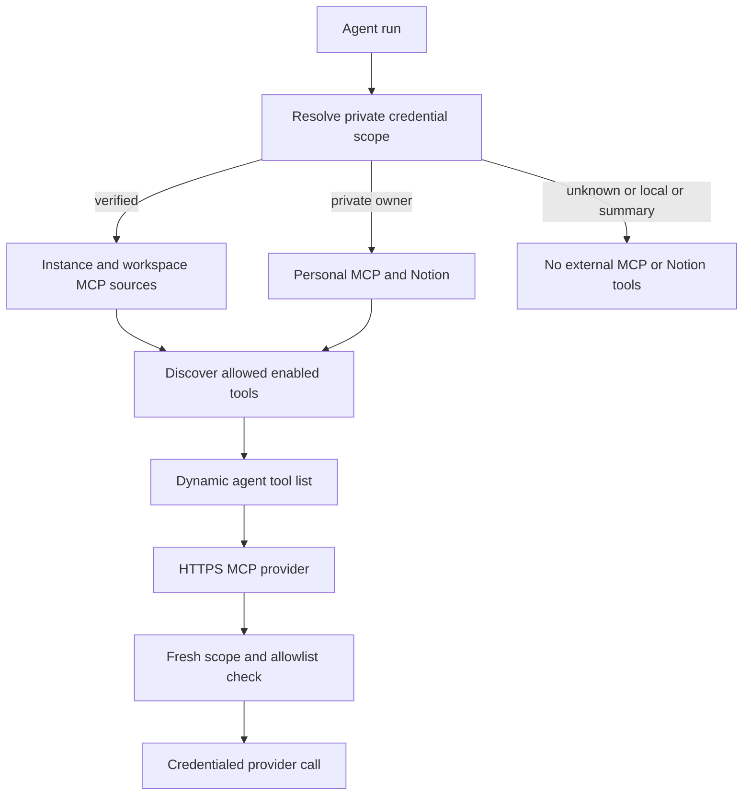

# Observability, External Tools, and MCP

Open SWE has two distinct observability paths. Product analytics is an internal, durable PostgreSQL event pipeline for usage and outcome reporting; APM tracing can name dashboard request spans when Datadog tracing is installed. External capabilities are optional tools: administrator-configured remote MCP servers and a personal Notion MCP connection. A missing verified credential scope, disabled connection, failed catalog lookup, or unavailable provider removes that capability rather than preventing the agent from starting.

See [Agent graph](../architecture/agent-graph.md) for graph construction, [Authentication and security](../concepts/auth-and-security.md) for the trust model, [Tools](../concepts/tools.md) for tool availability, [Dashboard UI](dashboard-ui.md) for management surfaces, and [Configuration](../operations/configuration.md) for deployment settings.

## Capability and credential flow

This flow distinguishes three states:

- **Dynamically loaded:** enabled MCP connections with a non-empty `allowed_tools` list are discovered at agent construction; Notion discovers its hosted catalog for the private owner.
- **Credential-scoped:** instance and workspace MCP connections are available to their run workspace; personal MCP and Notion require the saved owner of a private thread. A public thread has no personal credential login.
- **Unavailable:** local/desktop and summary-stop runs, an unknown credential scope, a disabled/disconnected connection, absent credentials, or a discovery failure yield no external tools. The rest of the agent remains usable.

The server determines the private credential scope before loading integrations. It accepts personal credentials only when the thread is private and its saved owner is the GitHub login that started the run. If this lookup fails, it deliberately omits MCP tools. The factory concurrently loads MCP and Notion tools only for non-local, non-summary runs with known scope; it passes the credential owner to personal loaders but does not use the message sender as an interchangeable credential identity.

## Product analytics and request tracing

### Durable analytics

Analytics emission is intentionally non-blocking from a product perspective. Capture functions run only when the database is configured and catch/log all errors. Events use typed payload models and deterministic UUIDs derived from workspace, producer event identifier, event name, and schema version; payload validation rejects forbidden field names. Producers enqueue the event into PostgreSQL's `outbox` within a transaction, using `ON CONFLICT DO NOTHING` to make repeat emission idempotent.

A worker starts only after the database, analytics workspace, and reporting setup have been initialized. It repeatedly claims a bounded batch using row locks, ingests each event, then acknowledges it. Failures are retried with randomized exponential backoff; after `ANALYTICS_OUTBOX_MAX_ATTEMPTS` they become dead letters. The same worker recomputes summary partitions and applies retention. Thus analytics may lag or be unavailable without interrupting an agent run, while operations can inspect pending, stale, and dead-letter counts.

The dashboard exposes the usage leaderboard and PR merge-rate report to the current session, applying report-side authorization. When analytics storage or queries are unavailable it returns `503`, rather than fabricating a report. Administrative endpoints expose readiness and outbox status.

### APM route names

`TraceResourceNameMiddleware` addresses the case where platform-level Datadog instrumentation sees all mounted dashboard traffic as one resource. After FastAPI routing, it changes the active root span resource to `METHOD route-path`; it also does this during exception unwinding because an outer layer generates the 500 response. The middleware tolerates Datadog tracer import variations and any tracing failure, logging at debug level rather than affecting the HTTP request.

### Optional LangSmith LLM Gateway

The LangSmith LLM Gateway is model routing, not an agent tool or the internal analytics pipeline. `make_model` applies it centrally when enabled. A workspace's tri-state `gateway_enabled` overrides the deployment default; an unset value inherits `LANGSMITH_GATEWAY_ENABLED`, and in the absence of that setting a dedicated `LANGSMITH_GATEWAY_API_KEY` enables it. The gateway key is preferred over `LANGSMITH_API_KEY`; supported OpenAI, Anthropic, Baseten, Fireworks, and Google GenAI calls receive gateway base URL and key overrides.

Unsupported providers and missing LangSmith credentials fall back to direct provider calls with a warning. This makes gateway routing optional even when a workspace setting requests it. Gateway-routed OpenAI retains the Responses API by default; `LANGSMITH_GATEWAY_OPENAI_USE_RESPONSES=false` opts into Chat Completions where necessary.

## Managed remote MCP connections

### Scopes, inheritance, and dashboard APIs

MCP connections have three Store-backed scopes:

| Scope | Namespace | Who manages it | Availability in a run |
| --- | --- | --- | --- |
| Instance | `instance_mcps` | Administrator | Base tier for every workspace |
| Workspace | `workspace_mcps/<workspace>` | Administrator | Overrides same-named instance connection |
| Personal | `user_mcps/<login>` | Connection owner | Overrides same-named instance/workspace connection, only for verified private owner |

The dashboard routes are `GET`/`PUT`/`DELETE` under `/mcps/{name}` for instance connections, `/workspaces/{workspace}/mcps/{name}` for workspace connections, and `/my-mcps/{name}` for personal connections. List routes return only a public connection view. Header reveal is an explicit `POST .../headers/reveal` response with `Cache-Control: no-store`; it decrypts only server-side and fails with a generic error if decryption cannot succeed. `POST .../discover` lists catalog descriptions for configuration and never executes a tool.

At runtime sources are ordered instance, workspace, then personal. A connection with a later matching name replaces the earlier connection entirely. If loading scope data fails, the runtime returns no MCP tools instead of falling back to a lower-precedence source, preventing accidental capability exposure. Historical flat `workspace_mcps` records are adopted into the instance tier on first access, while sharded workspace records are not moved.

### Connection contract and secret handling

A connection has a constrained lowercase name, an HTTPS server URL, `streamable_http` or `sse` transport, `enabled`, an explicit `allowed_tools` allowlist, optional headers, and optional OAuth client-credentials settings. URLs reject embedded credentials, fragments, whitespace/control characters, and secret-like query parameters. Headers reject hop-by-hop and proxy authorization fields, duplicates, invalid names, and unsafe values. The public response exposes header names, not values; header JSON and OAuth client secret are encrypted at rest.

When an update reuses saved credentials it may reuse them only from the same scope and same connection name. Changing a URL requires replacing or clearing existing headers. OAuth cannot be combined with an `Authorization` header, and a new or materially changed OAuth configuration must supply a client secret. This prevents one connection scope from silently borrowing another scope's credentials.

Client-credentials OAuth supports HTTPS token endpoints and `client_secret_post` or `client_secret_basic`. The runtime decrypts the secret only to obtain a bearer token, caches that token by connection identity/settings, refreshes before expiry, and retries once after a `401`. Administrator-facing discovery errors are reduced to safe diagnostic messages rather than provider response bodies.

### Discovery, invocation, and network boundary

For each enabled connection with allowed tools, the server initializes an MCP session, follows paginated `list_tools` results, and rejects repeated cursors or duplicate remote tool names. Catalog discovery is cached for 600 seconds using the connection revision in the key. Tool names are made stable and collision-resistant as `mcp_<connection>_<tool>_<hash>`; only explicitly allowed remote names are wrapped.

Every invocation re-resolves the connection against the original ordered sources. It rejects a disappeared/disabled connection, a changed source scope, URL/transport drift, or a tool that is no longer allowed, requiring a new run where the catalog context changed. Calls and discovery have a 30-second limit. Unexpected call failures become a generic tool error; discovery failures produce an empty group. These are optional, dynamically loaded tools rather than a run prerequisite.

The transport does not trust arbitrary network routing. It permits HTTPS only, disables redirects and environment proxy settings, requires every request to stay on the configured origin, validates that DNS resolves solely to public addresses, and pins the checked address for the connection. This prevents an MCP endpoint or DNS change from redirecting server-side credentials to a private or different origin.

## Personal Notion MCP

Notion is a separate hosted MCP integration at `https://mcp.notion.com/mcp`, using `streamable_http` and a per-user OAuth bearer token. OAuth discovery first reads the Notion protected-resource and authorization-server metadata, then dynamically registers the client. Every discovered authorization, registration, and token URL must be HTTPS on `mcp.notion.com`; authorization uses PKCE with `S256`. The temporary flow stores the code verifier and any client secret encrypted, keyed by a nonce hash, and consumes the record when read.

The resulting connection is stored under `user_credentials/<login>/notion`. Access, refresh, and client secrets are encrypted; dashboard status returns only connection state, expiry, and update time. Credential lookup is fail-soft because it gates an optional tool group. Expiring tokens are refreshed under a per-login lock. An `invalid_grant` refresh removes the stale connection so the user must reconnect.

`load_notion_tools(login)` is dynamically loaded only for the verified private owner. It performs one catalog lookup with the owner's valid access token and adds a required `on_behalf_of` argument to every exposed schema. At invocation, the wrapper resolves the requested participant and then independently requires that it is still the private credential owner; it obtains a fresh token, rebuilds the named MCP tool, and invokes it. A missing authorization, owner mismatch, vanished remote tool, or catalog failure leaves the tool unavailable or raises a reconnect-oriented error—it never substitutes another participant's connection.

## Configuration and verification

Administrators configure instance and workspace MCP connections through the dashboard APIs; users configure personal connections through `/my-mcps`. Configure a concrete `allowed_tools` list after using discovery—an empty list means the connection contributes no tools. For OAuth, configure the token endpoint, client ID, secret, optional scope, and permitted token endpoint authentication method; do not put credentials in an MCP URL.

The MCP tests cover instance-tier separation and migration from legacy flat records, plus isolation of sharded workspace records. The focused Notion observability tests from prior integration generations are no longer present in this checkout; current behavior is primarily protected by the MCP runtime's validation, scope, transport, and loader paths and should be exercised with provider mocks when changed.
