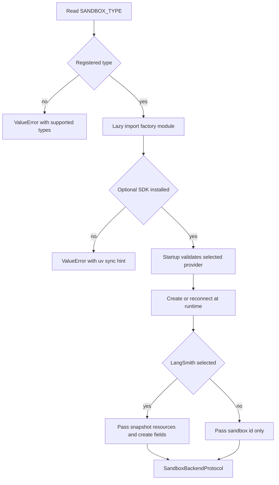

# Sandbox Provider Integration

Open SWE executes repository work through `SandboxBackendProtocol`. Provider selection is deployment configuration, while the sandbox lifecycle owns a thread's persistent binding, initialization, and replacement policy. See [sandbox lifecycle](../architecture/sandbox-lifecycle.md) for the wider thread lifecycle and [configuration](../operations/configuration.md) for environment-variable reference.

## Selection, loading, and startup validation

`SANDBOX_TYPE` defaults to `langsmith`. The registry recognizes `langsmith`, `daytona`, `modal`, `runloop`, `e2b`, and `local`; an unknown value raises `ValueError` with the supported names. Each registry entry names a module and factory, and the module is imported only when selected.

Lazy import is distinct from runtime configuration. `daytona`, `modal`, `runloop`, and `e2b` SDKs are optional dependencies: the base installation contains the default LangSmith and Local providers. Selecting an optional provider without its SDK produces an actionable error naming `uv sync --extra sandbox-<provider>` (or `sandbox-providers`). Startup deliberately loads the selected optional provider early so this deployment error occurs before the first sandbox is requested. It does not treat an unrelated `ModuleNotFoundError` as a missing provider extra.

The selection path separates lazy optional-dependency loading and boot-time validation from runtime provider configuration and creation.

The FastAPI lifespan calls `validate_sandbox_startup_config()` before serving. For LangSmith, startup verifies that resource and TTL environment values are integers, TTLs are non-negative, and `SANDBOX_CREATE_EXTRA_JSON` is a JSON object. Credentials for the third-party factories are checked when the factory runs; loading their optional SDKs is the startup-time check.

## Provider contract and registry dispatch

A provider factory has the shape `create_<name>_sandbox(sandbox_id: str | None = None)` and returns a `SandboxBackendProtocol`. A supplied id means reconnect; omission means create. Register the factory as a `(module, function)` pair in `SANDBOX_FACTORIES`. Factories may be synchronous or native async: the registry awaits coroutine factories and runs synchronous factories in `asyncio.to_thread` so synchronous SDK setup and Local filesystem setup do not block the event loop.

`create_sandbox()` forwards `snapshot_id`, memory, vCPUs, filesystem capacity, and `create_params` only when `SANDBOX_TYPE=langsmith`. All other built-ins receive only the id, so adding provider-specific creation controls requires an explicit integration rather than assuming these generic arguments arrive.

| Provider | Create or reconnect behavior | Runtime configuration |
|---|---|---|
| `langsmith` | Async get/create and a timeout-aware backend wrapper | `LANGSMITH_API_KEY` and `LANGSMITH_ENDPOINT`; snapshot, resource, TTL, and JSON create-body controls |
| `daytona` | Gets an id or creates from a snapshot | `DAYTONA_API_KEY`; `DAYTONA_SANDBOX_SNAPSHOT` defaults to `daytonaio/sandbox:0.6.0` |
| `modal` | Reattaches by id or creates in an app | Modal credentials; `MODAL_APP_NAME` defaults to `open-swe` |
| `runloop` | Retrieves an id or creates a devbox | `RUNLOOP_API_KEY` |
| `e2b` | Connects by id or creates a sandbox | `E2B_API_KEY`, optional `E2B_TEMPLATE`, and a one-hour timeout |
| `local` | Creates a host-backed `LocalShellBackend`; ids are ignored | Optional `LOCAL_SANDBOX_ROOT_DIR`, defaulting to the current directory |

The abstraction intentionally has no provider delete operation. A sandbox may be the only copy of an agent working tree, and metadata reads can fail open to “no sandbox”; LangSmith reclamation is instead controlled at creation through idle and delete-after-stop TTLs.

## LangSmith provisioning and execution

LangSmith uses the application's `LANGSMITH_API_KEY` and `LANGSMITH_ENDPOINT`. The sandbox SDK endpoint is normalized to `/v2/sandboxes`; the same API-root resolution also supplies the service identity JWKS URL. Missing an API key prevents LangSmith provider construction and proxy configuration is skipped with a warning if no key is available.

New LangSmith boxes use the requested snapshot; when it is absent the create request omits `snapshot_id`, causing the platform root snapshot to be used. Defaults are 4 vCPUs, 16 GiB memory, 128 GiB filesystem capacity, a two-hour idle TTL, and a 30-day delete-after-stop TTL. A memory or CPU override causes the other of those two values to remain `None`, rather than mixing a partial request override with a deployment default. Zero disables either TTL.

`SANDBOX_CREATE_EXTRA_JSON` supplies a deployment-level JSON object, and call-specific `create_params` win on conflicts. Because the SDK lacks arbitrary create-field support, the provider temporarily wraps its HTTP transport and injects extras only into `POST /boxes`. LangSmith creation retries retryable status and transient creation failures up to three attempts.

`TimeoutLangSmithSandbox` supplies asynchronous command execution. With an effective timeout it starts a nonblocking command and waits for that timeout plus `SANDBOX_EXECUTE_CLIENT_GRACE_SECONDS` (30 seconds by default). Server-side timeout and client-deadline expiry both become exit-124 responses; client expiry also best-effort kills the command. Supported WebSocket setup or stream failures fall back to the base execution path. Command retries are restricted to `SandboxRetryableConnectionError`, which means a WebSocket upgrade failed before the execute frame was sent, and use at most four jittered exponential-backoff attempts to avoid double-running a command.

## Thread binding, snapshots, and proxy access

`ensure_sandbox_for_thread()` reads thread metadata and either reuses a cached backend, reconnects to its saved id, or creates a new backend. New creation resolves a workspace's ready snapshot, resource settings, and create parameters; without a workspace snapshot, the LangSmith provider uses its base snapshot. It reapplies the bot Git identity on creation and reuse.

A LangSmith missing-box response becomes `SandboxGoneError`, which is recreated because the deleted box holds no working tree. Other reconnect or proxy-refresh failures become `SandboxUnreachableError`; normally they are not replaced because a new sandbox loses uncommitted work. Callers can set `allow_replacement=True` for reviewer work, whose checkout is re-derived.

Creation finishes identity setup, LangSmith proxy configuration, and any workspace update script before the lifecycle writes the new id to thread metadata. It then provisions the tool URL and publishes the cached backend last. This ordering prevents later work from discovering a half-initialized backend. Recreation similarly demands a distinct id and persists the new metadata before swapping the cached backend.

For LangSmith only, creation and reuse mint a GitHub App installation token and update the sandbox proxy rather than writing the real token into the sandbox. The proxy injects Basic authorization for `github.com` and `*.github.com`, Bearer authorization for `api.github.com`, and a placeholder `GH_TOKEN` for the `gh` CLI. It preserves eligible caller-provided proxy rules and refreshes the token on reuse. If proxy configuration is rejected because the box is not ready, the provider best-effort starts it and retries the update. Non-LangSmith providers do not receive this proxy integration.

## Local-provider safety

`local` is a development-only escape hatch: it runs commands directly on the host with no isolation. It creates the root directory and supplies an explicit environment that excludes selected model, LangSmith, and OAuth-broker secrets (`inherit_env=False`). Unless `GIT_CONFIG_GLOBAL` is explicitly set, it writes a root-local `.gitconfig-sandbox` that includes the host config. This preserves aliases and credential helpers while keeping the lifecycle's bot identity writes out of the developer's `~/.gitconfig`.

## Adding and verifying a provider

1. Implement `agent/sandboxes/providers/<name>.py` with a create-or-reconnect factory returning `SandboxBackendProtocol`.
2. Add the module/function pair to `SANDBOX_FACTORIES`. If its SDK is optional, add a dependency group and update the optional-SDK mapping so deployment failures remain actionable.
3. Classify missing versus unreachable reconnect failures. Do not silently replace an unreachable persistent working tree.
4. Decide whether snapshots, resource overrides, reset/recreation, proxy refresh, and browser or tool access are unsupported or need provider-specific equivalents.
5. Test creation/reconnection and registry dispatch. `tests/sandbox/test_optional_provider_extras.py` covers missing-extra messages and early validation; LangSmith configuration, timeout, retry, proxy, recovery, recreation, and publish-ordering tests cover the safety-sensitive paths.
