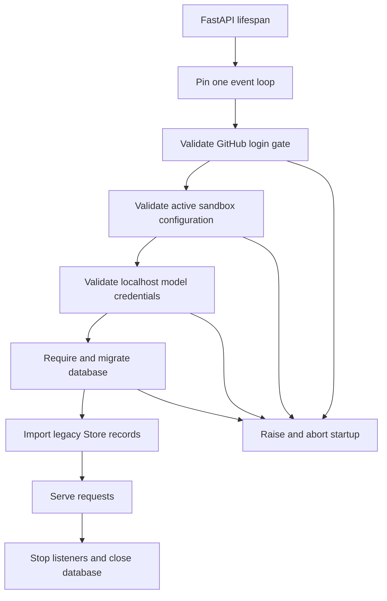

# Configuration and Workspace Administration

Open SWE deliberately separates **deployment-managed configuration** from **dashboard-managed settings**:

- The deployment supplies environment variables for credentials, endpoints, provider selection, security boundaries, and defaults. `agent/config.py` is the authoritative registry, not an invitation to read `os.environ` directly.
- Administrators manage instance and workspace behavior through persisted dashboard settings: model defaults, review behavior, gateway and Fable toggles, workspace repository/channel bindings, scripts, snapshots, and sandbox sizing. These settings do not replace deployment secrets.
- Users can add personal, integration-specific credentials. Those records are encrypted and are deliberately fail-soft where their absence should remove an optional capability rather than fail an agent run.

This page focuses on ownership, precedence, and failure modes rather than enumerating every variable. See [Deployment](deployment.md), [Authentication and security](../concepts/auth-and-security.md), [Models, profiles, and instructions](../concepts/models-profiles-instructions.md), and [Sandbox providers](../integrations/sandbox-providers.md) for domain-specific setup.

## Deployment configuration: registry and platform topology

`ENV` is a declared schema of application environment variables. Values are read lazily, so late secret injection, key rotation, and test monkeypatching are observed; blank or whitespace-only values are unset. A canonical name wins over its aliases. The `EnvVar` accessors provide required, integer, boolean, and comma-separated-list views, while undeclared attribute or item access raises. Add a variable to the registry—including its secret, alias, and deprecation metadata—before consuming it.

`langgraph.json` names `.env` as the platform environment file. It registers six graphs—`agent`, `reviewer`, `analyzer`, `review-scout`, `chat`, and `scheduler`—and mounts `agent.webapp:app` as the HTTP application. Its checkpointer deletes expired data with a 60-minute sweep and a 43200-minute default TTL.

## Startup validation and fail-closed boundaries

The FastAPI lifespan pins its one event loop, then performs checks and migrations before serving. The early checks validate dashboard login access policy, active sandbox configuration, local-development model credentials, and database configuration. The application then migrates the database and attempts legacy Store imports; analytics and transcript-listener startup are logged as warnings rather than preventing service. Shutdown stops those services and closes the database.

The lifespan's hard gates ensure the process does not serve with an open dashboard-login policy, invalid active sandbox configuration, missing locally required model credentials, or an unconfigured database. A dashboard deployment must configure `ALLOWED_GITHUB_ORGS` or `ALLOWED_GITHUB_USERS`, unless `OPEN_SWE_LOCAL_AUTH_TOKEN` is set. `DASHBOARD_ALLOWED_ORIGINS` may not contain `*`: credentialed CORS is installed only for explicit origins.

Two migration outcomes have intentionally different availability behavior. A failed user-mapping import is logged and limits users still held in the old Store. A failed workspace import is more restrictive: repository routing treats ownership as unknown, and GitHub webhook intake can return a retryable failure instead of silently dropping an event. The startup diagram shows the ordering and which failures prevent the server from starting.

## Workspace ownership, routing, and settings precedence

A workspace is a PostgreSQL-backed administrative unit. It owns repositories, optional Slack channels, workspace settings overrides, MCP connections, and sandbox definition material such as a prompt, setup/update scripts, a base snapshot, resource overrides, and non-secret create parameters. Database bindings guarantee that a repository or Slack channel has exactly one workspace owner. A non-default workspace must list at least one repository.

Repository and channel bindings are routing data, not merely labels. Workspace selection takes the first available source in this order: an existing thread's workspace, a `workspace:<slug>` tag (with `env:<slug>` accepted as a legacy alias), repository owner, Slack-channel owner, the user's preferred workspace, then `default`. A lookup failure is handled according to consequence: ordinary run resolution logs and uses `default`, but `repo_is_routable` raises when routing storage is unavailable or unpopulated so webhook delivery can be retried rather than permanently discarded. `OPEN_SWE_UNASSIGNED_REPO_WORKSPACE` controls whether a reliably unowned repository routes to `default` or is ignored.

Workspace settings use a distinct persisted tiering model:

1. Hardcoded settings, including the validated deployment model pair, establish a baseline.
2. The instance record in the LangGraph Store overrides that baseline for every workspace.
3. A sparse workspace record overrides only its explicitly set fields; `None` inherits the lower tier.
4. Callers that support them may layer user profile and thread `configurable` choices above the workspace result.

The read path is fail-soft: Store failures yield hardcoded defaults so an outage does not stop every run. Graph factories use a process-wide cache keyed by workspace slug with a 60-second TTL; callers must pass the run's slug because factory code can run outside graph context.

Model/effort pairs are validated against the catalog on write. An effort without a model, an unsupported model, or an incompatible effort is rejected. At resolution, stale selections try a same-provider fallback before the deployment default; chat inherits the agent default when no valid chat-specific pair exists. Instance and workspace gateway toggles are tri-state: a workspace inherits the instance setting when unset, and an unset instance setting inherits the environment decision. Fable is off by default; disabling it rewrites stored Fable defaults to safe non-Fable fallbacks and runtime guards prevent a disabled Fable model from reaching model construction.

## Workspace snapshots and sandbox controls

Workspace setup and update scripts define reproducible captured snapshots. A workspace can supply a base snapshot, prompt, resource overrides, and validated non-secret create parameters. Setup/update scripts and their logs live under `OPENSWE_SCRIPT_ROOT` (default `/open-swe/environment`); scripts receive the space-delimited repository list in `OPENSWE_WORKSPACE_REPOS`. Create parameters reject secret-like field names, so credentials remain deployment-managed.

A refresh captures under a stable workspace snapshot name, conventionally `<WORKSPACE_SNAPSHOT_PREFIX>-environment-<slug>:latest`, but a run boots from the immutable ready snapshot ID. During a capture, the prior ready snapshot remains usable; a failed or not-yet-captured workspace falls back to the configured base snapshot. This prevents a refresh in progress from changing an existing run's sandbox image.

`SANDBOX_TYPE` defaults to `langsmith`; the registry supports `langsmith`, `daytona`, `modal`, `runloop`, `e2b`, and `local`. An unknown type raises a `ValueError` listing supported types. Daytona, Modal, Runloop, and E2B have optional dependency groups; startup eagerly loads the selected optional provider and fails with the required `uv sync --extra sandbox-...` command if its SDK is absent. Only the LangSmith factory receives snapshot, resource, and create-parameter overrides; other providers receive an optional existing sandbox ID.

For LangSmith, `LANGSMITH_API_KEY` and `LANGSMITH_ENDPOINT` are the deployment identity and endpoint for sandbox operations. Defaults are 128 GiB filesystem, 4 vCPUs, 16 GiB memory, 7200 seconds idle TTL, and 2592000 seconds delete-after-stop TTL; zero disables either TTL. At startup, malformed numeric values, negative TTLs, or invalid/non-object `SANDBOX_CREATE_EXTRA_JSON` abort the process. A workspace can override positive resource values, but its create parameters are revalidated on read and ignored if invalid.

> **Safety:** `SANDBOX_TYPE=local` executes against the developer host and provides no isolation. Use it only for controlled local development.

## Model controls and provider routing

`LLM_MODEL_ID` and `LLM_REASONING_EFFORT` determine the deployment fallback model pair. The catalog accepts only models that can be deployment defaults and compatible efforts; unsupported values raise when defaults are resolved. If unset, an Anthropic-only deployment defaults to `anthropic:claude-opus-5-5`; other deployments default to `openai:gpt-6-sol`. Persisted instance/workspace choices take precedence as described above and do not mutate when the environment changes.

`make_model` applies six retries to constructed models and a 600-second per-request timeout for OpenAI, Anthropic, Baseten, Google GenAI, and Fireworks. `LLM_FALLBACK_MODEL_ID` may explicitly select a fallback; otherwise OpenAI and Anthropic primaries have cross-provider fallback defaults. Gateway routing is environment-controlled by `LANGSMITH_GATEWAY_ENABLED`, or enabled implicitly when `LANGSMITH_GATEWAY_API_KEY` is present, subject to the persisted tri-state overrides. The gateway applies only to supported providers; an unavailable route logs and falls back to direct provider calls, except that direct Baseten requires `BASETEN_API_KEY`.

## Credentials and operational secret handling

Deployment secrets include provider keys, GitHub App credentials, webhook signing secrets, dashboard JWT signing material, and service credentials. Keep them in the deployment environment or secret manager—not in workspace scripts or create parameters. `TOKEN_ENCRYPTION_KEY` protects stored OAuth and integration tokens. It accepts a single Fernet key or a newest-first comma/newline list: new writes use the first key and reads try all keys, allowing staged key rotation.

Personal Notion credentials are stored per login in the Store with encrypted access, refresh, and optional client-secret values. Status responses are redacted. The credential loader is deliberately fail-soft: Store/decryption/refresh failure returns no Notion credentials, removing those MCP tools rather than failing the run. Refresh is guarded by one in-process lock per login; a refresh-token reauthorization failure deletes the stale connection so the user must reconnect.

## Operating checklist

1. Declare and consume deployment variables through `ENV`; classify secrets and aliases there.
2. Validate the selected sandbox provider and its optional package in the deployment image before rollout.
3. Configure a GitHub login allowlist for non-local deployments; never use wildcard credentialed CORS.
4. Use workspace settings for supported behavioral defaults and routing, not provider credentials.
5. Treat a workspace import failure as a routing safety condition: repair it before accepting GitHub events under the `ignore` policy.
6. Rotate `TOKEN_ENCRYPTION_KEY` by prepending a new key, retaining old keys until old records are re-encrypted or retired.

## See also

- [Deployment](deployment.md)
- [Authentication and security](../concepts/auth-and-security.md)
- [Models, profiles, and instructions](../concepts/models-profiles-instructions.md)
- [Sandbox providers](../integrations/sandbox-providers.md)
- [Scheduling and baby-sit](../workflows/scheduling-and-baby-sit.md)
