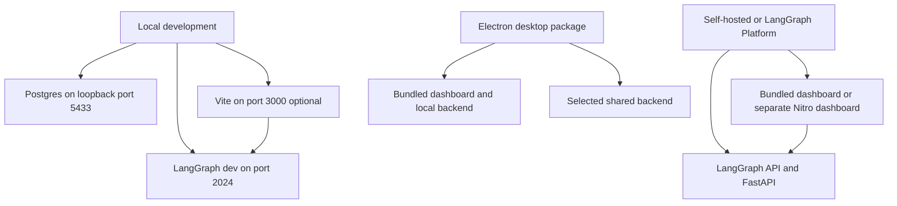

# Local Development, Packaging, and Deployment

Open SWE can be delivered in three deliberately different forms: a local LangGraph development server, a self-hosted or LangGraph Platform backend with an optional bundled or separate dashboard, and an experimental Electron application. The normal web topology is one public origin: LangGraph serves graphs and runtime routes, `agent.webapp:app` supplies dashboard and integration routes, and a built dashboard is served at `/`. That topology keeps the dashboard's relative `/dashboard/api/*` requests and `osw_session` cookie same-origin. See [Configuration](configuration.md) for the environment contract and [Dashboard UI](../integrations/dashboard-ui.md) for client behavior.



This diagram distinguishes the local server path, the web deployment path, and the separately packaged desktop path.

## Backend entry points and local state

`langgraph.json` is the primary LangGraph Platform and local-development manifest. It selects Python 3.14 and the `>~=0.15.0rc1` API, loads `.env`, registers six graphs—`agent`, `reviewer`, `analyzer`, `review-scout`, `chat`, and `scheduler`—and attaches `agent.webapp:app`. Its checkpointer deletes checkpoints after the 43,200-minute default TTL, sweeping every 60 minutes. `pyproject.toml` constrains the locally resolved API/runtime prerelease ranges to match that manifest.

Install the Python development environment with:

```bash
make install
```

This runs `uv sync --extra dev`. The normal backend command is:

```bash
make dev
```

It first starts the local `postgres:16` Compose service unless `POSTGRES_URI` is already supplied (including from `.env`), refuses to share an occupied port 2024, then runs:

```bash
uv run langgraph dev --no-browser --port 2024 --n-jobs-per-worker 10
```

`compose.yaml` binds Postgres only to `127.0.0.1:5433` and retains it in the named `open-swe-postgres` volume. This database is for application tables; local LangGraph threads and Store state live in `.langgraph_api` in the working directory. Stop the server cleanly before copying or sharing that state between worktrees: copied state diverges, while a shared state directory must have only one active backend.

`make run` is intentionally narrower:

```bash
uv run uvicorn agent.webapp:app --reload --port 8000
```

It is useful for FastAPI work, but it does not start LangGraph. Dashboard actions that create runs therefore require `make dev`, not `make run`.

### Local dashboard options

Build the dashboard into `ui/.output/public` before running the same-origin static mode:

```bash
make build-dashboard
make dev
```

The backend looks first at `DASHBOARD_STATIC_DIR` and otherwise at that in-repository build. It serves actual files and returns `_shell.html` only for HTML navigations; it declines reserved dashboard API, webhook, health, and LangGraph prefixes, so the UI catch-all cannot shadow those routes. Hashed assets receive immutable caching while the shell is revalidated.

For UI work, use:

```bash
make dev-ui
```

This runs Vite and `make dev` together, with `DASHBOARD_DEV_SERVER_URL=http://localhost:3000`. Open `http://localhost:2024`: FastAPI reverse-proxies non-reserved UI requests to Vite while API calls, login callbacks, and cookies remain on the backend origin. Vite's HMR WebSocket connects directly to port 3000.

`make web` runs the root workspace's dashboard development task. In development, Vite proxies backend prefixes to `DASHBOARD_API_URL`, defaulting to `http://localhost:2024`; it can be opened directly at `http://localhost:3000`. Direct Vite use is a distinct browser origin, so set `DASHBOARD_BASE_URL` and `DASHBOARD_API_BASE_URL` to that origin and register its `/dashboard/api/auth/callback` with the GitHub App. `DASHBOARD_ALLOWED_ORIGINS` allows additional credentialed CORS origins; `*` is rejected because FastAPI enables credentials.

### Local webhook exposure

`langgraph dev` leaves raw LangGraph routes unauthenticated. Never publish port 2024 wholesale. Instead:

```bash
make tunnel NGROK_DOMAIN=<name>.ngrok-free.dev
```

The Make target forwards through `examples/ngrok/webhooks-only.yml`, which returns 404 outside `/webhooks/*`. This permits GitHub, Slack, and Linear deliveries without exposing the dashboard or raw `/threads`, `/runs`, `/assistants`, or `/store` routes. Restart `make dev` after changing `.env`; code reload does not replace its environment.

## Dashboard workspace, build, and identity

The pnpm workspace contains `ui`, `desktop`, and `tests/e2e`. Root `pnpm run build`, `typecheck`, `test`, and `check` delegate package tasks to Turborepo; root `lint` and `format` commands run oxlint and oxfmt directly. Turbo caches dashboard build outputs and treats `DASHBOARD_API_URL`, `SOURCE_COMMIT`, `VERCEL`, `E2E_HARNESS`, and `VITE_*` values as build inputs. Do not put secrets in `VITE_*`: they are browser-visible build-time values.

`DASHBOARD_BASE_PATH` is a deployment invariant when the backend is mounted below `/`: it must equal the LangGraph `http.mount_prefix` plus its trailing slash. Vite uses it for router and asset URLs. The platform build derives it from `langgraph.json`; a local prefixed build must supply it, for example `DASHBOARD_BASE_PATH=/prefix/ make build-dashboard`. A mismatch makes assets or client-side navigation escape the mounted application.

Platform builds also use `SOURCE_COMMIT`. `scripts/stamp_build_info.py` writes `open-swe-build-info.json` containing the UTC build time and, when supplied, the commit. When it receives both backend and dashboard directories it records a hash of the dashboard stamp in the backend sidecar, allowing a deployment to identify the backend build and relate it to the UI it contains.

## Web deployment

### One-origin backend deployment

**LangGraph Platform** deploys this repository using `langgraph.json`. Its `dockerfile_lines` install Node and pnpm temporarily, build the dashboard for the manifest mount prefix, copy the public output to `/opt/open-swe-dashboard`, stamp build identity, and set `DASHBOARD_STATIC_DIR`. The dashboard build is best effort: a failure is logged and leaves the backend deployable without a bundled UI.

**Standalone Docker** uses the root `Dockerfile`:

```bash
docker build -t open-swe .
```

It is a production LangGraph API image, not a sandbox image. It is based on `langchain/langgraph-api:0.13.3-py3.14`, installs the repository with `uv`, and configures the FastAPI app, six graph registrations, and checkpointer TTL through environment variables before exposing port 8000. This image does not build the dashboard; build `ui/.output/public` before `docker build` or make a build available through `DASHBOARD_STATIC_DIR`.

For a standalone deployment, provide Agent Server backing services and settings including `DATABASE_URI` for Postgres, `REDIS_URI`, `LANGSMITH_API_KEY`, `LANGGRAPH_CLOUD_LICENSE_KEY`, and a public `LANGGRAPH_URL`; expose port 8000 through ingress. Do not use scale-to-zero hosting because Redis/Postgres-backed workers must remain available for background work. `POSTGRES_URI` is separately required by application analytics and migrations.

The standalone image defaults to `LANGGRAPH_AUTH_TYPE=noop`. That leaves raw LangGraph routes open to network clients; dashboard sessions and webhook signature checks protect custom routes, not those routes. Use LangSmith authentication or a private/authenticated network boundary.

### Separate dashboard deployment

A separate frontend is optional. Build it from the repository root:

```bash
docker build -f ui/Dockerfile .
```

The multi-stage Node 24 image installs the filtered workspace with the frozen lockfile, builds the Nitro output, and runs it as `node` on port 8080. It reads `DASHBOARD_API_URL` at request time, so a single image can front different backends; it fails explicitly rather than choosing a fallback backend when that variable is absent.

The production proxy forwards the original backend path and query, streams non-GET request bodies, preserves distinct `Set-Cookie` headers, and manually preserves OAuth redirects for the browser. Its same-origin arrangement proxies `/dashboard/api/*` and webhook paths to the backend; configure the backend's dashboard base and API base URLs and GitHub callback for the dashboard origin. Alternatively, compile `VITE_DASHBOARD_API_BASE_URL` to target the backend directly and add the dashboard origin to `DASHBOARD_ALLOWED_ORIGINS`, accepting the resulting cross-origin credential and CORS requirements.

## Desktop packaging

The Electron client is experimental; the web UI is the recommended interface. It packages the compiled dashboard UI and a local backend. Packaged users select and store an organization backend URL on first launch—there is no maintainer-hosted default—and Electron proxies its bundled UI's dashboard API requests to that selected backend. GitHub login uses the shared backend callback.

The **This Mac** mode is separate from cloud work: Electron starts a loopback-only LangGraph server and stops it with the app. It can run the local agent in a selected checkout or a worktree; local project metadata and history are held in application data and local checkpoints use SQLite. The desktop manifest is intentionally reduced to the `agent` graph, disables the built-in UI, and uses `agent.local_auth:auth` plus a local checkpointer.

For source development, run `make dev` and `make desktop`. The shared-backend default is `http://localhost:2024`; resolution prefers `--backend-url`, then `OPEN_SWE_BACKEND_URL`, saved configuration, and finally that development default. Package with:

```bash
pnpm --dir desktop run pack
pnpm --dir desktop run dist
```

Both build the dashboard, main process, and local backend resources; `pack` produces an unpacked app and `dist` an installer. Electron Builder packages macOS DMG/ZIP, Windows NSIS, and Linux AppImage targets; release signing and notarization are workflow responsibilities rather than a hosted-web deployment.

On macOS, `make install-desktop` requires a clean checkout, fast-forwards `main`, and invokes `scripts/install_desktop.sh`; `make install-checkout` uses the current checkout. The installer verifies macOS plus Node, `ditto`, `uv`, and a pnpm/corepack launcher, packages the app, stages it, quits a running app, and swaps it into `/Applications` or `~/Applications`.

## Maintenance and focused checks

- `make test`, `make integration_tests`, `make lint`, `make format`, `make format-check`, and `make typecheck` are the focused Python validation entry points. Workspace validation uses `pnpm run test`, `typecheck`, and `check`; desktop has its own `pnpm --dir desktop run test` and `check`.
- `make migration m="..."` calls `scripts/new_migration.py`, which creates the next numbered Alembic revision chained to the current head.
- `scripts/create_sandbox_snapshot.py` creates a LangSmith sandbox snapshot from a Docker image with `SandboxClient` and prints its ID for selection as a workspace base snapshot in the dashboard.
- `scripts/purge_wakeup_crons.py --dry-run` previews expired one-shot `thread_wakeup` crons, then deletes them when run without the flag. It resolves the deployment from `--url` or `LANGGRAPH_URL` and credentials from `LANGGRAPH_API_KEY` or `LANGSMITH_API_KEY`.
- `scripts/rebuild_transcript_projections.py <thread_id> ...` repairs specified transcript read projections by replaying their event log. It requires `POSTGRES_URI`, leaves attachments/tool outputs alone, and reports a nonzero outcome if any requested thread fails.

For a safe deployment change, verify the public URL in `LANGGRAPH_URL`, integration webhook targets, and GitHub callback; confirm `/ok`, a dashboard sign-in, and a representative run. A healthy backend alone does not prove the dashboard is present: the one-origin server needs either a valid static build or a configured Vite development server.
