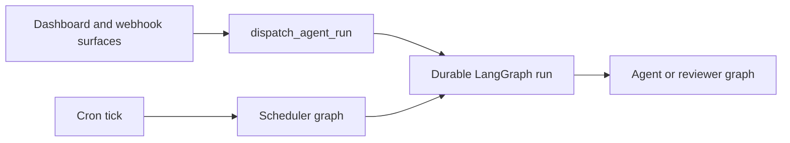

# Open SWE Codebase Guide

Open SWE is an asynchronous software factory built on Deep Agents and LangGraph. Dashboard, GitHub, Slack, Linear, and scheduled work can create durable agent work; coding threads use isolated sandboxes, while pull-request review and review-style analysis are separate concerns. This is a navigation page, not a substitute for implementation reading: **source code and focused tests are authoritative**. Start with the owning code and its nearest tests, then use the linked pages for cross-cutting context.

## Start the appropriate local loop

The Python backend requires Python 3.14+ and uses `uv`; `ui`, `desktop`, and `tests/e2e` are a pnpm workspace. For a first local environment, follow [the development guide](../docs/DEVELOPMENT.md), including its PostgreSQL, credentials, dashboard, and webhook-tunnel requirements.

```bash
make install            # uv sync --extra dev
make dev                # LangGraph graphs and FastAPI on :2024
make run                # FastAPI only on :8000
make dev-ui             # Vite plus the backend fronting it
make web                # dashboard Vite server
make desktop            # Electron wrapper; backend runs separately
```

Use `make dev` for any change that creates or executes LangGraph runs. It starts the local PostgreSQL container unless `POSTGRES_URI` is set and serves the registered graphs and FastAPI app. `make run` is useful for FastAPI-only work, but has no LangGraph runtime, so run-creating flows cannot work there. For dashboard changes, `make dev-ui` keeps the browser on `:2024` while the backend fronts Vite on `:3000`.

For local GitHub or Slack webhooks, use the documented tunnel setup. `make tunnel NGROK_DOMAIN=<name>.ngrok-free.dev` exposes only `/webhooks/*`; do not expose the unauthenticated local LangGraph API through a whole-port tunnel.

### Contributor guardrails

- Keep implementations async-only. If an interface requires a synchronous method, make that method raise `NotImplementedError` rather than maintaining two implementations.
- Use strong Python and TypeScript types; do not widen values to `Any` or `any` to suppress a type error.
- Put model-facing prompts in `agent/resources/prompts/` and load or render them rather than inlining them in Python.
- Put a dashboard endpoint in its feature package; `agent/dashboard/routes.py` aggregates feature routers under `/dashboard/api` rather than owning feature behavior.
- Never discard an exception silently: propagate it or log it with structured context.

## Locate the runtime owner

`langgraph.json` is the deployable registration boundary. It selects Python 3.14, registers six graph entrypoints, attaches `agent.webapp:app`, and configures delete-based checkpoint cleanup (a 60-minute sweep and a 43,200-minute default TTL). The graph modules in `agent/graphs/` are public, thin re-export shims; normally change the owning implementation instead of the shim.

| Entrypoint | Owning implementation | Use it when changing… |
| --- | --- | --- |
| `agent.graphs.agent:traced_agent` | `agent/server.py` | coding-agent assembly, prompts, models, tools, middleware, or coding sandbox preparation |
| `agent.graphs.reviewer:traced_reviewer_agent` | `agent/reviewer.py` | diff-based findings, review publication, or reviewer sandbox behavior |
| `agent.graphs.analyzer:traced_analyzer` | `agent/analyzer.py` | repository review-style analysis and guidance |
| `agent.graphs.review_scout:traced_review_scout` | `agent/review_scout/graph.py` | historical review scouting and walkthrough inputs |
| `agent.graphs.chat:traced_chat_agent` | `agent/chat.py` | dashboard PR chat and its read-only context/tools |
| `agent.graphs.scheduler:get_scheduler` | `agent/scheduler.py` | cron routing, scheduled work, CI watches, refreshes, or background tasks |
| `agent.webapp:app` | `agent/api/app.py` | dashboard/API composition, health, webhook ingress, CORS, or static UI mounting |



This diagram shows the main run-routing boundary: interactive surfaces dispatch agent or reviewer runs, while scheduler ticks either perform maintenance work or launch scheduled agent work.

### Boundaries that prevent unsafe changes

- The coding-agent factory is stateless; per-thread continuity belongs to LangGraph thread metadata and the sandbox. Do not add state to a long-lived graph instance to solve a thread problem.
- A main-agent sandbox that is merely unreachable is not replaced automatically, because a replacement could discard uncommitted work. The reviewer may replace one because it recreates its checkout for every review.
- The reviewer is non-mutating: its review-specific tools manage findings and publication, not commits, pushes, or pull-request creation. PR chat has no sandbox; it reads seeded `/pr/` virtual files and repository data through a repository-scoped GitHub App token, while excluding shell and file-mutation tools.
- Dashboard, Slack, Linear, and GitHub callers use `dispatch_agent_run` to create durable `agent` or `reviewer` runs. Its normal strategy interrupts competing work on the thread, and a caller must use either a prebuilt input or content/context/source identities, never both.
- FastAPI validates allowlists, sandbox configuration, local-development model configuration, and database setup during startup; it includes dashboard, plan, workflow-approval, Linear, Slack, health, GitHub, and sandbox-tool routes. Credentialed CORS is enabled only for configured dashboard origins and rejects `*`.

## Pick the task guide

### Change an agent, review, state, or tool capability

- [Runtime Architecture](architecture/overview.md) — deployment boundaries, graph registration, FastAPI composition, and product surfaces.
- [Coding Agent Assembly](architecture/agent-graph.md) — agent factory, model/profile resolution, prompt context, tools, and sandbox attachment.
- [Agent Middleware and Failure Boundaries](architecture/middleware-stack.md) — ordering-sensitive retries, queue delivery, timeouts, fallbacks, guards, and tool errors.
- [Thread Sandbox Lifecycle](architecture/sandbox-lifecycle.md) and [Sandbox Provider Integration](integrations/sandbox-providers.md) — ownership, recovery policy, snapshots, proxy credentials, and provider extensions.
- [Review, PR Chat, and Style Learning Graphs](architecture/reviewer-and-analyzer.md) — reviewer, analyzer, scout, findings, and read-only boundaries.
- [Threads, Runs, and Durable State](concepts/threads-and-state.md) — thread identity, checkpoint/store state, metadata, and queued messages.
- [Tool Surface and Capability Gating](concepts/tools.md) — static and dynamic tools, MCP, approvals, and authorization.
- [Model, Profile, and Instruction Resolution](concepts/models-profiles-instructions.md) — settings precedence, providers, and layered instructions.

### Change ingress, UI, integration, or delivery behavior

- [Invocation from Dashboard, Webhooks, and Schedules](workflows/invocation.md) — admission, identity/context construction, thread selection, and dispatch.
- [Follow-ups, Interrupts, and Completion Delivery](workflows/follow-up-messages.md) — continuing, stopping, and delivering work on an existing thread.
- [Run Context and Prompt Construction](workflows/context-engineering.md) — conversion from event/state into model messages and specialized context.
- [Code Delivery and Pull Request Creation](workflows/pr-creation.md) — commits, pushes, approval gates, PR creation, and CI hooks.
- [Pull Request Review Workflow](workflows/pr-review.md) — automatic/manual review, findings, publication, and replies.
- [Scheduled Work, CI Monitoring, and Baby-sit](workflows/scheduling-and-baby-sit.md) — schedule persistence, watches, reconciliation, and safe follow-up dispatch.
- [Dashboard, Web UI, and Desktop Clients](integrations/dashboard-ui.md) — browser/Electron behavior, APIs, streams, and approvals.
- [Identity, Authorization, and Credential Boundaries](concepts/auth-and-security.md) — sessions, webhook verification, repository access, and credentials.
- [Observability, External Tools, and MCP](integrations/observability-and-mcp.md) — tracing, connected services, optional tool loading, and failure handling.

### Change configuration or deployment

- [Configuration and Workspace Administration](operations/configuration.md) — environment registry, startup validation, workspace routing, settings, and credentials.
- [Local Development, Packaging, and Deployment](operations/deployment.md) — local topology, static UI builds, Docker/LangGraph deployment, and desktop packaging.

## Validate the changed boundary

**Do not run the full local test suite.** Choose the smallest deterministic test that owns the observable behavior, then add the relevant static check. `make test` accepts a test file or directory; use a direct pytest node id for one behavior.

```bash
make test TEST_FILE=tests/github/test_open_pull_request.py
uv run pytest -vvv tests/path/to_test.py::test_name
make lint
make format-check
make typecheck
```

Pytest runs async tests automatically. Shared fixtures route `agent.store` through an in-memory implementation while preserving its serialization path, reset process-global TTL and sandbox registries around tests, and enable automatic review by default; a test of those gates must override the fixture deliberately. Tests requiring PostgreSQL use a migrated, throwaway schema only when `TEST_ANALYTICS_POSTGRES_URI` is configured, otherwise they skip.

Use [Testing Strategy and Focused Validation](testing/overview.md) to select the nearest unit/integration family for an agent, sandbox, webhook, dashboard, review, or tool change. Add tests only for observable behavior and meaningful edge cases—not source-structure, constant, prompt-text, or incidental-call-order checks.

Use Playwright only when a real cross-boundary contract requires it. The harness runs real agent code, local sandbox, local git, dashboard, and Electron paths, while faking the model and external SaaS HTTP boundaries. Install Chromium once, then select a single relevant spec; browser runs are serial and the desktop configuration selects only the Electron spec.

```bash
pnpm install --frozen-lockfile
pnpm run test:e2e:install
pnpm exec playwright test tests/full_flow.spec.ts
```

See [Testing Strategy and Focused Validation](testing/overview.md) for E2E fakes, artifacts, and targeted frontend or desktop commands.
