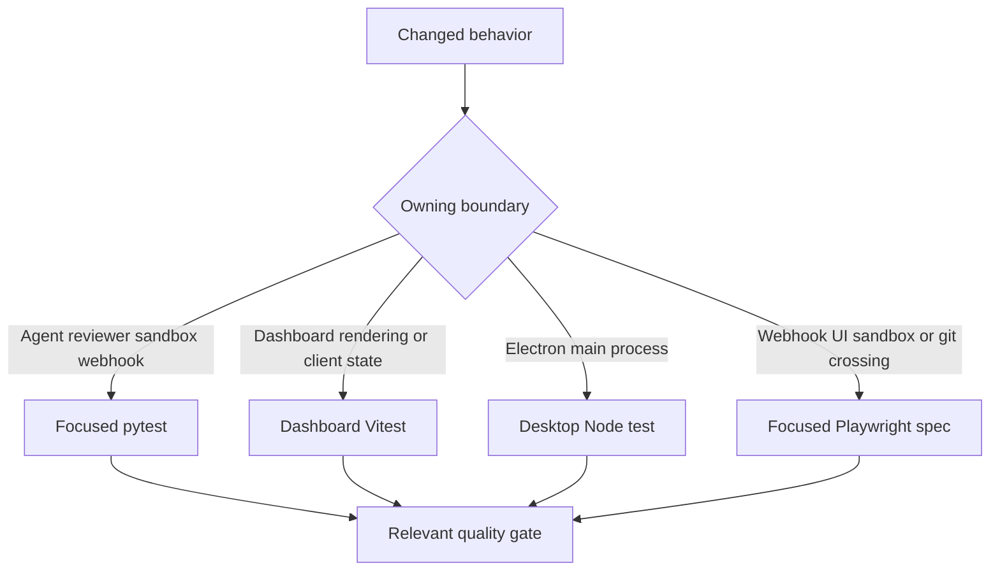
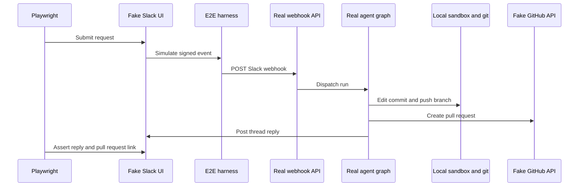

# Testing Strategy and Focused Validation

Validate the lowest layer that owns the observable contract changed. Start with one focused test or test file; do not run the full local suite. Tests should protect user-visible behavior, state transitions, authorization, error handling, or a real integration boundary—not prompt wording, constants, source structure, incidental calls, or call order. Keep inputs and external seams controlled so a failure identifies the changed contract rather than timing, a live service, or leftover process state.



This routing keeps feedback narrow while still requiring an end-to-end proof where independently running or stateful components meet.

## Python: isolated behavior and boundary contracts

Pytest collects `tests/` and runs in asyncio auto mode, so async tests and fixtures need no per-test asyncio marker; consequently, a bare `pytest` run discovers the whole unit suite there, which is deliberately not the local workflow. Test families are organized around owners such as `tests/agent/`, `tests/dashboard/`, `tests/reviewer/`, `tests/sandbox/`, and `tests/webhooks/`; select the family that owns the behavior rather than adding a duplicate cross-layer test.

### Shared fixtures establish deterministic defaults

`tests/conftest.py` makes ordinary tests independent of a running LangGraph Store, a bundled dashboard build, and leaked process-global state:

- `fake_store` routes `agent.store` through an in-memory SDK-shaped store but preserves the production `model_dump`/`model_validate` round trip. Seed it only when persistence is part of the contract.
- An autouse fixture points `DASHBOARD_STATIC_DIR` to a missing temporary location, so a local `ui/.output` cannot silently change Python behavior.
- Autouse cleanup clears the TTL cache and both sandbox registries before and after each test. This prevents workspace-setting cache entries or a sandbox handle from one thread answering for the next test.
- Tests treat the workspace-store import as complete and automatic review as enabled because the normal startup import and live opt-in Store are absent. A test of fail-closed routing or the review opt-in gate must explicitly restore the relevant condition or replace the default enablement stub.

### Database and webhook boundaries

Use a real isolated PostgreSQL schema when the behavior relies on SQL semantics, migrations, transactions, or connection cleanup. The `registry_db` fixture creates a unique schema, applies the production migrations, redirects the database engine/schema to it, then drops and disposes it; it skips when `TEST_ANALYTICS_POSTGRES_URI` is not configured. `registry_db_if_available` instead lets degradation behavior be tested both with a database and without `POSTGRES_URI`. For example, the read-only transaction tests demonstrate both write rejection and rollback/connection invalidation rather than mocking SQLAlchemy.

For inbound GitHub delivery behavior, use `post_signed_github_webhook`: it serializes the payload deterministically, computes the `X-Hub-Signature-256` HMAC, and posts to the real ASGI webhook route on the current event loop. This avoids the separate event loop that `TestClient` would create for workspace-backed database routes. Test signature verification, deduplication, routing, or failure responses at that route; mock only the external collaborator that is not the contract under test.

Completion-webhook tests focus on terminal effects across boundaries: terminal errors finalize agent usage; Slack-originated failures post and record a thread reply; reviewer failures settle a tracked GitHub check only with the necessary metadata and token; and failed reviewer cleanup cannot suppress the Slack failure reply. Reviewer-outcome tests similarly protect the mapping from resolved/dismissed findings and GitHub/Slack feedback to labels, including the intentional no-op when credentials or repository context is unavailable.

### Graph assembly and sandbox lifecycle

Agent assembly is a composition contract, not a prompt snapshot. `tests/agent/test_agent_assembly_context.py` captures the arguments passed to agent construction so changes to graph wiring can verify the sandbox-backed backend required by deepagents context eviction and summarization, source- and visibility-sensitive skills/tools, workspace middleware, and the boundary between parent and subagent tools. It also checks behavior such as starting sandbox creation concurrently with setting loads and preserving resolved configuration for tools.

Sandbox-state tests cover the proxy invariants that make a thread's backend safe to use after recovery: it remains `BaseSandbox`-compatible for capture-at-source offload; delegates offload when supported and safely falls back when it is not; shares one concurrent reconnect; survives a cancelled waiter; retries failed startup; and can recover an ID from live thread metadata. These are focused tests for reconnect, provider compatibility, and lazy-start changes—not tests of private implementation order.

| Changed behavior | Start here |
| --- | --- |
| Agent backend, middleware, source-specific tools, skills, or configuration propagation | `tests/agent/test_agent_assembly_context.py` |
| Dashboard API authorization, routes, session behavior, or thread state | The focused file in `tests/dashboard/` that owns the endpoint or state transition |
| PostgreSQL migration, transaction, or persistence behavior | `tests/database/` with `registry_db` when SQL semantics matter |
| Reviewer findings, publication, reconciliation, or learned outcomes | `tests/reviewer/`, including `test_reviewer_outcomes.py` for outcome mapping and no-op conditions |
| Sandbox recovery, capture offload, or identity recovery | `tests/sandbox/test_sandbox_state.py` |
| Run completion, Slack notification, or reviewer check cleanup | `tests/webhooks/test_completion_webhook.py` |

## Focused Python commands and separate gates

Install the Python dev extra with `make install`, which runs `uv sync --extra dev`. The dev extra declares pytest, pytest-asyncio, Ruff, and ty; Pygments is a runtime dependency. `make test` and `make tests` run `uv run pytest -vvv $(TEST_FILE)` only when `TEST_FILE` names an existing file or directory, otherwise they print a skip message. Use the Make target for a file or directory and direct pytest for a node id.

```bash
make install
make test TEST_FILE=tests/sandbox/test_sandbox_state.py
uv run pytest -vvv tests/sandbox/test_sandbox_state.py::test_sandbox_proxy_retries_failed_startup
```

Lint, formatting, and typing are independent gates: `make lint` runs Ruff checking plus a formatting diff; `make format` applies Ruff formatting and fixes; `make typecheck` runs `ty check agent tests`. Run the one relevant gate after the focused behavior test; they do not replace it.

## Frontend and desktop unit coverage

Use dashboard Vitest tests for React rendering, client state, streamed-message transformation, terminal state, API-client behavior, and other browser-independent contracts. The dashboard workspace command is `vitest run`. The desktop package builds its Electron main bundle, then uses Node's test runner for `test/*.test.cjs`. Root `pnpm test` delegates workspace test tasks through Turbo, so prefer the owning workspace command locally.

```bash
pnpm --filter open-swe-dashboard run test
pnpm --dir desktop run test
```

Escalate from these tests to browser or Electron Playwright only when the intended behavior depends on an authenticated server render, the dashboard API proxy, local filesystem/git, or Electron IPC/process behavior.

## Playwright: real execution with controlled external seams

The E2E harness mounts the real agent web app and graph alongside fake GitHub/Slack REST endpoints, mock SaaS UIs, and test control endpoints. It signs simulated Slack Events API and GitHub deliveries before sending them to the real webhook routes. `fake_llm.py` supplies the scripted `BaseChatModel`; `patches.py` redirects only the LLM and external SaaS/token/snapshot boundaries; and `fakes.py` owns the in-memory Slack/GitHub state plus seeded local bare remote. Agent code, tools, middleware, local sandbox provider, git operations, and webhook handling run for real, and the mock UIs render that fake-boundary state as their single source of truth.



The browser flow shows a signed Slack delivery traversing the real webhook, graph, sandbox, git, and tool paths, while only external dependencies remain controlled.

`full_flow.spec.ts` is the narrow proof for Slack request → implementation → PR → same-thread reply. The browser suite drives the real built `ui/` dashboard rather than a fake: global setup builds it with the harness as its backend/proxy target, starts its Nitro server, and uses a genuine signed session cookie. That covers server rendering, the session gate, and same-origin `/dashboard/api/*` behavior. Set `E2E_FORCE_UI_BUILD=1` after UI or E2E port changes to force a dashboard rebuild.

The browser configuration runs serially against real `langgraph dev`, excludes the desktop spec, and has a 90-second test timeout. The desktop configuration selects `desktop.spec.ts`, uses a 180-second test timeout, and has separate output. The Electron spec resets shared harness state, clones the seeded remote into a temporary project, injects a harness-issued `osw_session` cookie, runs a local-agent request, and checks both the actual project edit and fake-GitHub PR fields.

```bash
pnpm install --frozen-lockfile
pnpm run test:e2e:install
pnpm exec playwright test tests/full_flow.spec.ts
pnpm run test:e2e:desktop
```

Install Chromium before the first browser run. The backend requires `POSTGRES_URI`; use one focused spec against the reused local server rather than the full E2E suite.

## Failure evidence

Browser Playwright runs take screenshots on failure and retain trace/video on failed attempts locally or on the first retry in CI. `E2E_ARTIFACTS=1` records trace and video for every attempt under `test-results/` and `playwright-report/`. Desktop disables automatic Playwright media because its spec records an Electron-context trace and attaches screenshots for unified and completed local-agent views; it removes temporary desktop state unless `E2E_KEEP_TMP` is set.

```bash
pnpm exec playwright show-report
pnpm exec playwright show-trace test-results/<test>/trace.zip
SLOW_MO=700 pnpm exec playwright test --headed
```

Inspect the trace, screenshot, and fake-boundary state before changing a timeout or weakening an assertion.

## Related pages

- [Agent graph](/openwiki/architecture/agent-graph.md)
- [Sandbox lifecycle](/openwiki/architecture/sandbox-lifecycle.md)
- [Dashboard UI](/openwiki/integrations/dashboard-ui.md)
- [Quickstart](/openwiki/quickstart.md)
- [PR review workflow](/openwiki/workflows/pr-review.md)
