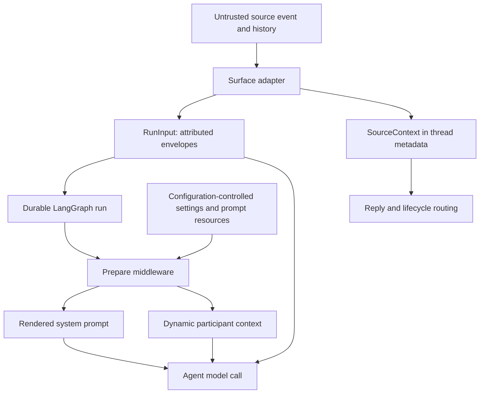

# Run Context and Prompt Construction

A run has two deliberately different context channels. Surface-owned text and metadata are normalized into attributed `RunInput` messages; durable origin is retained separately as `SourceContext`. At execution, trusted deployment, workspace, repository, and model configuration renders the system prompt immediately before a model call. This separation lets the agent identify where text came from without promoting an event body into system instructions.

This data flow distinguishes source-attributed, untrusted trigger content from configuration-controlled system context. `SourceContext` is used for routing and lifecycle behavior, not as a replacement for the transcript. See [Invocation](invocation.md), [Threads and state](../concepts/threads-and-state.md), and [Agent graph](../architecture/agent-graph.md) for the surrounding lifecycle.

## Normalize events into an attributed transcript

`dispatch_agent_run` is the common agent/reviewer dispatch boundary. Callers either provide a fully ordered `RunInput`—needed for histories with multiple people and systems—or provide raw content plus optional identity context. It rejects mixing those forms, derives a fallback identity when context is absent, and creates the durable run with its configurable state. Slack defaults to the triggering user and channel, GitHub to login, Linear to email, and otherwise emits a synthetic `system:<source>` sender.

`RunInput` is application-owned serialization, not a raw chat transcript. `human_input` and `system_input` wrap text in an escaped `<input-message>` envelope carrying namespaced sender identity, surface, kind, optional channel, and structured data. Text blocks in multimodal content are enveloped while non-text blocks retain their position. This preserves both source attribution and media payloads without pretending that the source text is trusted prompt policy.

Dynamic identity blocks use `<dynamic-context>` messages for channels, systems, and people. Their canonical XML is SHA-256 hashed, which supports deduplication. The injected-hash registry prevents repeat introductions at construction time; preparation also checks what remains visible after deepagents summarization, so an introduction hidden before the cutoff can be supplied again. Invalid XML is ignored by parsing helpers, and entity IDs must be nonempty namespaced identifiers without whitespace or XML-sensitive characters.

### Source provenance survives beyond the turn

`SourceContext` is persisted under `source_context` in LangGraph thread metadata and is also carried by baby-sit watches. It can record Slack thread data, Linear and GitHub issue references, and a PR number. Webhook and common reply paths use it to locate the originating surface, whereas the serialized transcript describes the model-visible request for a particular run.

The model is intentionally forward-compatible: its nested models allow unknown fields, and `dump()` excludes unset defaults, so a read-enrich-write path does not discard integration-specific keys or manufacture defaults. `parse()` accepts mappings only and returns an empty context after validation failure, logging rather than failing a run because historical metadata is malformed.

## Prepare prompt layers at execution time

The main graph starts with an empty deep-agent system prompt. `PrepareAgentRunMiddleware`, via `BasePrepareRunMiddleware`, computes per-invocation state before the agent runs: sandbox work directory, source and repository prompt material, workspace context, model attribution, and optional recent-thread context. It appends fresh participant introductions as distinct messages instead of mutating historical user messages; dynamic identities are added only when their hashes are not currently visible.

Preparation is checkpointed by a fingerprint of the latest message, middleware class, and configuration-specific data. A resumed attempt with the same fingerprint skips completed setup, while a later invocation can refresh credentials, prompt material, and diff context. `_prepare` must consequently be idempotent; failures while attaching the sandbox are notified and re-raised rather than running without a workspace.

`construct_system_prompt` loads only packaged or configured prompt resources and renders source-specific guidance, working environment, repository scope, custom default prompt, repository instructions, workspace instructions, collaboration guidance, and shared tool guidance. The result is stored as `rendered_system_prompt`. Immediately before each model call, base middleware prefixes that rendered material to any pre-existing system message. This is the system layer; event content remains in the separately supplied message history.

## Repository instructions and skills

The coding-agent prompt directs the model to read root `AGENTS.md` after repository setup; repository conventions take precedence over custom, environment, and sender instructions. `SubdirAgentsReadMiddleware` supplies scoped conventions after a successful `read_file`: it reads previously unseen ancestor `AGENTS.md` files from shallow to deep and appends a system reminder, where deeper scope wins. It marks direct convention reads as loaded, limits injected reads to 1,000 lines and 64 KiB, and silently skips missing, unreadable, non-UTF-8, or failed candidates so it does not turn a successful requested read into a failure.

The reviewer obtains conventions without relying on a clone. At the PR base SHA it fetches root `AGENTS.md`, falling back to `CLAUDE.md` only if the preferred file is absent; a network error, non-200 result, or oversized file yields no root convention context. It independently discovers ancestor convention paths for changed files, fetches candidates concurrently with bounded concurrency, and supplies fetched results in shallow-to-deep order. The reviewer prompt treats these base-branch conventions as mandatory, applies scoped documents only to files under their directory, and gives a deeper applicable document precedence.

Skills are lazily readable instruction files rather than wholesale prompt text. The main agent uses a `CompositeBackend` whose default is the run backend and whose prefixed routes are read-only skill sources. Bundled skills are always mounted; hosted runs can add organization skills and, for applicable run scope, user skills, while desktop runs source user skills from run state. The agent discovers routes through deepagents and reads the detailed `SKILL.md` using normal file tools.

## Specialized analyzer and reviewer context

The review-style analyzer is a separate deep agent. Bootstrap and continual launchers create system-attributed automation input and seed `RunInput.files` with the bundled analyzer playbooks. Its `CompositeBackend` maps `/skills/` to a `StateBackend`; because route handling strips the prefix, seeded file keys are `/<skill>/SKILL.md` while the model reads `/skills/<skill>/SKILL.md`. Analyzer preparation establishes a workspace sandbox and renders a focused prompt with repository, samples, review themes, mode, and the selected playbook path. A deterministic analyzer thread ID is required for continual cron runs so graph construction does not return the empty no-thread agent.

Reviewer preparation independently materializes the PR checkout and trusted skills at the base reference, then concurrently loads diff data, PR overview, existing review threads, author guidance, repository style, root conventions, organization guidance, and API standards. It derives changed files from the diff before fetching scoped conventions. The assembled reviewer system prompt receives only the relevant optional sections, while PR title/body is formatted as untrusted data to prevent a PR author from escaping its context block. See [Reviewer and analyzer](../architecture/reviewer-and-analyzer.md).

## Safe changes and focused tests

When changing this flow, retain the boundary between source text, durable routing metadata, and configuration-controlled system instructions. Preserve the two dispatch forms, escaped envelopes, namespaced identities, reintroduction after summarization, and idempotent preparation. Do not make user- or PR-authored content system policy, mutate cached history to add current sender data, or make missing convention files fatal.

Focused coverage includes `tests/agent/test_input_messages.py` for envelope escaping, media preservation, and summarization visibility; `tests/agent/test_source_context.py` for tolerant metadata; `tests/agent/test_agents_md.py` and `tests/middleware/test_subdir_agents_middleware.py` for instruction retrieval and injection; `tests/agent/test_agent_assembly_context.py` for skill-route assembly; and `tests/analyzer/test_analyzer_cron.py` for the seeded continual analyzer run.
