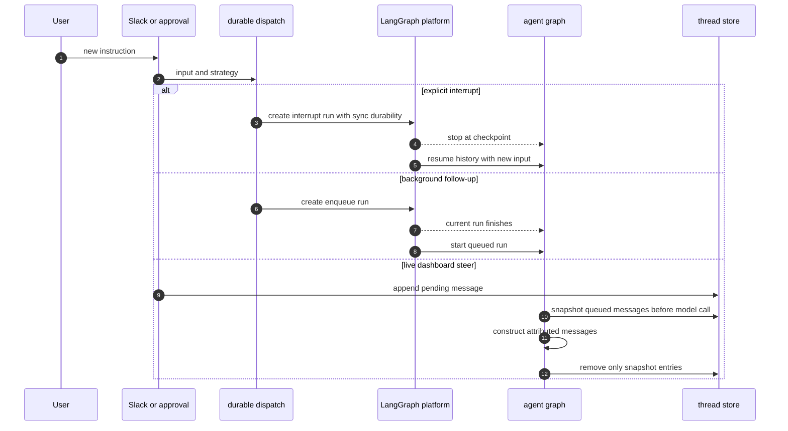

# Follow-ups, Interrupts, and Completion Delivery

A thread is the continuity boundary: durable run history, thread metadata, and its
sandbox binding all remain associated with the same `thread_id`. A new instruction
can therefore redirect work without creating another workspace. There are two
intentionally different delivery mechanisms:

- A **durable follow-up run** lets the platform interrupt current work or queue a
  later turn. It is the normal path for Slack, approvals, automation, and a
  dashboard `run.start` that asks for a separate future turn.
- The **store-backed message queue** steers a message into a run already in
  flight. Before that run's next model call, middleware turns queued content into
  attributed conversation messages. It is used by the dashboard busy-thread
  composer, live `run.start` steering, and message edits.

An enqueued *run* starts only after preceding work finishes. A queued *message*
is consumed by the current run at a model boundary. Choosing between them is a
user-visible ordering decision, not an implementation detail. See
[Invocation](invocation.md), [Threads and state](../concepts/threads-and-state.md),
and [Middleware stack](../architecture/middleware-stack.md) for the surrounding
contracts.

## Durable dispatch and thread continuity

`dispatch_agent_run` is the shared agent/reviewer dispatch boundary. It either
accepts a prebuilt `RunInput` or builds one with source identities, then delegates
to `create_durable_run`. By default the latter uses
`multitask_strategy="interrupt"`; callers choose `"enqueue"` when the follow-up
must wait. Dispatch config also enables the event-streaming-v2 compatibility
marker, preserves/creates an invocation ID and start time in configuration and
metadata, and requests Protocol-v3-compatible stream modes, subgraphs, and
resumable streaming. Thus a dashboard can replay an externally started run,
including tool and subgraph events.

Every such run defaults to `durability="sync"`, checkpointing before steps. An
interrupt is consequently a continuation from checkpointed thread history plus
the new input, not a fresh conversation. A workflow-push approval is one direct
example: approving the recorded fingerprint authorizes the user, records the
decision, and dispatches a new instruction run telling the agent to retry the
blocked push. Rejection records the decision but does not dispatch work.

This sequence contrasts platform-level interruption and enqueueing with a message
that joins the live graph, including the snapshot-based protection against loss.

### Selecting a run strategy

Slack dispatches an explicitly tagged request with `"interrupt"`, while an
untagged follow-up uses `"enqueue"`. A Slack edit is instead placed in the
message queue; when the thread is idle it stays there until a later run reaches a
model boundary. In code-channel DMs, messages are treated as explicit requests,
so they redirect active work.

Background work intentionally does not preempt the interactive turn. Baby-sit
terminal/failure updates and sandbox background-task completion notifications use
`"enqueue"`. Background-task notification delivery claims a per-task marker in
the sandbox before dispatch and marks it delivered only after successful
dispatch; on failure it releases the claim so a later monitor pass can retry.

The dashboard command protocol supports both models. A `run.start` received while
live can be **steered** into the current turn: its attributed message is persisted
immediately and queued. If the live run ended in the narrow interval before the
write, the handler tries a `"reject"` pickup run; rejection means another run won
the race and will drain the same entry. Conversely, `queue_follow_up_run` creates
a separate `"enqueue"` durable run, records who queued it, and opens its
transcript turn immediately so it can be cancelled before it starts.

## In-run queue, attribution, and loss avoidance

`queue_message_for_thread` stores `{"content": ...}` records at
`("queue", thread_id) / "pending_messages"`. It preserves FIFO order, caps the
queue at the newest 100 records, and deduplicates structured messages with the
same `queue_id`. The cap prevents unbounded store growth; it deliberately drops
the oldest item when overwhelmed.

The dashboard `POST /threads/{thread_id}/messages` path is specifically a
busy-thread continuation endpoint. After authorization it requires the platform
to report `busy` (409 when idle and 502 when activity cannot be read), updates
participant, activity, model, and unresolved-thread metadata, and queues a
payload containing text, web surface, a `github:<login>` sender, a client or
server-generated `queue_id`, and non-text image blocks. A best-effort Slack
trace update announces a handoff when the thread originated there.

`check_message_queue_before_model` runs before model calls in both the agent and
reviewer graphs; the agent excludes it for `stop_summary` mode. It first consumes
the batched autofix event at `("autofix", thread_id) / "pending_event"`, adding a
system instruction to re-check CI/review feedback. It then snapshots
`pending_messages` in queue order and builds the messages before changing the
store.

This order is the important message-loss invariant. Message construction can
await a model lookup and image download, while another caller can append to the
same queue. After successful construction, `_consume_queued_messages` rereads
the record and removes only items from the original snapshot, retaining anything
appended concurrently. If conversion fails, consumption is not attempted, so the
snapshot remains available for the next model call. If reading the queue fails,
any already assembled autofix instruction is still returned; the outer middleware
logs unexpected errors and permits the model call to continue.

### Message and reply-surface handoff

Queued ordinary blocks become an automation system message attributed to
`system:thread-queue`. Structured dashboard content becomes a human web message
attributed to its canonical sender. When the current reply surface is Slack, the
first dashboard message also inserts a `system:dashboard-handoff` instruction and
changes the reply surface to web; later web messages do not repeatedly announce
the same move. Dynamic context hashes already visible to the model are withheld,
while hashes before a summarization cutoff may be reintroduced.

For queued images, middleware prefers the run's resolved model and falls back to
thread metadata. A model without vision drops fetched `image_urls` and appends a
warning; provided image blocks remain. Each structured input envelope is kept in
its own message because transcript parsing expects one envelope per message.

## Sandboxes follow the thread

`ensure_sandbox_for_thread` first checks the sandbox ID persisted in thread
metadata. It reuses an in-process backend when available, otherwise reconnects
and refreshes proxy credentials and Git identity. If no ID exists, it creates and
initializes a sandbox, then persists the binding only after initialization.

An existing but unreachable sandbox raises `SandboxUnreachableError` for normal
agent work rather than being silently replaced, because replacement would lose
uncommitted files. A deleted sandbox (`SandboxGoneError`) is replaced because the
old one cannot contain recoverable work. Callers such as the read-only reviewer
may set `allow_replacement=True` for an unreachable sandbox whose checkout can be
re-derived. Serial interrupt dispatch prevents concurrent provisioning for a
thread; it is not a substitute for preserving an unavailable workspace.

## Stop behavior

### Slack emergency stop

A Slack `:x:` reaction may target a mapped agent reply or the root thread message.
The handler resolves the Slack mapping, verifies that the thread metadata names
the same Slack channel and timestamp, and only then claims the unique event ID.
Missing IDs, duplicates, unknown messages, and mismatches cause no side effects.

After validation it enumerates every `pending` and `running` run, cancels them
with `action="interrupt"`, clears both queued messages and the deferred autofix
event, and records `latest_run_status="interrupted"` plus a stop timestamp. It
then dispatches and maps a special `stop_summary` run. That prompt is read-only:
it summarizes what happened instead of continuing task work. If cancellation or
store cleanup fails, the summary is not dispatched. An `agent_session_stopped`
event for a code channel does the cancellation, cleanup, metadata update, and
session reset to `active`, but deliberately does not create a summary run.

### Dashboard cancellation

An authorized dashboard stop similarly enumerates live runs rather than trusting
`latest_run_id`, so it can stop work started by Slack, GitHub, Linear, or CI. It
also settles transcript turns for exactly the runs it cancelled. Unlike Slack,
it retains queued store messages: after cancellation it dispatches a pending
follow-up pickup unless a separately queued run owned by another participant was
kept. This avoids cancelling another person's queued request and avoids losing
store-delivered follow-ups. A successful pickup updates latest-run metadata;
failure to submit it is reported as HTTP 502 after cancellation was requested.
The admin cancellation variant does not perform this continuation.

## Completion delivery and operations

A completion webhook is attached only when `RUN_COMPLETE_WEBHOOK_SECRET` exists
and `COMPLETION_WEBHOOK_URL` is absolute and non-loopback. The secret is appended
as the token when necessary; the public route fails closed with 401 when token
verification fails. Invalid JSON and non-object payloads are handled without
calling completion processing, avoiding an unauthenticated or malformed callback
from changing thread state.

Completion finalizes invocation telemetry for terminal statuses and settles
transcript turns. On a successful non-pickup run it also looks for store follow-ups
left after the last model call. If no pending run already exists, it asks
`dispatch_pending_follow_ups` for a `"reject"` pickup run. This closes the race
where a user queues a steer after the final model boundary: either the existing
pending run drains it or exactly one safe pickup does.

`error` and `timeout`, but not `interrupted`, are terminal failures for user
notification. A best-effort reply is posted to the originating Slack, Linear, or
GitHub surface and is deduplicated by run ID (with a legacy thread flag only for
payloads lacking one). Successful eligible Slack runs schedule a session-cost
refresh once per run; success also performs feedback and code-channel/session
cleanup best-effort. `interrupted` is expected when a follow-up supersedes work
and must not produce a spurious failure reply.

### Focused tests and safe changes

`tests/slack/test_slack_stop.py` covers mapped replies and root stops, cancellation
of pending plus running runs, deferred-work cleanup, stop-summary configuration
and mapping, missing/duplicate event safety, metadata mismatch rejection, cleanup
and cancellation failures, and the no-summary code-channel stop. When changing
queue semantics, test the concurrent append window explicitly: deleting an entire
snapshot record after awaited conversion would reintroduce message loss. When
adding a new follow-up producer, choose whether it is an interrupt, a platform
queue, or a live-run steer, and ensure its source/reply surface and cancellation
policy match that choice.
