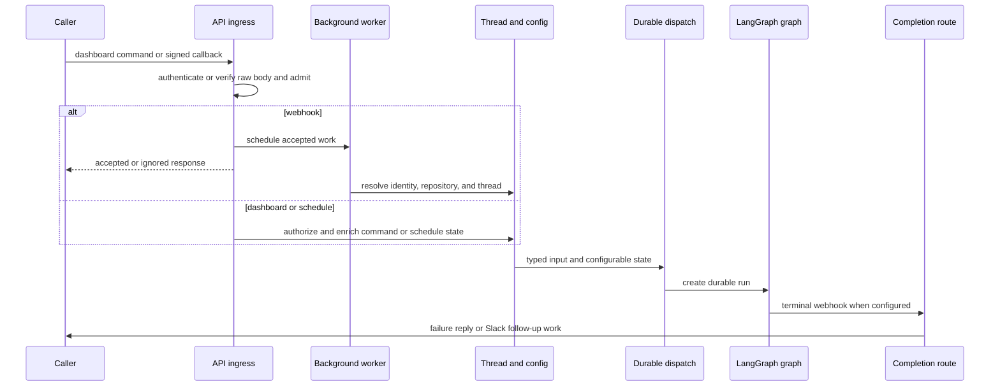

# Invocation from Dashboard, Webhooks, and Schedules

Open SWE accepts work through authenticated dashboard commands, signed integration callbacks, and stored automations. These surfaces do not hand arbitrary text directly to a model: each establishes an authorized thread, source context, actor identity, repository/workspace configuration, and typed input before it creates a LangGraph run. See [Threads and state](../concepts/threads-and-state.md) for thread persistence, [Dashboard UI](../integrations/dashboard-ui.md) for the client boundary, and [Follow-up messages](follow-up-messages.md) for in-flight turns.

## Shared lifecycle

This sequence shows the boundary: webhooks acknowledge after inexpensive admission and perform remote work in a background task, while dashboard commands are enriched before proxying to LangGraph. `create_app` composes these routers, rejects wildcard dashboard CORS origins when credentials are enabled, and validates sandbox and local-development model configuration during startup.

## Admission gates and routing

GitHub, Linear, and Slack verify their platform signature against the **raw** request body before parsing it; an invalid signature is `401`. The routes then return an ignored/error/accepted response rather than dispatching malformed or ineligible payloads. GitHub treats an unreadable workspace ownership lookup as `503`, allowing GitHub to retry instead of silently losing work.

- **Slack** resolves channel context before normal message routing. DMs and channels explicitly allowed for operations are eligible; external or unverified channels are blocked. An `app_mention` in an external shared channel receives one claimed refusal reply rather than a run. Delivery is deduplicated with `claim_slack_event` before the normal background task is queued. Bots and self messages are excluded except for explicitly allowed bot handling; ordinary non-code-channel messages must be a mention or DM. Code channels instead use their shared session thread and treat every message as addressed to Open SWE.
- **Linear** accepts only non-bot `Comment` `create` events that mention Open SWE. It chooses a repository from an explicit comment reference, then the author’s profile default, then the workspace default, and requires that result to be allowlisted.
- **GitHub** multiplexes issue, PR, comment, review, push, and CI deliveries. It filters unsupported actions, applies routing/allowlist and public-repository organization gates, requires mentions for ordinary issue and comment work, and directs replies to review findings to reviewer processing.

These checks are deliberately separate from graph authorization: they reduce untrusted delivery and establish a valid source/repository before a background worker performs API reads or creates state.

## Surface-specific thread and input construction

### Slack

Slack thread identity is resolved before work is scheduled: an explicit stored mapping wins, then matching metadata, then the deterministic Slack-derived id. A conflicting explicit mapping is an error rather than a heuristic choice. The worker resolves the triggering user, profile, repository/workspace, channel and thread history, then persists `SourceContext.slack_thread`, visibility, owner/participants, repository, and workspace metadata.

The worker builds rich input: channel and person introductions, relevant historical messages, the current request, and optional image/file context. Introductions already visible in graph state and messages already dispatched are omitted, so retries and follow-ups do not blindly replay context. A triggering user without a valid mapped GitHub token receives a link or re-login prompt and no run; permitted bot triggers have their own ownership constraints.

An explicit mention, DM-session message, or explicit code-channel action dispatches with `multitask_strategy="interrupt"`; other Slack follow-ups use `"enqueue"`. A message edit is placed in the thread message queue rather than started as a standalone run, so it corrects context for later work. Slack status and code-channel UI are restored if dispatch fails or completion proves no newer run remains.

### Linear

A Linear worker deterministically derives its thread from the issue id, maps the comment author (falling back to issue creator then assignee) to GitHub identity, resolves workspace/model selection, and upserts Linear issue source context into thread metadata. It serializes the issue description as system input and relevant comments as attributed human input; image-bearing issues can select a vision fallback. The run is then dispatched with the resulting repository, actor, workspace, and issue configuration.

### GitHub and reviewer work

A coding PR-comment worker recovers the UUID embedded in an Open SWE branch when present; otherwise it derives the canonical PR-comment thread from owner, repository, and PR number. It resolves the author’s email/token, refreshes once after a `401`, reacts to the triggering comment, fetches comments since the last Open SWE tag, serializes authors and comments, then dispatches the coding agent. Issue work has an independent deterministic issue id and stores GitHub issue context before dispatch.

Automatic PR reviews, push re-reviews, and review-finding replies are isolated from coding work: they use `reviewer_thread_id(owner, repo, pr)` and `assistant_id="reviewer"`. Reviewer metadata tracks the PR/watch/check state, allowing later pushes and finding replies to resume the review graph without merging it into the coding conversation.

## Dashboard and desktop commands

The dashboard API requires same-origin protection for mutations and proxies thread commands only after JSON and access checks. A missing thread may be created only by `run.start`; the first command stamps the user-owned dashboard thread, validates the requested repository/workspace and model/image capability, creates attributed structured messages, and rebuilds configurable state and metadata rather than trusting client-supplied attribution. It assigns an invocation identifier and uses resumable streaming.

On a busy thread, a dashboard follow-up either steers its attributed message into the live run or creates an `enqueue` run, according to the requested multitask strategy. Queued runs retain their sender so only that sender or the owner can withdraw them. A follow-up that arrives after the active run’s final model call is picked up by an empty-input durable run after completion.

Desktop is a dashboard-originated `source="desktop"` run, but local shell execution is separately constrained: its real path must be an allowlisted registered project or a worktree below `OPEN_SWE_LOCAL_WORKTREES_DIR`.

## Scheduled automations

Schedule records are admin-managed dashboard resources. For a cron schedule, creation stores the record and creates a LangGraph cron for the `scheduler` assistant carrying `schedule_id`; the scheduler launches the actual agent execution. Before each launch, the automation rechecks workspace repository access, creates a **fresh UUID thread**, stamps it as a system-owned automation thread, and invokes the agent with a system schedule identity and durable configuration.

A schedule configured for `always` Slack notification posts and binds its root Slack message before creating the run. If that post fails, the automation records an error and does not start, preserving the expectation that status has a response location. Schedule state records the latest thread/run and error information after durable creation; an `on_action` mode instead supplies notification configuration to the run.

GitHub issue-opened automations reuse schedule records but claim each delivery per schedule using a TTL thread before launch, preventing duplicate deliveries from producing duplicate automation runs.

## Input, identifiers, and durable dispatch

Thread-id derivations are a persisted cross-process routing contract: Slack locations, Linear issues, GitHub issues/PRs, and reviewer handlers must reproduce the same identifiers to find existing state. Changing a namespace or stable input string can orphan live threads. In particular, `thread_id_from_branch` merely extracts an embedded UUID; its absence falls back to the PR-derived identifier.

At the graph boundary, `human_input` and `system_input` enforce role/kind alignment and serialize authored content in XML-escaped `<input-message>` envelopes. Entity/channel context is emitted as SHA-256-addressed `<dynamic-context>` content, which permits deduplication; untrusted channel fields remain data, not executable instructions.

`dispatch_agent_run` rejects a prebuilt input combined with raw content or identities, builds input when necessary, and delegates agent or reviewer requests to `create_durable_run`. Durable creation defaults to interrupt multitasking, synchronous checkpoints, resumable streams, v3 stream modes/subgraphs, and a correlated invocation/`prepare_run_id` in both configurable state and metadata. These defaults make non-dashboard runs observable and resumable in the dashboard as well.

Completion delivery is optional by design. Dispatch attaches the completion URL only when `RUN_COMPLETE_WEBHOOK_SECRET` exists and `COMPLETION_WEBHOOK_URL` is absolute and non-loopback; the receiver rejects missing or incorrect tokens. On terminal completion it finalizes invocation telemetry and handles waiting follow-ups. Successful eligible Slack runs schedule a deduplicated cost refresh. For `error` or `timeout`, it performs best-effort reviewer/code-channel cleanup and posts an idempotent source-specific failure reply; `interrupted` is normal replacement behavior and is not a failure reply.

## Change guidance and focused tests

- Preserve raw-body signature checks, fail-closed completion authentication, and Slack event claims. Exercise external-channel refusal, duplicate delivery, bot/message admission, message edits, and thread mapping conflicts in `tests/slack/`.
- Treat formulas in `agent/thread_ids.py` and `SourceContext` metadata as compatibility surfaces. Do not replace a mapping conflict with a guessed thread.
- New integration callers should use `dispatch_agent_run` or `create_durable_run`; verify defaults, invocation correlation, streaming configuration, and completion URL degradation in `tests/agent/test_dispatch.py`.
- Cover completion statuses, idempotent failure replies, reviewer cleanup, and intentional silence for interrupted runs in `tests/webhooks/test_completion_webhook.py`.
- For dashboard changes, test lazy `run.start` creation, command enrichment, busy-thread steer/enqueue behavior, and authorization in the thread proxy/run tests. For automations, use `tests/agent/test_agent_schedules.py` to cover cron creation, repository rechecks, Slack notification failure, and fresh-thread launch behavior.
