# Code Delivery and Pull Request Creation

The delivery path is **commit → push → open or update PR → CI and review follow-up**. New pull requests are deliberately centralized in `open_pull_request` so GitHub can attribute the PR to the appropriate person. Two middleware boundaries protect delivery: one prevents shell fallbacks that would bypass attributed creation, and one requires a human decision before an agent can push changed GitHub Actions workflow files.

```mermaid
sequenceDiagram
    participant Agent as Coding agent
    participant Guard as Push guard
    participant Human as Thread owner
    participant GitHub as GitHub
    participant PRTool as open_pull_request
    participant Thread as Agent thread
    Agent->>Guard: git push origin branch
    alt No workflow-file change
        Guard->>GitHub: push unchanged command
    else Workflow-file change and approved fingerprint
        Guard->>GitHub: push explicit head SHA refspec
    else Workflow-file change without approval
        Guard->>Thread: persist pending fingerprint
        Guard->>Human: Slack or web approval request
        Guard-->>Agent: WorkflowPushApprovalRequired
        Human->>Thread: approve or reject
        opt Approved
            Thread->>Agent: follow-up to retry identical push
            Agent->>Guard: retry push
            Guard->>GitHub: push explicit head SHA refspec
        end
    end
    Agent->>PRTool: open_pull_request after branch is visible
    PRTool->>GitHub: preflight and create PR
    GitHub-->>PRTool: created PR or existing PR
    PRTool->>Thread: record tracked PR and telemetry
```

Caption: delivery includes two approval checkpoints: workflow changes must be approved before push, while PR creation is performed only by the attributed tool after the branch is available on GitHub.

## Open or update the PR

After committing prepared sandbox changes, push the branch to `origin` and call `open_pull_request(owner, repo, head, base, title, body, draft=True, resolves_thread=False)` for a **new** PR. Do not use `gh pr create`. The result includes `created`, URL, number, author, and token kind. `created=False` means a PR already exists for that head branch; update it with commands such as `gh pr edit` rather than creating a duplicate.

The tool resolves an author credential before it creates anything. It asks the credential-scope policy for an eligible requested or triggering participant's GitHub login, then obtains that user's current OAuth token. If no person is eligible, it uses the GitHub App installation token; if an eligible user's token is unavailable, it returns an authorization failure rather than silently changing authorship. For a user token outside a private-credential deployment, the workspace installation must also be able to verify the target repository.

### Preflight, idempotency, and presentation

Before the create request, the tool reads the repository and the base branch, and also reads the head branch when the head belongs to the target owner. It reports access, invisible-branch, and other preflight failures as `github_app_access_missing_or_repo_not_found`, `github_pr_branch_not_visible`, or `github_pr_preflight_failed`; diagnostic text includes GitHub's HTTP status, selected headers, and a bounded response body. A missing credential is separately reported as `no_github_token`.

A GitHub `422` response is handled as an idempotency case: the tool searches for an open PR on the head branch and returns it with `created=False` when found. If not found, the original create failure remains a failure. This makes the safe operational rule explicit: do not work around a failed attributed creation through another API or a different identity.

`draft` is a caller preference, not an absolute instruction. The `draft_prs` run configuration, when set, overrides it; profile configuration supplies this value and defaults new PRs to drafts. The tool appends its collaboration attribution footer and, unless the body already contains `## References`, can add a dashboard plan link. Source links for Slack, Linear, or GitHub issues are added only when GitHub positively confirms that the target repository is private, so failed or ambiguous visibility checks do not expose private conversation links in a public PR.

## Record delivery and manage thread lifecycle

Whether a PR was newly created or discovered, the tool best-effort fetches full details, records usage and opening feedback, and upserts a normalized tracked-PR record in thread metadata while retaining legacy PR fields. The record carries repository, number, URL, state, refs, author, diff statistics, and `resolves_thread`. In an active Slack code-channel session it also refreshes repository context, registers a PR resource, and sets a diff view only when GitHub returned a nonempty diff. Telemetry failures are logged and do not revoke a successful PR creation; because this work is in one protected sequence, an early telemetry error can prevent later bookkeeping.

Use `resolves_thread=True` only for a PR intended to complete the agent's task. PR lifecycle webhooks synchronize tracked PR state. They auto-resolve an agent thread only once **all** tracked PRs are closed or merged and at least one tracked record has `resolves_thread=True`. If all are terminal without that flag, the thread receives `attention_reason="prs_closed"`; reopening a PR clears an auto-resolution or that attention state as appropriate.

## Delivery guardrails

### Attributed-creation boundary

`PullRequestCreationGuardMiddleware` wraps `execute` and `background_execute`. It rejects shell commands that create a PR outside `open_pull_request`: `gh pr create`, `gh api` POST or field submission to a pulls endpoint, and `curl` POST or body submission to GitHub's pulls endpoint. It also examines nested `bash`, `dash`, `sh`, and `zsh` `-c` commands. Shell expansion is bounded at depth three and fails closed when further nested shell commands remain.

The response is a non-recoverable `PullRequestCreationFallbackBlocked` error with code `pr_creation_fallback_blocked`, instructing the agent to surface the attributed-tool failure instead of masking it with an unattributed PR. Both main agents and subagents install this guard for non-local runs; local runs omit it. The workflow push guard is installed for main agents and subagents, including local runs.

### Workflow-file approval checkpoint

`WorkflowPushGuardMiddleware` only interprets conservative standalone `git push origin <refspec>` shapes, including supported `git -C`, `cd ... &&`, and `--set-upstream` variants. It declines to interpret unsafe shell syntax and other push forms, which proceed through normal execution. For an eligible push of the current branch, it compares against the remote branch or merge base and checks `.github/workflows/`. A push with no changed workflow paths passes untouched.

For a workflow change, the middleware collects the binary diff, bounded preview, files and additions/deletions, base and head SHAs, normalized origin URL, and a SHA-256 fingerprint over the change identity. It also detects workflow changes inherited through a merge. The fingerprint keys a per-thread `workflow_push_approvals` record, which stores review material, notification state, decision metadata, and is trimmed to the 20 most recent records.

**Approval checkpoint and failure behavior:** if the exact fingerprint has been approved, the guard rewrites the command to push the explicit `<head_sha>:refs/heads/<branch>` refspec. Otherwise it blocks execution with `WorkflowPushApprovalRequired`, creates or refreshes a pending record, and attempts one Slack interactive notification. A notification is marked delivered only after Slack returns a message timestamp without an error. A rejected record stays blocked, and any workflow-content or identity change produces a new fingerprint that needs fresh approval.

The web approval API requires an authenticated session, same-origin mutation protection, and access to the thread; mutation additionally requires that the session can prompt the thread. Approval records the session subject and dispatches an agent follow-up directing it to retry the unchanged blocked push. Rejection only records the denial. The reviewer can inspect approvals through the API response, including diff preview, truncation flag, stats, inherited source, and actor/timestamps.

## CI, review, and user follow-up

`request_pr_review` is a review handoff, not PR creation. It validates the GitHub PR URL, resolves the active Slack thread and triggering identity from run configuration, then delegates to `trigger_pr_review_from_ref`. See [PR Review](pr-review.md) for reviewer behavior.

CI readers paginate check runs and legacy commit statuses and return `None` for permission or HTTP errors, keeping webhook handling best effort. The auto-fix classification treats completed `failure`, `timed_out`, and `action_required` check runs as fixable, excludes cancelled, stale, and skipped runs, and filters Open SWE's own checks. `names_failing_on_base` excludes failures that already exist on the base SHA. Permission checks for unattended code-changing paths fail closed unless the requester has `write`, `maintain`, or `admin` access.

Webhook helpers normalize head branch and SHA across `check_run`, `check_suite`, `workflow_run`, and legacy `status` payloads. The baby-sit CI handler evaluates only completed events and proceeds only when an active watch matches the SHA or branch. See [Scheduling and Baby-sit](scheduling-and-baby-sit.md).

For GitHub feedback, `fetch_pr_comments_since_last_tag` combines issue comments, inline review comments, and nonempty review bodies in chronological order. On the first configured Open SWE mention it returns the full discussion; on later mentions it returns activity after the preceding mention. Mention matching rejects a configured handle when it is merely the prefix of a longer handle. Before comment content enters a prompt, reserved trust-wrapper tags are sanitized and comments from untrusted authors are fenced.

## Direct PR actions

Direct dashboard PR actions run with the signed-in user's GitHub token. Merge and close actions confirm GitHub's response; marking ready reads the PR then uses GitHub GraphQL because REST cannot clear the draft flag; update-branch includes the expected head SHA to reject a stale view. Resolving review threads first limits requested IDs to unresolved threads on that PR and performs mutations serially to avoid GitHub secondary-rate-limit pressure.

## Focused verification

The delivery behavior is covered by `tests/github/test_open_pull_request.py` for credential choice, preflight diagnostics, duplicate handling, references, and tracked metadata; `tests/github/test_pr_creation_guard.py` for direct and nested shell fallback detection; and `tests/agent/test_workflow_push_guard.py` for parsing, workflow diffs, fingerprints, notification, and approved command rewriting. `tests/dashboard/test_workflow_approval_api.py` covers approval-list response shaping. CI and feedback coverage includes `tests/github/test_github_ci.py`, `tests/github/test_baby_sit_webhook.py`, `tests/github/test_github_feedback.py`, and `tests/github/test_mention_tags.py`.
