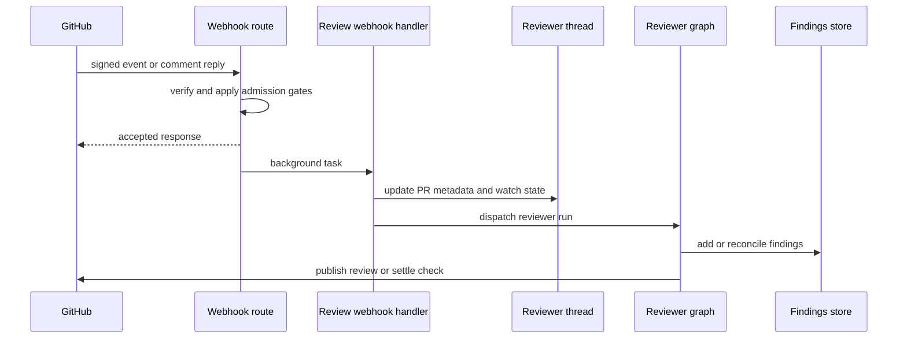
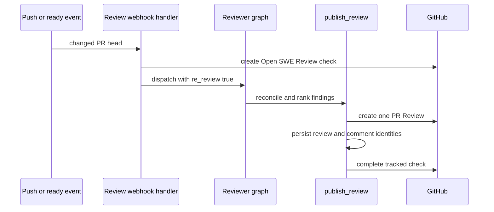

# Pull Request Review Workflow

Open SWE uses a dedicated `reviewer` graph for PR review. One canonical reviewer thread represents a PR across invocations; thread metadata owns its routing and run state, while findings are durable PostgreSQL records associated with that PR. Later pushes and replies therefore revise one review history rather than starting unrelated reviews. For the graph and prompt architecture, see [Reviewer and Analyzer Architecture](../architecture/reviewer-and-analyzer.md); for dashboard interaction, see [Dashboard UI](../integrations/dashboard-ui.md).

## Entrypoints and admission

`POST /webhooks/github` is signed ingress: it validates `X-Hub-Signature-256`, rejects unsupported event types or PR actions, verifies that a workspace owns the repository, and queues accepted work as FastAPI background tasks. A temporarily unreadable workspace mapping returns 503 so GitHub retries rather than silently losing a delivery. Automatic review and push handling require repository opt-in; the enabled-repository store is deliberately fail-soft, so an unavailable store means “not opted in.” First-review and finding-reply webhook paths also enforce the public-repository organization gate.

A run may start in four ways:

- **Automatic first review** — `pull_request` `opened` or `ready_for_review`. Draft PRs require the author's effective `review_draft_prs` setting (profile setting with workspace fallback). The ready event does nothing when the head is already `last_reviewed_sha`.
- **On-demand review** — the agent's `request_pr_review` tool parses a PR URL and retains the active Slack thread when applicable; the dashboard calls the same `trigger_pr_review_from_ref` entrypoint. That entrypoint reads PR metadata and creates/updates the canonical reviewer thread, enables `watch`, posts an in-progress comment, and dispatches the graph.
- **Push re-review** — a branch push is eligible only for an open PR with an existing watched reviewer thread and a head that has not already been reviewed.
- **Finding reply** — a reply to an Open SWE inline comment is handled before normal mention routing. Bot replies, unknown reviewer threads, and replies that cannot be matched to a finding do not launch a run.

This sequence shows the asynchronous path shared by automatic review, re-review, and reply-triggered runs.

## Stable identity and state ownership

`reviewer_thread_id(owner, repo, pr_number)` is UUIDv5 over `"{owner}/{repo}/pr/{pr_number}/reviewer"`. Webhooks, dashboard code, and the graph derive this same identifier; changing its formula would orphan existing PR state.

The LangGraph thread is marked `kind="reviewer"` and stores PR identity, live `head_sha`, `last_reviewed_sha`, `watch`, optional Slack origin, current run ID, status-comment ID, and review-check state. Runs use `assistant_id="reviewer"`, mapped in `langgraph.json` to `agent.graphs.reviewer:traced_reviewer_agent`. `head_sha` is intentionally live metadata: a push may arrive while a run has a frozen configuration, and publication must anchor to the current head.

Findings do **not** normally live in thread metadata anymore. `pull_request_finding_state` links a reviewer thread to a PR and `pull_request_finding` plus interaction rows persist the list in PostgreSQL. On first access, legacy metadata findings are copied into that store once. The thread metadata remains the source of PR identity needed to establish that mapping. Reads normalize legacy publication fields into canonical comment/thread-ID lists and forward-only `surface_state` values.

Writes are serialized by a database row lock and operate on the latest finding rows. `replace_findings` merges by finding ID instead of discarding concurrent additions; `append_finding` deduplicates open findings by a fingerprint that includes file, side, range, and normalized description. A missing LangGraph reviewer thread becomes `ReviewerThreadMissingError`; review tools return `thread_not_found` with an explicit do-not-retry instruction rather than pretending that no finding exists.

## Preparing and recording a review

Before model execution, `PrepareReviewerRunMiddleware` obtains the applicable GitHub token, prepares a replaceable per-thread sandbox and checkout, fetches the PR diff, and injects a per-file/per-side changed-line set. It selects first-review, re-review, or finding-reply context: a re-review receives existing findings and the prior reviewed SHA, whereas a reply run receives the specific finding and human reply. The reviewer graph exposes review tools—diff retrieval, finding management, thread reply/resolution, and `publish_review`—rather than code-authoring tools.

The reviewer prompt treats PR descriptions and existing review threads as untrusted, delimited data. It asks for concrete changed-line defects and rejects style-only, speculative, pre-existing, and out-of-diff reports; organization guidance, repository review style, and base-branch `AGENTS.md`/`CLAUDE.md` conventions may refine those criteria.

`add_finding` normalizes one-sided ranges, requires a generated non-default title, and validates severity, confidence, side, and range order. When a diff-line set is available, an anchor outside that changed range returns `success: false`, `in_diff: false`, and a do-not-retry message. A file-level finding has neither line and is accepted, but cannot become an inline GitHub comment. Suggestions longer than `MAX_SUGGESTION_LINES` (4) are dropped while the description-only finding remains.

## Publication and settlement

Before publishing, the agent must submit a complete best-first ranking of the current publishable findings. Selection includes open, in-diff findings at or above the threshold (default `medium`); explicit rank comes first, then severity descending and file/line, and ordinary reviews are capped at `REVIEW_FINDING_CAP` (6). Confidence is recorded but does not gate publication.

`publish_review` reconciles current GitHub threads, resolves the effective head SHA from live thread metadata, and posts a single GitHub PR Review. Each inline comment is anchored by `path`, line, and side, includes a hidden finding marker and optional fenced suggestion, and the review body has an Open SWE summary marker. After GitHub accepts it, the tool records the review and comment identities together and backfills thread identities as needed, avoiding a GitHub-surfaced finding that cannot later be reconciled or resolved.

A re-review never reposts a finding that already has a comment ID, and only considers unpublished findings first seen at the current head. If there are no new inline comments but Open SWE has already posted a summary, it skips a noisy new summary, still resolves fixed threads, and advances `last_reviewed_sha`. Eval mode is a dry run and posts nothing. A 422 unresolved-anchor response causes identifiable invalid findings to be removed from the batch and the remaining batch retried once; otherwise the tool returns `unresolvable_findings` with remediation rather than encouraging an identical retry.

This sequence shows the changed-diff re-review path; first review uses its initial PR range, while a reply run reassesses one existing finding instead.

## First review, re-review, and finding-reply runs

| Run kind | Scope and context | Publication effect |
| --- | --- | --- |
| First review | Reviews the PR range from base SHA to head SHA and initializes PR/thread metadata. | Can create the first summary and inline findings. |
| Re-review | Triggered by a changed watched head or `ready_for_review` after prior review; uses `last_reviewed_sha`, reconciles existing findings, and seeks net-new findings. | Does not repost previously surfaced comments; may resolve fixed threads and skip an empty duplicate summary. |
| Finding reply | Triggered by a non-bot reply to a tracked Open SWE comment; records a `human_reply` interaction with `needs_reassessment`. | Focuses on clarification, reply, dismissal, or resolution of that finding rather than treating the reply as a new full first review. |

A watched push exits early when the head equals `last_reviewed_sha`. If GitHub proves the PR diff unchanged, Open SWE advances `last_reviewed_sha` and creates then settles a **No new changes to review** success check on the new head, because checks on the old head are no longer visible. A changed push reconciles review threads, updates metadata, creates a new in-progress check, and dispatches a re-review. Closing disables watch, reopening enables it, and conversion to draft disables watch only when the author's effective draft-review setting is off.

Reconciliation matches a finding to a live GitHub thread first by the bot-authored hidden marker and then by stored thread/comment IDs. It backfills publication identity, records the latest human reply after the bot comment as an interaction requiring reassessment, and marks an open finding resolved only when every matched thread is actually resolved; an outdated thread is terminal for matching but does not itself prove resolution.

Automatic first reviews and push re-reviews create an **Open SWE Review** check and persist `review_check_run_id`. `settle_review_check_run` clears that ID only after a successful GitHub completion PATCH; on a failure it persists the intended result in `review_check_pending_result`. The after-agent middleware retries that pending result, or closes an unpublished run as `neutral`, so reviewer infrastructure failure is not misrepresented as a code failure. The transient in-progress PR comment is cleared after successful publication paths.

## Operations and tests

Enable auto-review explicitly through the enabled-review-repositories store; installing the GitHub App does not opt repositories in. When a check remains in progress, inspect the reviewer thread's `review_check_run_id` and `review_check_pending_result`, GitHub token availability, and sandbox/diff preparation. Treat `thread_not_found` as terminal for that run.

`tests/reviewer/` covers automatic PR admission and draft behavior (`test_pr_ready_auto_review.py`), push/watch and unchanged-diff paths (`test_reviewer_watch.py`), PostgreSQL finding state and legacy migration (`test_reviewer_findings.py`), tool validation (`test_reviewer_tools.py`), GitHub reconciliation (`test_reviewer_reconcile.py`), and publication, retry, status-comment, and assessment behavior (`test_reviewer_publish.py`).
