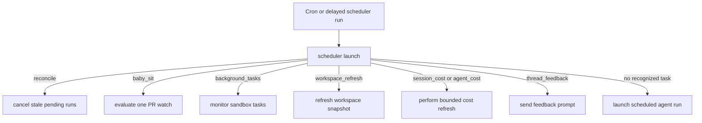
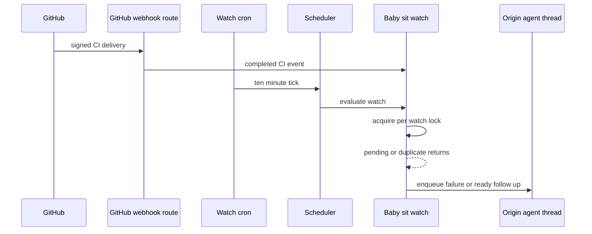

# Scheduled Work, CI Monitoring, and Baby-sit

The `scheduler` assistant is the model-free dispatch boundary for cron ticks and delayed maintenance runs. It does not select work with an LLM: one tick enters a one-node graph and invokes one handler. A handler may update durable state, enqueue a deliberately separate agent run, or finish and remove its own scheduling resource. See [Invocation](invocation.md) for run creation and [Follow-up messages](follow-up-messages.md) for the resulting agent-thread messages.

## Dispatch and ownership

`langgraph.json` registers `scheduler` as `agent.graphs.scheduler:get_scheduler`. The graph is `START → launch → END`; `_launch` gets routing fields from state first and then `RunConfig`.

Diagram: a scheduler invocation deterministically selects one maintenance or dispatch path.

The legacy `environment_refresh` task is accepted alongside `workspace_refresh`; a legacy expedited-review task deletes obsolete cron resources. `baby_sit` and `background_tasks` return `missing_watch_key` or `missing_thread_id` if their key is absent. The fallback dashboard path returns `missing_schedule_id` rather than raising. The outer dispatch retries only transient sandbox-attachment failures for a bounded interval; after that it returns `sandbox_unavailable`, while non-transient exceptions propagate.

**Ownership and idempotency boundary.** The scheduler does not create or garbage-collect a producer's crons. Dashboard schedules, watches, background monitors, workspace records, and wakeups own their respective lifecycle. Producers tag crons with a `kind` and use an idempotent lookup or persisted ID where needed; consumers still tolerate duplicate deliveries through locks, claims, or durable dedupe keys.

### Dashboard schedules and recovery

`agent.schedules.store` stores dashboard schedule definitions in `agent_schedules` and operational outcomes in the separate `agent_schedule_run_state` namespace. Its cron validator requires five fields, normalizes whitespace, range-checks each field, and supports numbers, `*`, ascending ranges, steps, and comma lists. A recurring schedule sends `schedule_id` to `scheduler`; the launcher rejects missing records, non-schedule triggers, disabled schedules, and workspace repository access failures before starting work.

For a valid tick it makes a fresh `agent` thread and durable run, rather than resuming a prior scheduled run. It can first create and bind a Slack root message, carries schedule/repository/workspace and invocation context into the new run, and records run state independently. Creation of a dashboard cron rolls back the just-stored definition if the cron API fails; changing a schedule creates a replacement cron before attempting deletion of the prior one.

Durable dispatch relies on completion to release a busy thread. `reconcile_stale_runs()` is the safety sweep for a lost completion: it pages through busy threads, lists pending runs, and interrupts those older than 1,800 seconds by default. Bad timestamps and a failure for one thread are isolated; the result reports threads checked, stale runs, and cancellations.

### Delayed enrichment and workspace refresh

Session and agent-cost enrichment use stateless delayed scheduler runs with `on_completion="delete"`, not permanent pollers. Both use the fixed delays `(15, 30, 60, 120, 240)` seconds. Session refresh updates the mapped Slack response footer after a LangSmith thread aggregate becomes available; a pending result schedules the next attempt. Agent-cost refresh requests a `run_only=True` LangSmith cost and persists it to the invocation usage record; an unavailable lookup or failed persistence advances only until the same finite budget is exhausted.

Workspace refresh is another scheduler task. `ensure_refresh_cron` gives each workspace a deterministic, staggered daily UTC cron; `start_refresh_run` can also create a one-shot scheduler run for a `full` or `update` refresh. A full refresh boots from the base snapshot and runs setup then update scripts, while an update starts from the current snapshot and runs only the update script. Refresh state prevents a plausibly live refresh from being duplicated; failures preserve the previous usable snapshot.

## Background-task follow-up

Sandbox command monitoring is model-free until it needs to report a terminal result. `ensure_background_task_cron(thread_id)` ensures one `background_tasks` cron per thread on `* * * * *`, removes duplicate rows, and tags it with `agent_thread_id` because the platform drops `thread_id` metadata. The monitor reads task state from the sandbox and updates the thread's tracked task metadata.

For every terminal task not already marked done, the monitor atomically creates a task-local claim directory before dispatching a system follow-up to the originating agent thread with `multitask_strategy="enqueue"`. It changes the claim to a durable done marker only after dispatch succeeds; a failed dispatch releases the claim for a later tick. Once no task is running and no terminal notification remains, it takes a monitor lock, rechecks the sandbox, and deletes all current and legacy monitor crons. Thus delivery is at-least-once at the dispatch boundary, while the sandbox claim prevents ordinary duplicate notifications.

## Thread wakeups

`schedule_thread_wakeup` is intentionally separate from the scheduler assistant: it creates a one-shot, thread-bound cron directly for `agent`. Delays must be whole minutes from one minute through 24 hours; the fire time is rounded up to a minute and `end_time` is 90 seconds later. The input is a system automation message using a supplied prompt or the standard wakeup prompt, and selected source, repository, issue, Slack, user, and schedule context is carried forward. `prepare_run_config` adds invocation correlation and the completion webhook when configured.

To prevent recursive polling, wakeups are limited to ten per latest human-message generation. The tool hashes that human input identity, stores generation and count in thread metadata, and serializes local calls for a thread. System messages do not reset the budget. It records the increment before creating the cron, so a failed creation consumes a slot rather than permitting a retry storm.

A wakeup cron stops firing after `end_time`, but its row remains. Before a new wakeup, best-effort cleanup fully pages only `metadata.kind=thread_wakeup` crons and deletes those with a past `end_time`. The standalone `scripts/purge_wakeup_crons.py` provides the same operational cleanup: use `--dry-run` to inspect candidates, and resolve deployment URL and credentials from its arguments or `LANGGRAPH_URL`, `LANGGRAPH_API_KEY`, and `LANGSMITH_API_KEY`.

## Opt-in `/baby-sit` CI watches

`/baby-sit` is not a repository-wide CI watcher. The skill starts durable monitoring only for a cloud-run PR that explicitly uses `manage_baby_sit`; local and desktop execution instead uses a bounded foreground `gh pr checks --watch` loop. Inputs from PR metadata, check names, URLs, and logs are untrusted.

### Watch lifecycle and trigger convergence

A `BabySitWatch` is persisted in `baby_sit_watches` under a normalized `owner/repo#number` key. It binds the originating agent thread, PR URL and head SHA/ref, GitHub App installation, allowed run configuration, and source context. Only one active thread can own a PR watch. Re-starting the same head carries retry and dedupe history; a new head clears retries, failure-dispatch keys, and alert keys.

Starting first saves the watch and then ensures a single UTC `*/10 * * * *` scheduler cron tagged `kind=baby_sit_watch`; duplicate cron rows are deleted. If creating a brand-new watch's cron fails, the saved watch is rolled back. Stopping deletes its cron and row; if deletion fails, it persists `active=False` so it cannot evaluate.

Diagram: signed CI events and the polling fallback converge under a per-watch lock.

The GitHub HTTP route verifies `X-Hub-Signature-256` before processing and schedules supported CI events in background processing. A completed CI payload is matched only against active watches in the same repository whose stored head SHA or head branch matches. The watch records up to 50 delivery IDs before evaluation, so a replayed delivery is ignored. Cron and webhook evaluation use a short-lived, five-minute lock thread keyed to the watch; contention returns `busy` rather than starting concurrent diagnoses.

### CI decision and safe dispatch

Evaluation fetches the PR, check runs, and legacy commit statuses with the watch's GitHub App token. An inactive or closed PR stops the watch; unavailable credentials, PR data, or CI data count toward the evaluation-error limit. Three consecutive evaluation errors produce a terminal notification and stop. A head change resets per-head retry and dedupe state. Open watches classify no checks or incomplete checks as `pending`; completed failing conclusions or failure/error statuses as `failure`; non-success terminal checks as `blocked`; and a nonempty all-successful, neutral, or skipped set as `success`.

A success is accepted only after the service also fetches the base branch's required checks and verifies that every required check is reported by the head. It then enqueues a ready prompt to the origin thread and stops the watch. Pending and unchanged states do not create an agent run, making the ten-minute cron a token-free fallback while CI is unchanged.

For failure, the durable dedupe key is a hash of head SHA and current retry count. The service saves that key *before* enqueuing the `/baby-sit --continue` follow-up; this prevents concurrent duplicate dispatch. If enqueue fails, it removes the key so a later event can retry. The prompt includes bounded, sanitized failure signals and directs confidence-gated diagnosis. A blocked check, retry exhaustion, or error limit sends a terminal message through the source context where possible, falls back to an enqueued `/baby-sit --terminal` run, and stops the watch.

An agent records only an evidence-backed flaky GitHub Actions rerun through `manage_baby_sit(action="record_retry")`. The service rechecks watch ownership and head SHA under the same lock, caps retries at three per head, and increments durable state. A flaky alert is deduplicated per head, check name, and safe `https://github.com/` details URL. The tool requires a canonical PR URL and an executable thread; start validates GitHub access, open PR head data, and App installation, while stop and retry are restricted to the owning thread.

## Focused verification

`tests/agent/test_scheduler.py` covers scheduler routing. `tests/agent/test_baby_sit.py` and `tests/github/test_baby_sit_webhook.py` cover watch lifecycle, locking, dedupe, retry limits, and signed event routing. `tests/tools/test_background_task.py` covers sandbox notification handling; `tests/tools/test_schedule_thread_wakeup.py` covers delay validation, correlation, wakeup budget, concurrency, and cleanup. `tests/reviewer/test_reconcile_sweep.py`, `tests/agent/test_session_cost.py`, and `tests/agent/test_agent_cost.py` exercise recovery and bounded cost-refresh behavior.
